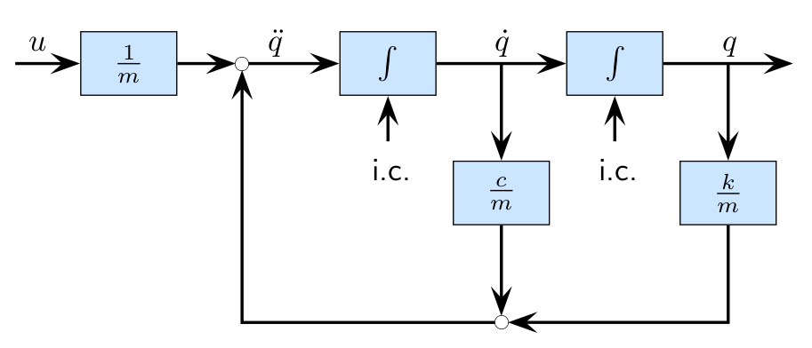
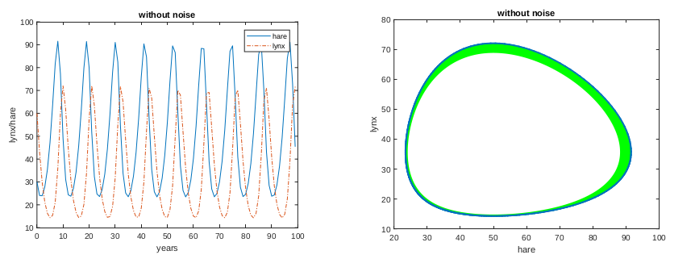
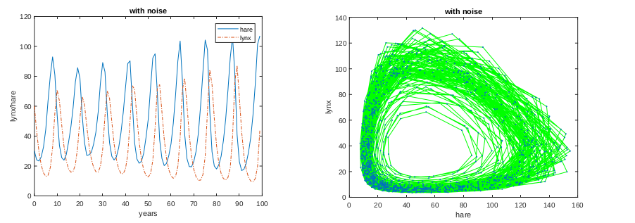
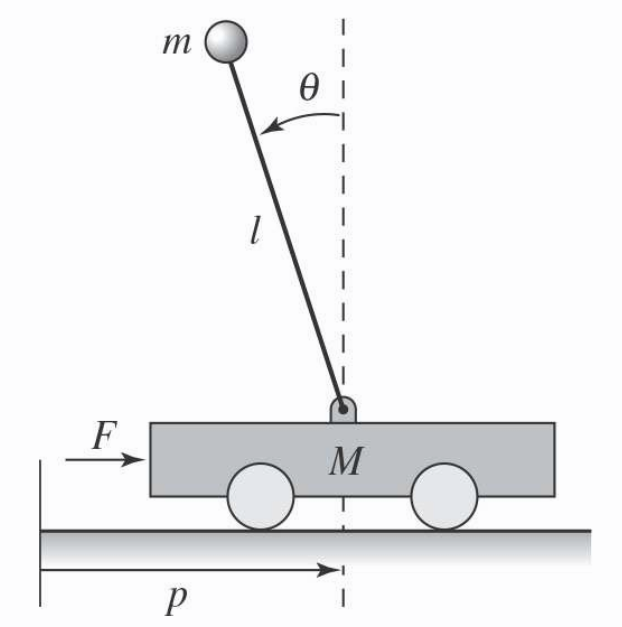

# Lesson 1

## Introduction

Important things for the course:

- Only  one type of calculator allowed **Casio FX-82M** 
- Download the book

There's a way to reconstruct the states just from the output of the system, for many applications is very important to know what's happening to your system.

## The concept of *control system* and *feedback*

It can be a bit "boring" for people of mechanical engineering and so.

### The concept of control

> Interconnect system A (controller) with system B (physical system) to change the behavior of system B

The control specifications are:

- Stabilization
- Tracking
- Performance
- Robustness
- Adaptation

#### Open loop

```{.mermaid caption="Series connection"}
graph LR
A(System 1) --> B(System 2)
I(Input) --> A
B --> O(Output)

classDef hide display:none;
class I hide;
class O hide;

```

#### Closed loop

```{.mermaid caption="Feedback connection"}
graph LR

I(Input) --> P((+))
P --> A
A(System 1) --> B(System 2)
B --> O(Output)
B --> P

classDef hide display:none
class I hide
class O hide
```


### The use of Mathematical Models

**Objective**: quantitative description of a system

### State-space models

> ***
>
> **EXAMPLE 1**: Mass-spring-damper system
> $$
> \begin{aligned}
> F &= m \ddot{q} \\
> \ddot{q}(t) &= \frac{1}{m}\left(-c(\dot{q}(t)) -kq(t) + u(t)\right)
> \end{aligned}
> $$
>
> - Input signal: $u(t)$
> - Output signal: $y(t) = q(t)$
>
> {width=75%}
>
> - Obtain system of first-order ODE:
>
> $$
> \begin{cases}
> \dot{x}_1(t) &= x_2(t) \\
> \dot{x}_2(t) &= \frac{1}{m}(-c(x_2(t)) - kx_1(t) + u(t))
> \end{cases}
> $$
>
> - To find a solution, need two initial conditions
> - Note presence of linear ($kx_1$) and nonlinear parts ($c(x_2)$, e.g. arctangent)
> - Given a model we can
>   - Analyze it
>   - Simulate it
>
> ***

>***
>
>**EXAMPLE 2**: Predator-prey model
>
>- We aim at obtaining the quantitative, abstract simplification of the actual dynamics
>- State variables:
> - Time-dependent population level for the lynxes: $l(t),\ t \ge 0$
> - and for the hares: $h(t),\ t\ge 0$
>- Control Input: hare birth rate $b(u)$, function of food
>- Outputs: population levels, $l(t)$, $h(t)$
>- Model parameters:
> - Mortality rate $d$, Interaction rates $a$, $c$
>- Dynamical model:
>
>$$
>\begin{cases}
>\dot{h}(t) &= b(u)h(t) - a\ l(t)h(t) \\
>\dot{l}(t) &= c\ l(t)h(t) - d\ l(t)
>\end{cases}
>$$
>
>where
>$$
>\begin{aligned}
>a &= 0.014\quad,\qquad c = 0.014 \quad,\qquad d = 0.7 \\
>b &= 0.5 & (\text{noiseless case}) \\
>b &= 0.5(1 + 0.2n(t)), \quad n(t) = \text{random variable} & (\text{noisy case})
>\end{aligned}
>$$
>
>{width=75%}
>
>{width=75%}
>
>***
>

>
>
>***
>
>**EXAMPLE 3**: Pendulum
>
>{width=50%}
>
>- General form mechanical systems:
>
>$$
>M(q)\ddot{q} + C(q, \dot{q}) + K(q) = B(q)u
>$$
>
>where:
>$$
>q = 
>\begin{bmatrix}
>p \\ \theta
>\end{bmatrix}
>$$
>Balance system:
>$$
>\begin{bmatrix}
>(M + m) & ml \cos \theta \\
>-ml \sin \theta & (J + ml^2)
>\end{bmatrix}
>\begin{bmatrix}
>\ddot{p} \\ \ddot{\theta}
>\end{bmatrix} + 
>\begin{bmatrix}
>c\dot{p} + ml \sin\theta\dot{\theta}^2 \\
>\gamma\dot{\theta} - mgl \sin \theta
>\end{bmatrix} =
>\begin{bmatrix}
>F \\ 0
>\end{bmatrix}
>$$
>
>- Total mass: $M_t = M + m$
>- Total inertia: $I_t = J + ml^2$
>- Equations of motion:
>
>$$
>\begin{aligned}
>\frac{d}{dt}
>\begin{bmatrix}
>p \\ \theta \\ \dot{p} \\ \dot{\theta}
>\end{bmatrix} &=
>\begin{bmatrix}
>\dot{p} \\ \dot{\theta} \\
>\frac{-mls_{\theta}c_{\theta}\dot{\theta}^2 + 
>mg \left(\frac{ml^2}{J_t}\right)s_{\theta}c_{\theta} - c\dot{p} -
>\left(\frac{\gamma}{J_t}\right)mlc_{\theta}\dot{\theta} + u}
>{M_t - m\left(\frac{ml^2}{J_t}\right)c_{\theta}^2} \\
>\frac{-mls_{\theta}c_{\theta}\dot{\theta}^2 + M_tgls_{\theta} -
>clc_{\theta}\dot{p} - \gamma \left(\frac{M_t}{m}\right)\dot{\theta} +
>lc_{\theta}u}
>{\frac{J_tM_t}{m} - m(lc\theta)^2}
>\end{bmatrix} \\
>y &= 
>\begin{bmatrix}
>p \\ \theta
>\end{bmatrix}
>\end{aligned}
>$$
>
>- where $c_{\theta} = \cos \theta$ and $s_{\theta} = \sin \theta$
>- Use approximations:
>
>$$
>\sin \theta \approx \theta \quad,\quad \cos \theta \approx 1 \quad,\quad \dot{\theta}^2 \approx 0
>$$
>
>- Linearized model:
>
>$$
>\begin{aligned}
>\frac{d}{dt}
>\begin{bmatrix}
>p \\ \theta \\ \dot{p} \\ \dot{\theta}
>\end{bmatrix} &=
>\begin{bmatrix}
>0 & 0 & 1 & 0 \\
>0 & 0 & 0 & 1 \\
>0 & \frac{m^2l^2}{\mu} & -\frac{cJ_t}{\mu} & -\frac{\gamma lm}{\mu} \\
>0 & \frac{M_tmgl}{\mu} & -\frac{clm}{\mu} & -\frac{\gamma M_t}{\mu}
>\end{bmatrix}
>\begin{bmatrix}
>p \\ \theta \\ \dot{p} \\ \dot{\theta}
>\end{bmatrix} +
>\begin{bmatrix}
>0 \\ 0 \\ \frac{J_t}{\mu} \\ \frac{lm}{\mu}
>\end{bmatrix}u \\
>y &= 
>\begin{bmatrix}
>1 & 0 & 0 & 0 \\
>0 & 1 & 0 & 0
>\end{bmatrix}
>\begin{bmatrix}
>p \\ \theta \\ \dot{p} \\ \dot{\theta}
>\end{bmatrix}
>\end{aligned}
>$$
>
>***
>
>

