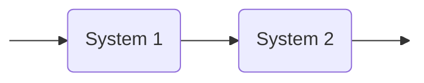

# Lesson 1

## Introduction

Important things for the course:

- Only  one type of calculator allowed **Casio FX-82M** 
- Download the book

There's a way to reconstruct the states just from the output of the system, for many applications is very important to know what's happening to your system.

## The concept of *control system* and *feedback*

It can be a bit "boring" for people of mechanical engineering and so.

### The concept of control

> Interconnect system A (controller) with system B (physical system) to change the behavior of system B

The control specifications are:

- Stabilization
- Tracking
- Performance
- Robustness
- Adaptation

#### Open loop



#### Closed loop

```{.mermaid caption="Feedback connection"}
graph LR

I(Input) --> P((+))
P --> A
A(System 1) --> B(System 2)
B --> O(Output)
B --> P

classDef hide display:none
class I hide
class O hide
```


### The use of Mathematical Models

**Objective**: quantitative description of a system

> ***
>
> **EXAMPLE**: Mass-spring-damper system
> $$
> \begin{cases}
> F &= m \ddot{q}
> \end{cases}
> $$
>
> $$
> \ddot{q}(t) = \frac{1}{m}\left(-c(\dot{q}(t)) -kq(t) + u(t)\right)
> $$
>
> 


## The concept of *model* in systems engineering

We use state space models

