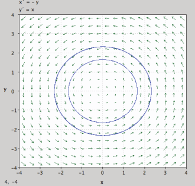
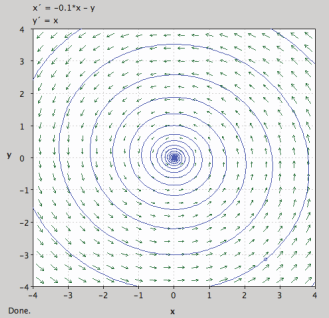
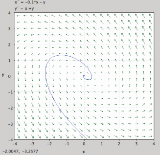
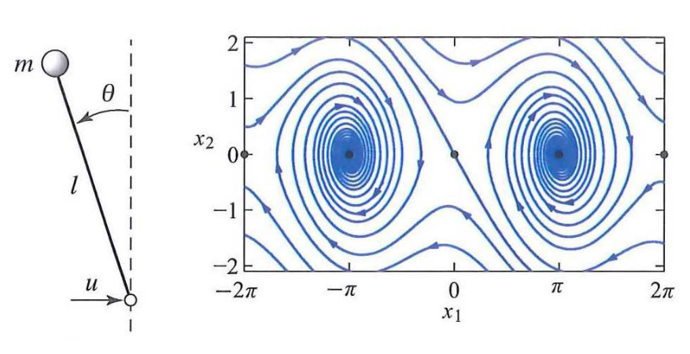
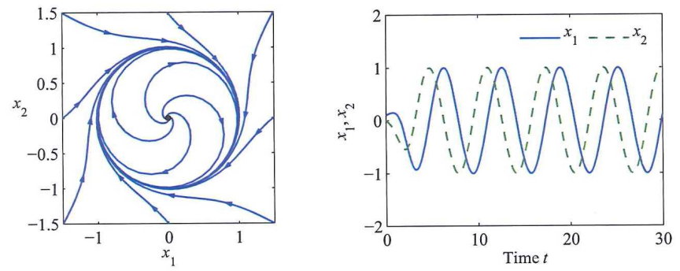

# Lesson 2

## Solving differential equations

Consider a system with feedback:

$$
\left.
\begin{aligned}
\dot{x} &= f(x, u) \\
u &= \alpha(x)
\end{aligned}
\right\} \quad
\dot{x} = f(x, \alpha(x)) = F(x)
$$

Find solution for

$$
\dot{x} = F(x),\quad x(t_0) = x_0,\quad \forall t,\ t_0 < t < t_f
$$

Problems:

- Existence: maybe there's not a signal that satisfies all the conditions
- Uniqueness: sometimes there's not a unique solution but many to them

> ***
>
> **EXAMPLE 1**: 
>
> $$
> \dot{x} = x^2, \quad x(0) = 1
> $$
> 
> Solution:
> 
> $$
> x(t) = \frac{1}{1 - t}
> $$
> 
> **Finite escape time**. In this case there's no solution here. The system would have exploded disintegrated or something else
>
> ***

>***
>
>**EXAMPLE 2**:
>
>$$
>\dot{x} = \sqrt{x}, \quad x(0) = 0
>$$
>
>Solution:
>
>$$
>x(t) = \begin{cases}
>0 & \text{if } 0 \le t \le a \\
>(t - a)^2 & \text{if } t > a
>\end{cases}
>$$
>
>**Non-uniqueness**. You don't know what to expect at some point is just going to start. There are an infinite number of solutions.
>
>***

They can be guaranteed by Lipschitz continuity:

$$
\exists c : ||F(x) - F(y)|| < c||x - y||
$$

_It's just a sufficient condition_

- If you look at $F(x)$ the derivative of this function is bounded, although sometimes the derivative does not exist
- If the derivative is not bounded this condition does not hold

### Qualitative analysis of ODE: phase portraits

_Book 4.2_

- Consider planar case, $x \in \mathbb{R}^2$ 
- Plot with the two states on the axis
- By studying properties of vector field, build _phase portrait_

Let's suppose that we have:

$$
x(t) = 
\begin{bmatrix}
x_1(t) \\ x_2(t)
\end{bmatrix} \qquad
\dot{x}(t) = f(x(t)) = 
\begin{bmatrix}
f_1(x(t)) \\ f_2(x(t))
\end{bmatrix} = 
\begin{bmatrix}
1 \\ 1.2
\end{bmatrix}
$$

Then we can compute for every point in $t$ the values for $f(x(t))$ 

> ***
>
> **EXAMPLE 1**:
>
> {width=40%}
> 
> $$
> \begin{cases}
> \dot{x} &= -y \\
> \dot{y} &= x
> \end{cases}
> $$
> 
> This system is **marginally stable** since it does not go to infinity or zero and just oscillates
>
> ***

> ***
>
> **EXAMPLE 2**:
>
> {width=40%}
> 
> $$
> \begin{cases}
> \dot{x} &= -0.1x - y \\
> \dot{y} &= x
> \end{cases}
> $$
> 
> This  system is **stable** because the points go to zero even if it is slowly
>
> ***

> ***
>
> **EXAMPLE 3**
>
> {width=40%}
> 
> $$
> \begin{cases}
> \dot{x} &= -0.1x - y \\
> \dot{y} &= x + y
> \end{cases}
> $$
> 
> This system is **unstable** because it goes to infinity
>
> ***

### Multiple equilibria

Pendulum:

$$
\dot{x} = 
\begin{bmatrix}
x_2 \\
\sin x_1 - cx_2 + u\cos x_1
\end{bmatrix}, \quad 
x_1 = \theta, \ x_2 = \dot{\theta}
$$

{width=75%}

### Limit cycle

The solutions in the phase plane converge to a circular trajectory. In the time domain this corresponds to an oscillatory solution.

$$
\dot{x} = y + x(1 - x^2 - y^2) \quad,\quad\dot{y}=-x+y(1 - x^2 - y^2)
$$

{width=75%}

## Stability

_Book (4.3)_

- Consider autonomous system:

$$
\dot{x} = f(x)
$$

with initial state $x_0$ and trajectory $x(t, x_0)\ \forall t$

- Many different "kinds". Most relevant for this class
  - BIBO (Bounded-Input-Bounded-Output stability)
- Lyapunov stability
  - Asymptotical Lyapunov stability
  - Local asymptotical Lyapunov stability
  
- $x_e$ is an _equilibrium point_ for $\dot{x} = f(x)$ if $f(x_e) = 0$ (Note that for linear ODE the origin is an equilibrium point)
- An equilibrium point $x_e$ is Lyapunov stable if:

$$
\forall \varepsilon > 0, \exists\delta>0: ||x_0 - x_e|| < \delta \rightarrow
||x(t, x_0) - x_e|| < \varepsilon, \forall t \ge 0
$$

> If my system is Lyapunov stable and I draw a circle of radius $\varepsilon$ around the equilibrium point, my system will remain bounded inside the circle and probably converge in the $x_e$ point

- An equilibrium point $x_e$ is asymptotically stable if
  1. Is Lyapunov stable
  
  2. $x(t, x_0) \rightarrow x_e$, as $t \rightarrow \infty$ 
- There's a difference between **local** and **global** validity  of the above notions

## Lyapunov Stability Analysis

_Book (4.4)_

- Let $x \in \mathbb{R}^n$. A function $V(x)$ is called **positive (semi)definite** in $\mathbb{R}^n$ if $V(x) > 0\ (V(x) \ge 0)$ for all $x \in \mathbb{R}^n$ with $x \ne 0$ and $V(0) = 0$

> ***
>
> **EXAMPLES**:
>
> | Equation                       | Classification        |
> | ---- | ---- |
> | $x_1^2 + 2x_2^2$ |positive definite |
> | $(x_1 + x_2)^2$ | positive semidefinite |
> | $-x_1^2 - (3x_1+2x_2)^2$ | negative definite |
> | $x_1x_2 + x_2^2$ | indefinite |
>| $x_1 + \frac{2x_2^2}{1+x_2^2}$ | positive definite |
> 

- Special case: $V(x) := x^TPx$, where $P=P^T \in \mathbb{R}^{n \times n}$ ($P$ is symmetric). Then $V > 0 \iff P > 0$ (pos. def.) $\iff$ all eigenvalues $\lambda_i(P) > 0$ 
- Look at the level sets for a positive definite function

$$
V(x) = \text{constant}
$$

- The vectors defined by $\nabla V(x)$ are orthogonal to the level sets. Proof: pick a curve $c(t)$ such that

$$
\begin{aligned}
V(c(t)) &= \text{constant} \iff \\
\frac{d}{dt}(V(c(t))) &= 0 \iff \\
\left.\frac{\partial V(x)}{\partial x}\right|_{x=c(t)} \cdot \frac{dc(t)}{dt} &= 0 \iff \\
\nabla V \cdot \dot{c}(t) &= 0
\end{aligned}
$$

- **Lyapunov stability**:
  - Consider system $\dot{x}(t) = f(x(t)),\ x(0) = x_0$.
  - $V(x)$ be scalar function having continuous first derivatives, satisfying:
    1. $V(x)$ is positive definite
    2. $\dot{V}(x) = \frac{d V(x)}{dx} \dot{x}$ is negative definite
  - Then the system is **asymptotically stable**
- $V(x)$ is called **Lyapunov function**
- $V(x)$ can be a measure for the total **energy** in the system
- Decreasing "energy derivative" and lower bound on energy imply (asymptotic) stability

### Lyapunov Stability Analysis of linear systems

Consider system

$$
\dot{x} = Ax
$$

and a function

$$
V(x) = x^T Px
$$

Derivative:

$$
\begin{aligned}
\dot{V}(x) &= \dot{x}^T Px + x^TP\dot{x} \\
&= x^TA^TPx + x^TPAx \\
&= x^T(A^TP + PA)x
\end{aligned}
$$

For Lyapunov stability there must hold:

$$
A^TP + PA < 0
$$

If $A^TP + PA < 0$ the function $V(x)$ is a Lyapunov function

### Lyapunov Stability Analysis of Nonlinear systems

> ***
>
> **EXAMPLE**: regular pendulum with damping
> $$
> ml^2 \ddot{\theta} + k\dot{\theta} + mgl \sin\theta = 0 \quad \text{pick } x= 
> \begin{bmatrix}
> \theta \\ \dot{\theta}
> \end{bmatrix}
> $$
>
> - Select $V(x)$ the sum of kinetic energy
>
> $$
> V(x) = mgl(1 - \cos\theta) + \frac{1}{2}ml^2\dot{\theta}^2
> $$
>
> - Compute time derivative of $V(x)$ along trajectory
>
> $$
> \begin{aligned}
> \dot{V}(x) = \frac{dV^T}{dx}\dot{x} &=
> \begin{bmatrix}
> mgl\sin\theta & ml^2\dot{\theta}
> \end{bmatrix}
> \begin{bmatrix}
> \dot{\theta} \\
> \frac{-k\dot{\theta} - mgl\sin\theta}{ml^2}
> \end{bmatrix} \\
> &= \dot{\theta}(mgl\sin\theta - k\dot{\theta}-mgl\sin\theta) = -k\dot{\theta}^2
> \end{aligned}
> $$
>
> 
>
> - Observe that:
>   - $V(x) > 0,\ V(0) = 0$
>   - $\dot{V}(x) < 0 \implies$ the system is asymptotically stable 
> - Consider now the case with no damping, $k=0 \implies$ the system is **not** stable
>
> ***

## System properties

- Memoryless / Dynamic
- Causality
- Linearity
- Time-invariance

### Memoryless vs dynamic

A system is said to be **memoryless** if its output at a given time is dependent only on the input at the same time

- Memoryless systems
  - $y(t) = \left(2u(t) - u^2(t)\right)^2$
  - $i(t) = \frac{u(t)}R$ (resistor)
- Dynamical system:
  - $v(t) = \frac{1}{C} \int_{-\infty}^t i(\tau) d\tau$ (capacity)
  - $y(t) = 4u(t - 3)$ (delay)
  - $m\ddot{x}(t) + c\dot{x}(t) + kx(t) = F(t)$ (mechanical system)

### Causal

A system is **causal** if the output at any time depends only on values of the input at that the present time and in the past.

> All physical systems in the real world are causal because they cannot anticipate on the future.
>
> Note however: In signal/image processing we can sometimes use non-causal filters.

### Linear

Let $y_1(t)$ be the output of the system to the input $u_1(t)$ and let $y_2(t)$ be the output of the input $u_2(t)$. A system is said to be **linear** if it satisfied the following properties:

- The input $u_1(t) + u_2(t)$ will give an output $y_1(t) + y_2(t)$
- The input $\alpha u_1(t)$ will give an output $\alpha y_1(t)$ for any (complex) constant $\alpha$

> ***
>
> **EXAMPLE**: Inductor
> $$
> i(t) = \frac{1}{L}\int_{-\infty}^t v(\tau)d\tau
> $$
>
> ***

### Time-invariant

A system is said to be **time invariant** if the behavior and characteristics are fixed over time.

An input-output system is time-invariant if a time-shift $\tau$ in the input leads to the same time-shift in the output

$$
u(t) \implies y(t),\ t \in \mathbb{R}\ \implies\ u(t - \tau) \implies y(t - \tau),\ t \in \mathbb{R}
$$

### System properties

Linear time-invariant system:

$$
\begin{aligned}
\dot{x}(t) &= Ax(t) + Bu(t) \\
y(t) &= Cx(t) + Du(t) \\
\end{aligned}
$$

Linear time-varying system:

$$
\begin{aligned}
\dot{x}(t) &= A(t)x(t) + B(t)u(t) \\
y(t) &= C(t)x(t) + D(t)u(t) \\
\end{aligned}
$$

Non-linear time-invariant system:

$$
\begin{aligned}
\dot{x}(t) &= f\left(x(t), u(t)\right) \\
y(t) &= g\left(x(t), u(t)\right)
\end{aligned}
$$

Non-linear time-varying system:

$$
\begin{aligned}
\dot{x}(t) &= f(t, x(t), u(t)) \\
y(t) &= g(t, x(t), u(t))
\end{aligned}
$$

## Matrix exponentials

_Book 5.2_

$$
\begin{aligned}
\dot{x} = a \cdot x \quad ,\quad x(0) = x_0 \implies x(t) = e^{at} \cdot x_0
\end{aligned}
$$

Solution of $\dot{x} = Ax$ is $x(t)  = e^{At}x_0$

Substitution:

$$
\begin{aligned}
\dot{x}(t) &= \frac{d}{dt}\left(e^{At}x_0\right) \\
&= \frac{d}{dt}\left(I + At + \frac{A^2t^2}{2!} + ...\right)x_0 \\
&= \left(A + A^2t + \frac{A^3t^2}{2!} + ...\right)x_0 \\
&= A \left(I + At + \frac{A^2t^2}{2!}+...\right)x_0 \\
&= A \underbrace{e^{At}x_0}_{x(t)} \\
&= Ax(t)
\end{aligned}
$$

Solution of $\dot{x} = Ax + Bu$ is $x(t) =  e^{At} \left[x_0 + \int_0^t e^{-At}Bu(\tau)d\tau\right]$

Substitution:

$$
\begin{aligned}
\dot{x}(t) &= \frac{d}{dt}\left(e^{At}\left[x_0 + \int_0^te^{-At}Bu(\tau)d\tau\right]\right) \\
&= Ae^{At}\underbrace{\left[x_0 + \int_0^te^{-At}Bu(\tau)d\tau\right]}_{x(t)} 
+ e^{At}\underbrace{\frac{d}{dt}\left[\int_0^te^{-At}Bu(\tau)d\tau\right]}_{e^{-At}Bu(t)} \\
&= Ax(t) + e^{At}e^{-At}Bu(t) \\
&= Ax(t) + Bu(t)
\end{aligned}
$$

### Stability of linear ODE

- For LTI system $\dot{x} = Ax, x \in \mathbb{R}^n$, stability of equilibrium is related to the **eigenvalues** of state matrix $A$
- $\lambda(A) = \{s \in \mathbb{C}: \det (sI - A) = 0\}$
- $\det(sI - A)$ is known as the _characteristic polynomial_
- diagonal case: $A = \operatorname{diag}(\lambda_1, ..., \lambda_n) = \begin{pmatrix} \lambda1 & & & 0 \\ & \lambda_2 & & \\ & & \ddots & \\ 0 & & & \lambda_n\end{pmatrix}$
- Result: equilibrium point $x_e = 0$ is
  - stable if $\Re(\lambda_i) \le 0$
  - Asymptotically stable if $\Re(\lambda_i) < 0,\quad i = 1,..., n$ 
- Case $A$ diagonalizable: $A = T^{-1}\Lambda T$ (invertible matrix $T$ provides similarity transformation) $\rightarrow$ study stability on matrix $\Lambda$

$$
\det(sI - A) = \det(sI - \Lambda)
$$

### Transformation of state equations (state coordinate change)

Consider the original system:
$$
\begin{aligned}
\dot{x}(t) &= Ax(t) + Bu(t) \\
y(t) &= Cx(t) + Du(t)
\end{aligned}
$$
and define new state $z(t) = Tx(t)$ or $x(t) = T^{-1}z(t)$ where $T$ is non-singular matrix. This gives:
$$
\begin{aligned}
T^{-1}\dot{z}(t) &= AT^{-1}z(t) + Bu(t) \\
y(t) &= CT^{-1}z(t) + Du(t)
\end{aligned}
$$
Multiply first equation with $T$ to obtain:
$$
\begin{aligned}
\dot{z}(t) &= TAT^{-1}z(t) + TBu(t) \\
y(t) &= CT^{-1}z(t) + Du(t)
\end{aligned}
$$
Define:
$$
\begin{aligned}
&A' = TAT^{-1} && B' = TB \\
&C' = CT^{-1} && D' = D
\end{aligned}
$$

then
$$
\begin{aligned}
\dot{z}(t) &= A'z(t) + B'u(t) \\
y(t) &= C'z(t) + D'u(t)
\end{aligned}
$$

- Property:

$$
e^{A't} = e^{TAT^{-1}t} = Te^{At}T^{-1}
$$

- Two systems related by a similarity transformation have same I/O response

$$
\begin{aligned}
C'e^{A't}B'u(t) &= CT^{-1}e^{TAT^{-1}}TBu(t) \\
&= CT^{-1}Te^{At}T^{-1}TBu(t) \\
&= Ce^{At}Bu(t)
\end{aligned}
$$

### Solution to autonomous ODE

- Let us focus on the "dynamical" part of ODE

$$
\frac{d}{dt}x(t) = Ax(t),\quad x(0)=x_0
$$

has solution
$$
x(t) = e^{At}x_0
$$
where:
$$
e^{At} := I + At + A^2\frac{t^2}{2!} + A^3\frac{t^3}{3!} + ...
$$
Is there a better way to compute $e^{At}$?

We consider two cases

- Case 1: $A$ is diagonalizable
- Case 2: $A$ is not diagonalizable

#### Case 1: $A$ is diagonalizable

If $A$ has $n$ distinct eigenvalues. Eigenvalue decomposition
$$
\lambda_im_i = Am_i\quad \text{for } m_i \ne 0
$$

- Values $\lambda_i$ are the eigenvalues of $A$
- Vectors $m_i$ are the eigenvectors of $A$

Equation can be rewritten as:
$$
(\lambda_i I - A)m_i = 0
$$
Condition
$$
\det(\lambda_i I - A) = 0
$$
or
$$
\lambda_i^n + a_{n-1}\lambda_i^{n - 1} + ... + a_1\lambda_i + a_0 = 0
$$
or
$$
(\lambda - \lambda_1)(\lambda - \lambda_2) \cdots (\lambda-\lambda_n) = 0
$$
Define
$$
T = \begin{bmatrix}
m_1 & m_2 & \cdots & m_n
\end{bmatrix}^{-1}\quad, \quad
\Lambda = \begin{bmatrix}
\lambda_1 & 0 & \cdots & 0 \\
0 & \lambda_2 & \ddots & \vdots \\
\vdots & \ddots & \ddots & 0\\
0 & \cdots & 0 & \lambda_n
\end{bmatrix}
$$
then the eigenvalue decomposition
$$
A = T^{-1}\Lambda T
$$
Result
$$
\begin{aligned}
x(t) &= e^{At}x_0 \\
&= e^{T^{-1}\Lambda Tt}x_0 \\
&= T^{-1}e^{\Lambda t}Tx_0 \\
&= T^{-1}e^{\begin{bmatrix}
\lambda_1t & 0 & \cdots & 0\\
0 & \lambda_2t & \ddots & \vdots \\
\vdots & \ddots & \ddots & 0 \\
0 & \cdots & 0 & \lambda_nt
\end{bmatrix}}Tx_0 \\
&= T^{-1}\begin{bmatrix}
e^{\lambda_1t} & 0 & \cdots & 0 \\
0 & e^{\lambda_2t} & \ddots & \vdots \\
\vdots & \ddots & \ddots & 0 \\
0 & \cdots & 0 & e^{\lambda_nt}
\end{bmatrix}
\end{aligned}
$$

#### Case 2: $A$ is not diagonalizable

What if $A$ is **not diagonalizable**? (e.g.: $A$ has eigenvalues with multiplicity)

- Jordan transformation $TAT^{-1} = J = \begin{bmatrix}J_1 & 0 & \cdots & 0 \\ 0 & J_2 & \ddots & 0 \\ 0 & \ddots & \ddots & 0\\ 0 & \cdots & 0 & J_n \end{bmatrix}$
- where $J_i = \begin{bmatrix}\lambda_i & 1 & 0 & \cdots & 0 \\ 0 & \lambda_i & \ddots & \ddots & \vdots \\ \vdots & \ddots & \ddots & 1 & 0 \\ \vdots & & 0 & \lambda_i& 1 \\ 0 & \cdots & \cdots & 0 & \lambda_i\end{bmatrix}$
- $e^{Jt} = \begin{bmatrix}e^{J_1t} & 0 & \cdots & 0 \\ 0 & e^{J_2t}& \ddots & \vdots \\ \vdots & \ddots & \ddots & 0 \\ 0 & \cdots & 0 & e^{J_kt}\end{bmatrix}$
- For any $A$ - in MATLAB, command `jordan`

> ***
>
> **EXAMPLE**
> $$
> A = \begin{bmatrix}
> 4 & 0 & 1 & 0 \\
> 2 & 2& 3 & 0 \\
> -1 & 0 & 2 & 0 \\
> 4 & 0 & 1 & 2
> \end{bmatrix}
> $$
> Characteristic polynomial: $(s - 2)^2(s - 3)^2$
>
> Eigenvectors:
> $$
> \underbrace{v_1 = \begin{bmatrix}0 \\ 1 \\ 0 \\ 0\end{bmatrix},\quad 
> v_2 = \begin{bmatrix}0 \\ 0 \\ 0 \\ 1\end{bmatrix}}_{\lambda=2},\quad
> \underbrace{v_3=\begin{bmatrix}0 \\ 1 \\ 0 \\ 0\end{bmatrix}}_{\lambda=3}
> $$
> Jordan form:
> $$
> J = \begin{bmatrix}
> \begin{array}{c|c|cc}
> 2 & 0 & 0 & 0 \\
> \hline
> 0 & 2 & 0 & 0 \\
> \hline
> 0 & 0 & 3 & 1 \\
> 0 & 0 & 0 & 3
> \end{array}
> \end{bmatrix}
> $$
>
> $$
> \begin{aligned}
> e^{Jt} &= e^{
> \begin{bmatrix}
> \begin{array}{c|c|cc}
> 2 & 0 & 0 & 0 \\
> \hline
> 0 & 2 & 0 & 0 \\
> \hline
> 0 & 0 & 3 & 1 \\
> 0 & 0 & 0 & 3
> \end{array}
> \end{bmatrix}t
> } \\
> &= \begin{bmatrix}
> \begin{array}{c|c|cc}
> e^{2t} & 0 & 0 & 0 \\
> \hline
> 0 & e^{2t} & 0 & 0 \\
> \hline
> 0 & 0 & e^{3t} & te^{3t} \\
> 0 & 0 & 0 & e^{3t}
> \end{array}
> \end{bmatrix}
> \end{aligned}
> $$
>
> ***

