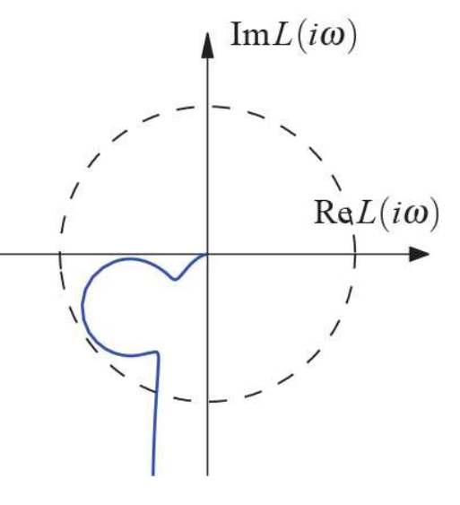

# Lecture 3

## Linearization

_Book 5.4_

An _equilibrium point_ or _steady-state_ is a point where the system comes to a rest.
$$
\dot{x}(t) = 0
$$
Consider the system $\dot{x} = f(x, y)$. For a steady-state or equilibrium point $(x_0, u_0, y_0)$ there holds
$$
f(x_0, u_0) = 0
$$
The corresponding output $y_0$ can be computed by
$$
y_0 = g(x_0, u_0)
$$
Look at small variations $\tilde{x}$, $\tilde{u}$, and $\tilde{y}$ about the equilibrium $(x_0, u_0, y_0)$:
$$
\begin{aligned}
x(t) &= x_0 + \tilde{x}(t) \\
u(t) &= u_0 + \tilde{u}(t) \\
y(t) &= y_0 + \tilde{y}(t)
\end{aligned}
$$
First of all, note that $\dot{\tilde{x}}(t) = \dot{x} - \dot{x}_0$, and so
$$
\begin{aligned}
\dot{\tilde{x}}(t) &= f(x_0 + \tilde{x}(t), u_0 + \tilde{u}(t)) \\
y_0 + \tilde{y}(t) &= g(x_0 + \tilde{x}(t), u_0 + \tilde{u}(t))
\end{aligned}
$$
Use Taylor expansion to describe nonlinear equations in terms of $\tilde{x}$ and $\tilde{u}$:
$$
\begin{aligned}
\dot{\tilde{x}}(t) &= f(x_0, u_0) + A\tilde{x}(t) + B\tilde{u}(t) \\
\tilde{y} &= g(x_0, u_0) + C\tilde{x}(t) + D\tilde{u}(t) - y_0
\end{aligned}
$$
where $A$, $B$, $C$, and $D$ are computed as
$$
A = \left.\frac{\partial f}{\partial x}\right|_{\substack{x = x_0 \\ u=u_0}} \quad,\quad 
B = \left.\frac{\partial f}{\partial u}\right|_{\substack{x = x_0 \\ u=u_0}} \quad,\quad 
C = \left.\frac{\partial g}{\partial x}\right|_{\substack{x = x_0 \\ u=u_0}} \quad,\quad 
D = \left.\frac{\partial g}{\partial u}\right|_{\substack{x = x_0 \\ u=u_0}}
$$
With $f(x_0, u_0) = 0$ and $y_0 = g(x_0, u_0)$, this reduces to:
$$
\begin{aligned}
\dot{\tilde{x}}(t) &= A\tilde{x}(t) + B\tilde{u}(t) \\
\tilde{y}(t) &= C\tilde{x}(t) + D\tilde{u}(t)
\end{aligned}
$$

## From state-space models to frequency domain

_Book 8.1 and 8.2_

- Start with a state-space representation

$$
\begin{aligned}
\dot{x} &= Ax + Bu \\
y &= Cx + Du
\end{aligned}
$$

- Consider inputs of the form $u(t) = e^{st}, s = \sigma+iw \implies u(t) = e^{\sigma t}(\cos wt + i\sin wt)$ 
- Solution is $x(t) = e^{At}x_0 + \int_0^t e^{A(t - \tau)} Be^{st} d\tau = e^{At}x_0 + e^{At}\int_0^t e^{(sI - A)\tau} Bd\tau$
- If $s\ne \lambda(A) \implies x(t) = e^{At}x_0 + e^{At}(sI - A)^{-1}(e^{(sI-A)t} - I)B$
- Thus $y(t) = Ce^{At}(x_0 - (sI - A)^{-1}B) + (C(sI-A)^{-1}B + D)e^{st}$
  - (closely related to the frequency response (see Lecture 2) - transient plus steady-state term)
- Consider steady-state term. Let us define the transfer function as follows:

$$
G_{yu}(s) = C(sI - A)^{-1}B + D
$$

then we obtain:
$$
y(t) = G_{yu}(s)(t),\quad \text{for } u(t) = e^{st}
$$

### Transfer functions

> ***
>
> **EXAMPLE**: Consider the system
> $$
> \ddot{q} + 2 \zeta\omega_o\dot{q} + \omega_o^2q = k\omega_o^2u,\quad y = q
> $$
>
> - Can be written as (note: $x_1 = q$ and $x_2 = \dot{q}$)
>
> $$
> \frac{dx}{dt} = \begin{bmatrix}
> 0 & 1 \\ -\omega_0^2 & -2 \zeta\omega_o
> \end{bmatrix} \boldsymbol{x} + \begin{bmatrix}
> 0 \\ k\omega_o^2
> \end{bmatrix} u, \quad y = \begin{bmatrix}
> 1 & 0
> \end{bmatrix}x
> $$
>
> - Model has eigenvalues $\lambda = -\zeta\omega_o \pm \sqrt{\omega_o^2(\zeta^2 - 1)}$
> - For $\zeta,\omega_o > 0 \rightarrow$ model is stable
> - Transfer function
>
> $$
> \begin{aligned}
> G(s) &= C(sI - A)^{-1}B \\
> &= \begin{bmatrix}
> 1 & 0
> \end{bmatrix}\left(
> sI - \begin{bmatrix}
> 0 & 1 \\ -\omega_o^2 & -2\zeta\omega_o
> \end{bmatrix}
> \right)^{-1} \begin{bmatrix}
> 0 \\ k\omega_o^2
> \end{bmatrix} \\
> &= \frac{k\omega_o^2}{s^2 + 2\zeta\omega_os + \omega_o^2}
> \end{aligned}
> $$
>
> - Frequency response $G(j\omega) = Me^{j\theta}$, where
>
> $$
> M = \frac{k\omega_o^2}{\sqrt{(\omega_o^2 - \omega)^2+(2\zeta\omega_o\omega)^2}}\ ,\quad
> \phi = \frac{\sin\theta}{\cos\theta} = \frac{-2\zeta\omega_o\omega}{\omega_o^2-\omega^2}
> $$
>
> - $M$: Magnitude
> - $\phi$: Phase
>
> {width=75%}
>
> The higher the damping the smoother the phase change goes
>
> - Step response
>
> {width=60%}
>
> - Damping ratio $\zeta$: over-damping ($\zeta > 1$), critical damping ($\zeta = 1$), underdamping ($\zeta < 1$)
> - Can find closed-form solutions for natural, step, frequency responses
> - Steady-state response to $u(t) = 1 \rightarrow y(t) = G_{yu}(0) \cdot 1 = k$
>
> ***

- Rise time ($T_r$): How fast does it go up
- Settling time ($T_s$): How long does it take to get stable
- Steady-state value ($y_{ss}$): Final stable value
- Overshoot ($M_p$): Extra distance from the maximum value to the stable value

### Transfer Functions, alternative derivation

- Consider integrable function $f(t), f:\mathbb{R}^+ \rightarrow \mathbb{R}$ and s.t. $f(t) < e^{s_0t}$
- Laplace transform $\mathcal{L}$ yields and $F = \mathcal{L}f:\mathbb{C} \rightarrow\mathbb{C}$, defined by

$$
F(s) = \int_0^{\infty}e^{-s\tau}f(\tau)d\tau,\quad\Re(s) > s_0
$$

- Properties of $\mathcal{L}$
  - $\mathcal{L}(af(t) + bg(t)) = a\mathcal{L}f(t) + b\mathcal{L}g(t) = aF(s) + bG(s)$
  - $\mathcal{L}\frac{df(t)}{dt} = -f(0) + s\mathcal{L}f(t) = -f(0) + sF(s)$
  - $\mathcal{L}\int_0^t f(\tau)d\tau = \frac{1}{s}\mathcal{L}f(t) = \frac{F(s)}{s}$
  - $\mathcal{L}((f*g)(t)) = F(s)G(s)$
- Now consider the system

$$
\begin{cases}
\dot{x} &= Ax + Bu \\ 
y &= Cx + Du
\end{cases}
$$

- Take Laplace transforms (with zero initial conditions):

$$
\begin{cases}
sX(s) &= AX(s) + BU(s) \\
Y(s) &= CX(s) + DU(s)
\end{cases}
$$

$$
(sI - A)X(s) = BU(s) \implies X(s) = (sI-A)^{-1}BU(s)
$$


- Substitute for $X(s)$ to obtain:

$$
\begin{aligned}
Y(s) &= CX(s) + DU(s) \\
&= C(sI - A)^{-1}BU(s) + DU(s) \\
&= \left\{C(sI - A)^{-1}B + D\right\}U(s)
&= G_{yu}(s)U(s)
\end{aligned}
$$

- Notice that Laplace transforms can be used to solve ODE

> ***
>
> **EXAMPLE**: Let an LTI system be defined by the differential equations:
> $$
> \begin{aligned}
> \frac{d^2}{dt^2}x_1(t) - x_2(t) + \frac{d}{dt}u(t) &= 0 \\
> -\frac{d}{dt}x_2(t) + x_1(t) + u(t) &= 0 \\
> x_1(t) + x_2(t) &= y(t)
> \end{aligned}
> $$
>
> - Obtain: $Y(s) = \frac{s - 1}{1 - s^3}U(s) = \frac{1}{s^2+s+1}U(s)$
>
> - More generally, consider
>
> $$
> \frac{d^ny}{dt^n} + a_1\frac{d^{n-1}y}{dt^{n-1}}+...+a_ny = 
> b_0\frac{d^mu}{dt^m} + b_1\frac{d^{m-1}u}{dt^{m-1}}+...+b_mu
> $$
>
> $$
> s^nY(s) + a_1s^{n-1}Y(s) + ...+a_nY(s)=b_0s^mU(s)+...+b_mU(s)
> $$
>
> $$
> \frac{Y(s)}{U(s)} = \frac{b_0s^m + b_1s^{m-1}+...+b_m}{s^n+a_1s^{n-1}+...a_n}
> $$
>
> ***

### Transfer Functions, invariance w.r.t. coordinate transformation

- Consider model $\dot{x} = Ax + Bu,\quad y=Cx + Du$
- corresponding transfer function

$$
Y(s) = \left(C(sI - A)^{-1}B + D\right)U(s)
$$

- Introduce similarity transformation $z = Tx$, and deduce model

$$
\dot{z}=TAT^{-1}z + TBu\qquad y=CT^{-1}z+Du
$$

- Transfer function for new model is again

$$
Y(s) = \left(C(sI-A)^{-1}B + D\right)U(s)
$$

### Block Diagrams and Transfer Functions

_Book 8.3_

- TF manipulation allows modular analysis
- Recall similar analysis done for state-space models

{width=30%}

$$
G_{yu} = G_2G_1
$$

{width=30%}

$$
G_{yu} = G_1 + G_2
$$

{width=30%}

$$
G_{yu} = \frac{G_1}{1 + G_1G_2}
$$

### Bode plot

- Consider $u(t) = e^{st},\ s=i\omega t$ (recall frequency response, Lecture 2)
- Then, $y(t) = G(i\omega t)e^{i\omega t} = Me^{i(\omega t + \phi)}$
  - gain: $M = \left|G(i\omega)\right|$
  - phase: $\phi = \angle G(i\omega) = \tan^{-1} \frac{\Im G(i\omega)}{\Re G(i\omega)}$
- Input is magnified by $M$, phase-shifted by $\phi$

### Loop transfer function

_Book 9.1_

We introduce the loop transfer function
$$
L(s) = P(s)C(s)
$$
which is the transfer function obtained by breaking the feedback loop

```{.mermaid caption="Basic feedback loop"}
graph LR
classDef hide display:none;

Input -- r --> Add(( ))
C[C] -- u --> P[P]
Add -- e --> C
P -- y --> Output
P -- - --> Add

class Input hide
class Output hide
```

$$
\begin{aligned}
e &= y - r
\end{aligned}
$$

### Nyquist plot

_Book 9.2_

It is the curve $L(j\omega)$ in the complex plane parametrized by $\omega$
$$
L(s) = \frac{1.4e^{-s}}{(s + 1)^2}
$$

{width=50%}

### Nyquist stability criterion

_Book 9.2_

- $N_{enc}$ is number of clockwise encirclements
- $P$ is the number of unstable poles of $L(s)$
- Then

$$
N_{enc} = 0 - P \implies N_{enc} = -P \implies
$$

> For the system to be stable, $L(j\omega)$ should encircle the point -1 in the clockwise direction as many times as the number of unstable poles of $L(j\omega)$

### Stability Margins

- The distance from point "-1" is therefore a measure of stability and damping.
- Important margins are:
  - $\phi_m$ = Phase margin (OK is $45^{\circ}$)
  - $g_m$ = Gain margin (OK is $4 - 6 = 12 - 16$ dB)
  - $s_m$ = Vector stability margin (also just _stability margin_)

### Different margins

> ***
>
> **EXAMPLE**:
> $$
> L(s) = \frac{0.38(s^2 + 0.1s + 0.55)}{s(s+1)(s^2 + 0.06s + 0.5)}
> $$
>
> - Gain margin: $g_m = 266$
> - Phase margin: $\phi_m = 70^{\circ}$
> - Stability margin: $s_m =  0.27$
>
> {width=30%}
>
> ***

### PID Control

- Transfer functions allow the study of the properties of PID controllers, and the proper selection of their characteristic parameters
- Consider $u(t) = k_p e(t) + k_i \int_0^t e(\tau) d\tau + k_d \frac{de(t)}{dt}$
- Controller block $C(s) = k_p + \frac{k_i}{s} + k_d s$

{width=75%}

