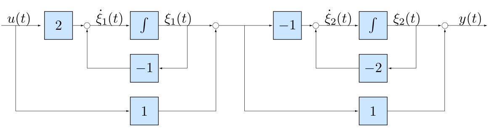
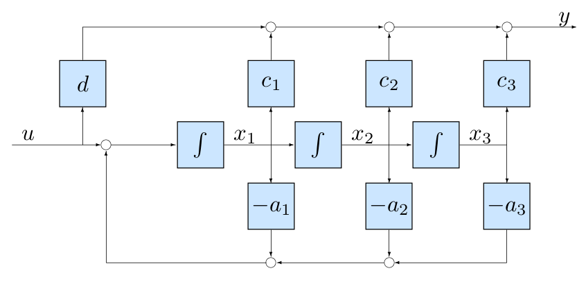
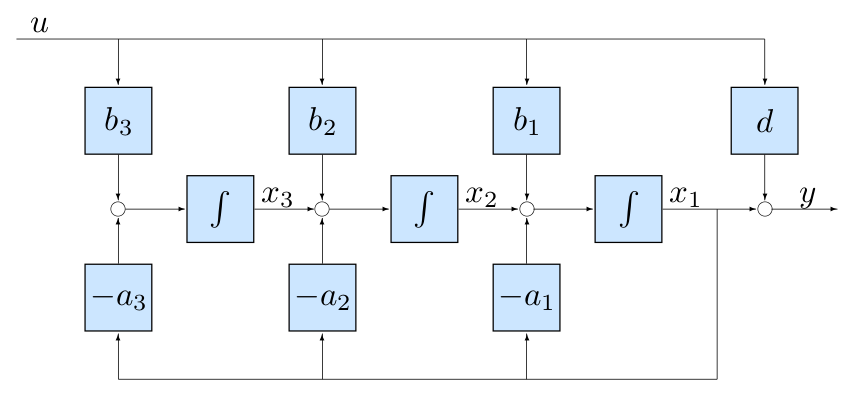

# Lecture 4

If you want a system and you should be able to know where you are (know the state of your system). Thus, the observability of a system is really important

- If you can observe your system then it's important that you can control it
- Do we have enough freedom to control our system?1

## Reachability

_Book 6.1_

- Consider

$$
\frac{d}{dt}x(t) = Ax(t) + Bu(t),\quad x(0) = x_0 \in \R^n
$$

- with known solution

$$
x(t) = e^{At}x_0 + \int_0^t e^{A(t - \tau)}Bu(\tau)d\tau
$$

- **Definition**: System is reachable if for any $x_0 \in \R^n, x_t \in \R^t$, there exists input $u(\tau)$, with $\tau\in[0,t],0<t<\infty$, such that $x(t) = x_t$
- Reachability is equivalent to Controllability

### Algebraic Conditions for Reachability

_Book 6.1_

- Reachability depends on the form $e^{At}B$, i.e. on matrices $A$ and $B$
- Assume initial state $x(0) =0$
- For input $u(t) = \delta(t)$ we find the state

$$
x(t) = \int_0^t e^{A(t - \tau)}B\delta(\tau)d\tau = e^{At}B
$$

- For input $u(t) = \dot{\delta}(t)$ we find the  state $x(t) = Ae^{At}B$
- For input $u(t) = \ddot{d}(t)$ we find the state $x(t) = A^2e^{At}B$
- For input $u(t) = d^{(k)}(t)$ we find the state $x(t) = A^ke^{At}B$
- For input $u(t) = \alpha_1\delta(t) + \alpha_2\dot{\delta}(t) + \alpha_3\ddot{\delta}(t) + \dotsb + \alpha_n \delta^{(n-1)}(t)$ we find the state

$$
\begin{aligned}
x(t) &= \alpha_1 e^{At} B + \alpha_2 A e^{At} B + \alpha_3 A^2 e^{At} B + \dotsb + \alpha_1 A^{n-1}e^{At} B \\
&= \underbrace{\begin{bmatrix}
B & AB & A^2B& \cdots & A^{n-1}B
\end{bmatrix}}_{W_r}\begin{bmatrix}
\alpha_1 \\ \alpha_2 \\ \alpha_3 \\ \vdots \\ \alpha_n
\end{bmatrix} e^{At} \\
\begin{bmatrix}
\alpha_1 \\ \alpha_2 \\ \alpha_3 \\ \vdots \\ \alpha_n
\end{bmatrix} = e^{-At}W_r^{-1}x(t)
\end{aligned}
$$

- Reachability means that Reachability matrix $W_r$ must have full rank

$$
W_r = \begin{bmatrix}
B & AB & A^2B & \cdots A^{n-1}B
\end{bmatrix}
$$

- **Theorem**: $(A, B)$ reachable if and only if

$$
\operatorname{rank} \begin{bmatrix}
B & AB & A^2B & \cdots A^{n-1}B
\end{bmatrix} = n (= \text{ number of rows})
$$

- The test

$$
\operatorname{rank} W_r = n
$$

is known as Kalman rank condition

- Extensions to time-varying, non-linear case through notion of state-transition matrix $\Phi$ (also mentioned in Lec 2)
- In MATLAB use command `ctrb over ss` structure to obtain Reachability matrix

> ***
>
> **EXAMPLE**
>
> - Consider
>
> $$
> A = \left[\begin{array}{rrr}
> -5 & -4 & 4 \\ 1 & 0 & -2 \\ -1 & -1 & -1
> \end{array}\right]\quad B = \left[\begin{array}{r}
> 3 \\ -1 \\ 1
> \end{array}\right]
> $$
>
> - Compute
>
> $$
> W_r = \begin{bmatrix}
> B & AB & A^2 B
> \end{bmatrix} = \left[\begin{array}{rrr}
> 3 & -7 & 19 \\ -1 & 1 & -1 \\
> 1 & -3 & 9
> \end{array}\right]
> $$
>
> - Perform elementary column operations $(2^{\circ} + 1^{\circ},3^{\circ} - 1^{\circ})$
>
> $$
> \operatorname{rank} \left[\begin{array}{rrr}
> 3 & -7 & 19 \\
> -1 & 1 & -1 \\
> 1 & -3 & 9
> \end{array}\right] = \operatorname{rank} \left[\begin{array}{rrr}
> 3 & -4 & 16 \\ -1 & 0 & 0 \\ 1 & -2 & 8
> \end{array}\right] = 2 < n = 3 \implies (A,B) \text{ not reachable}
> $$
>
> ***

## Observability

_Book 7.1_

- Consider autonomous (no control) system:

$$
\frac{d}{dx}x(t) = Ax(t),\quad x(0) = x_0 \in \R^n;\quad y(t) = Cx(t)
$$

- with solution

$$
y(t) = Ce^{At}x_0
$$

- **Definition**: System is observable if any $x_0\in \R^n$ can be derived from observation $y(\tau)$ within the interval $\tau \in [0, t], t> 0$
- Observability follows from $Ce^{At}$, hence it depends on matrices $A, C$
- Output is given by $y(t) = Ce^{At}x_0$
- Derivative Output is given by $\dot{y}(t) = C\frac{d}{dt}e^{At}x_0 = CAe^{At}x_0$
- And so:

$$
\begin{bmatrix}
y(t) \\ \dot{y}(t) \\ \ddot{y}(t) \\ \vdots \\ y^{(n-1)}(t)
\end{bmatrix} = \begin{bmatrix}
C \\ CA \\ CA^2 \\ \vdots \\ CA^{n-1}
\end{bmatrix} e^{At}x_0
$$

- Observability matrix $W_o$:

$$
W_o = \begin{bmatrix}
C \\ CA \\ CA^2 \\ \vdots \\ CA^{n-1}
\end{bmatrix}
$$

- **Theorem**: $(A,C)$ is observable if and only if

$$
\operatorname{rank} W_o = n (= \text{ number of columns})
$$

- In MATLAB, use `obsv over ss` structure to obtain observability matrix

> ***
>
> **EXAMPLE**: Consider the following model
> $$
> \begin{cases}
> \dot{x}_1 &= x_2 \\
> \dot{x}_2 &= 2x_2 \\
> y  &= \alpha x_1 + x_2
> \end{cases}
> $$
>
> $$
> \begin{aligned}
> A &= \begin{bmatrix}
> 0 & 1 \\ 0 & 2
> \end{bmatrix},\quad C=\begin{bmatrix}
> \alpha & 1
> \end{bmatrix} \\
> W_o &= \left[\begin{array}{rl}
> \alpha & 1 \\ 0 & 2 + \alpha
> \end{array}\right]
> \end{aligned}
> $$
>
> - $(A,C)$ is observable for $\alpha \ne 0$ and $\alpha \ne -2$
>
> ***

### Reachability and Observability: Alternative Test by Hautus

_Book 6.1_

- Rationale: $\lambda I - A$ has rank $n$ for all $\lambda$ not equal to an eigenvalue of $A \implies$ rank check  needs only to be evaluated when $\lambda$ is equal to an eigenvalue of $A$

- Finding unreachable or unobservable _eigenvalues_ can be done using:

  - **Hautus reachability condition**: $(A,B)$ is reachable iff:

  $$
  \operatorname{rank}\begin{bmatrix}
  \lambda I - A & B
  \end{bmatrix} = n, \forall \lambda \in \mathbb{C}
  $$
  - **Hautus observability condition**: $(A,C)$ is observable iff:
  $$
  \operatorname{rank}\begin{bmatrix}
  \lambda I - A \\ C
  \end{bmatrix} = n, \forall \lambda \in C
  $$

> ***
>
> **EXAMPLE**: Consider $(A,B)$:
> $$
> A = \left[\begin{array}{rrr}
> -5 & -4 & 4 \\ 1 & 0 & -2 \\ -1 & -1 & -1
> \end{array}\right]\quad
> \left[\begin{array}{r}
> 3 \\ -1 \\ 1
> \end{array}\right]
> $$
>
> - Matrix $A$ has eigenvalues in the set $\{-1, -2, -3\}$
> - Perform following computations
>
> $$
> \operatorname{rank} \left[\begin{array}{c|c}
> (\lambda I - A)|_{\lambda=-1} & B
> \end{array}\right] = \operatorname{rank} \left[\begin{array}{rrr|r}
> 4 & 4 & -4 & 3 \\
> -1 & -1 & 2 & -1 \\
> 1 & 1 & 0 & 1 
> \end{array}\right] = 3
> $$
>
> - Eigenvalue $-1$ is reachable
>
> $$
> \operatorname{rank} \left[\begin{array}{c|c}
> (\lambda I - A)|_{\lambda=-2} & B
> \end{array}\right] = \operatorname{rank} \left[\begin{array}{rrr|r}
> 3 & 4 & -4 & 3 \\
> -1 & -2 & 2 & -1 \\
> 1 & 1 & -1 & 1 
> \end{array}\right] = 2
> $$
>
> - Eigenvalue $-2$ is unreachable
>
> $$
> \operatorname{rank} \left[\begin{array}{c|c}
> (\lambda I - A)|_{\lambda=-1} & B
> \end{array}\right] = \operatorname{rank} \left[\begin{array}{rrr|r}
> 2 & 4 & -4 & 3 \\
> -1 & -3 & 2 & -1 \\
> 1 & 1 & -2 & 1 
> \end{array}\right] = 3
> $$
>
> - Eigenvalue $-3$ is reachable
>
> ***

## Lack of unreachability and of unobservability

_Book 8.3_

- **UC 1**: Physical unreachability - uncoupled variables are not affected by input
- **UC 2**: Parallel interconnection controlled by single input
- **UO 1**: Directly unmeasured variables are not fed back to measured ones
- **UO 2**: Single variables cannot be extracted from global observation function

- This is particular true for SISO systems

> ***
>
> **EXAMPLE**: Consider the system in series, described via the following block diagram:
>
> {width=75%}
>
> $$
> \begin{aligned}
> \dot{\mathcal{E}}_1(t) &= -\mathcal{E}_1(t) + 2u(t) \\
> \dot{\mathcal{E}}_2(t) &= -\mathcal{E}_1(t) - 2\mathcal{E}_2(t) - u(t) \\
> y(t) &= \mathcal{E}_1(t) + \mathcal{E}_2(t) + u(t)
> \end{aligned}
> $$
>
> - System matrices:
>
> $$
> \begin{aligned}
> A &= \begin{bmatrix}\begin{array}{rr}
> -1 & 0 \\ -1 & -2
> \end{array}\end{bmatrix}\quad & B &= \begin{bmatrix}\begin{array}{r}
> 2 \\ -1
> \end{array}\end{bmatrix} \\
> C &= \begin{bmatrix}1 & 1\end{bmatrix} &
> D &= \begin{bmatrix}1\end{bmatrix}
> \end{aligned}
> $$
>
> - Eigenvalues matrix $A$: $(\lambda_1 = -1, \lambda_2 = -2)$
> - Reachability and observability matrices:
>
> $$
> W_r = \begin{bmatrix}\begin{array}{rr}
> 2 & -2 \\ -1 & 0
> \end{array}\end{bmatrix}\quad 
> W_o = \begin{bmatrix}\begin{array}{rr}
> 1 & 1 \\ -2 & -2
> \end{array}\end{bmatrix}
> $$
>
> - The matrix $W_r$ has full rank so the system is reachable
> - The matrix $W_o$ has rank 1, so the system is not observable
> - Check reachability with Hautus test
>
> $$
> \begin{bmatrix}
> \lambda I - A & B
> \end{bmatrix} = \begin{bmatrix}
> \lambda + 1 & 0 & 2 \\ 1 & \lambda + 2 & -1
> \end{bmatrix}
> $$
>
> - For $\lambda = -1$ we find:
>
> $$
> \operatorname{rank}\left(\begin{bmatrix}
> \lambda I - A & B
> \end{bmatrix}_{\lambda=-1}\right) = \operatorname{rank}
> \left(\begin{bmatrix}\begin{array}{rrr}
> 0 & 0 & 2 \\ 1 & 1 & -1
> \end{array}\end{bmatrix}\right) = 2
> $$
>
> - For $\lambda = -2$ we find:
>
> $$
> \operatorname{rank}\left(\begin{bmatrix}
> \lambda I - A & B
> \end{bmatrix}_{\lambda=-2}\right) = \operatorname{rank}
> \left(\begin{bmatrix}\begin{array}{rrr}
> -1 & 0 & 2 \\ 1 & 0 & -1
> \end{array}\end{bmatrix}\right) = 2
> $$
>
> - This means that the system is reachable
> - Check observability with Hautus test
>
> $$
> \begin{bmatrix}c \\ \lambda I - A\end{bmatrix} =
> \begin{bmatrix}
> 1 & 1 \\ \lambda + 1 & 0 \\ 1 & \lambda + 2
> \end{bmatrix}
> $$
>
> - For $\lambda=-1$ we find:
>
> $$
> \operatorname{rank}\left(\begin{bmatrix}
> C \\ \lambda I - A
> \end{bmatrix}_{\lambda=-1}\right) = \operatorname{rank}
> \left(\begin{bmatrix}\begin{array}{rr}
> 1 & 1 \\ 0 & 0 \\ 1 & 1
> \end{array}\end{bmatrix}\right) = 1
> $$
>
> - For $\lambda = -2$ we find:
>
> $$
> \operatorname{rank}\left(\begin{bmatrix}
> C \\ \lambda I - A
> \end{bmatrix}_{\lambda=-2}\right) = \operatorname{rank}
> \left(\begin{bmatrix}\begin{array}{rr}
> 1 & 1 \\ -1 & 0 \\ 1 & 1
> \end{array}\end{bmatrix}\right) = 2
> $$
>
> - This means that the system is not observable
> - Compute transfer function
>
> $$
> \begin{aligned}
> G(s) &= C(sI - A)^{-1}B + D \\
> &= \frac{s^2 + 4s + 3}{s^2 + 3s + 2} \\
> &= \frac{(s+3)(s+1)}{(s+2)(s+1)}
> \end{aligned}
> $$
>
> - Pole-zero cancellation for $s=-1$
>
> ***

### Duality

_Book 7.2_

- Reachability, observability are dual concepts

$$
\begin{aligned}
(A,B) \text{ reachable } &\iff (A^T, B^T) \text{ observable } \\
(A,C) \text{ observable } &\iff (A^T, C^T) \text{ reachable}
\end{aligned}
$$

- The above fact relates to the following propositions
  - For every property that holds for Reachability there exists a dual property in terms of observability
  - State feedback and observer design problems are closely related (as we shall see later in class)
  - Both Reachability and observability are invariant under similarity transformations (will elaborate in exercise session)

## Canonical forms

_Book 6.1 + 7.1_

- Consider the system

$$
\dot{x}(t) + Ax(t) + Bu(t),\quad y(t) = Cx(t) + Du(t)
$$

- Given similarity transformation $z(t) = Tx(t)$ with

$$
\begin{aligned}
A' &= TAT^{-1}\qquad & B'&=TB \\
C' &= CT^{-1} & D' &= D
\end{aligned}
$$

- to obtain

$$
\dot{z}(t) = A'z(t) + B'u(t),\quad y(t) = C'z(t) + D'u(t)
$$

- Then if $(A,B)$ is reachable $\implies (A', B')$ is reachable
- Then if $(A,C)$ is observable $\implies (A',C')$ is observable

### Reachable Canonical form

_Book 6.1_

- Consider the following system to be reachable

$$
\dot{x}(t) = Ax(t) + Bu(t),\quad y(t) = Cx(t) + Du(t)
$$

- Transform SISO model coordinates as $z=Tx$ to obtain the following:

$$
\begin{aligned}
A_r &= \begin{bmatrix}
-a_1 & -a_2 & -a_3 & \cdots & -a_n \\
1 & 0 & 0 & \cdots & 0 \\
0 & 1 & 0 & \cdots & 0 \\
\vdots & \ddots & \ddots & \ddots & \vdots \\
0 & \cdots & 0& 1 & 0
\end{bmatrix},\quad &B_r &= \begin{bmatrix}1 \\ 0 \\ vdots \\ 0 \\ 0\end{bmatrix}\\
C_r &= \begin{bmatrix}c_1 & c_2 & c_3 & \cdots & c_n\end{bmatrix}, &
D_r &= \begin{bmatrix}d\end{bmatrix}
\end{aligned}
$$

- Its block diagram contains th every constants appearing in the model

{width=75%}

- The characteristic polynomial (same as that of original model) is:

$$
\lambda(s) = s^n + a_1 s^{n-1} + \dotsb + a_{n-1}s + a_n
$$

- This canonical form also yield the following reachability matrix:

$$
\begin{aligned}
\begin{bmatrix}
B_r & A_rB_r & A_r^2B_r & A_r^3B_r & \cdots & A_r^{n-1}B_c
\end{bmatrix} = \\
=\begin{bmatrix}
1 & -a_1 & a_1^2 - a_2 & \cdots & * & * & * \\
0 & 1 & -a_1 & \cdots & * & * & * \\
0 & 0 & 1 & \cdots & * &*&* \\
\vdots & \vdots & \vdots &  & \vdots & \vdots & \vdots \\
0 & 0 & 0 & \cdots & 1 & -a_1 & *\\
0 & 0 & 0 & \cdots & 0 & 1 & -a_1  \\
0 & 0 & 0 & \cdots & 0 & 0 & 1
\end{bmatrix}
\end{aligned}
$$

$\implies (A_r,B_r)$ in reachable canonical form is reachable (as expected)

### Reachability - Similarity transformation

Note: Similarity transformations do not affect reachability

- How to find $T$ that gets the reachable canonical form? From $(A,B)$ (with $W_r$) to $(A_r = TAT^{-1},B_r=TB)$ with $T$.
- **Fact**: If $(A,B)$ is reachable, then there exists a transformation $T$ that yields the reachable canonical form
- $W_r =$  reachability matrix of original system
- $\tilde{W}_r$ reachability matrix of system in reachable canonical form

Then
$$
T = \tilde{W}_rW_r^{-1}
$$

### Observability Canonical Form

_Book 7.1_

- Consider the observable system

$$
\dot{x}(t) = Ax(t) + Bu(t),\quad y(t) = Cx(t) + Du(t)
$$

- Transform SISO model coordinates as $x=T\bar{x}$ to obtain

$$
\begin{aligned}
A_o &= \begin{bmatrix}
-a_1 & 1 & 0 & \cdots & 0 \\
-a_2 & 0 & 1 & \cdots & 0 \\
\vdots & \vdots & \vdots & \ddots & \vdots \\
-a_{n-1} & 0 & 0 & \cdots & 1 \\
-a_n & 0 & 0 & \cdots & 0
\end{bmatrix},\quad & B_o &= \begin{bmatrix}
b_1 \\ b_2 \\ \vdots \\ b_{n-1} \\ b_n
\end{bmatrix},\\
C_o &= \begin{bmatrix} 1& 0 & \cdots & 0 & 0 \end{bmatrix},
& D_o &=\begin{bmatrix}d\end{bmatrix}
\end{aligned}
$$

- Its block diagram contains the very constants appearing in the model

{width=75%}

- This canonical form yields the observability matrix:

$$
\begin{bmatrix}
C_o \\ C_oA_o \\ C_oA_o^2 \\ \vdots \\ C_oA_o^{n-1}
\end{bmatrix}=\begin{bmatrix}
1 & 0 & 0 & \cdots & 0 & 0 & 0 \\
-a_1 & 1 & 0 & \cdots & 0 & 0 & 0 \\
* & -a_1 & 1 & \cdots & 0 & 0 & 0 \\
\vdots & \vdots &\vdots &  &\vdots &\vdots &\vdots \\
* & * &* & \cdots& 1 & 0 & 0 \\
*&*&*&\cdots &-a_1 & 1 & 0 \\
*&*&*&\cdots &*&-a_1&1
\end{bmatrix}
$$

$\implies (A_o,C_o)$ in observable canonical form is observable

### Observability - Similarity transformation

Note: Similarity transformations do not affect observability

- How to find a $T$ that gets the observable canonical form:? From $(A,C)$ (with $W_o$) to $(A_o =TAT^{-1},C_o=CT^{-1})$ with $T$
- **Fact** If $(A,C)$ is observable, then there exists a transformation $T$ that yields the observable canonical form
- $W_o=$ observability matrix of original system
- $\tilde{W}_o=$ observability matrix of system in reachable canonical form

Then:
$$
T=\tilde{W}_o^{-1}W_o
$$

