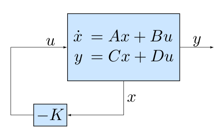
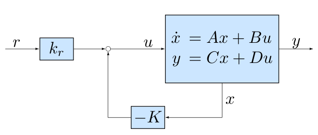
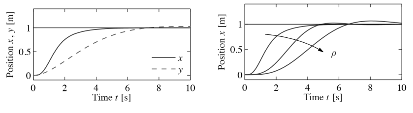
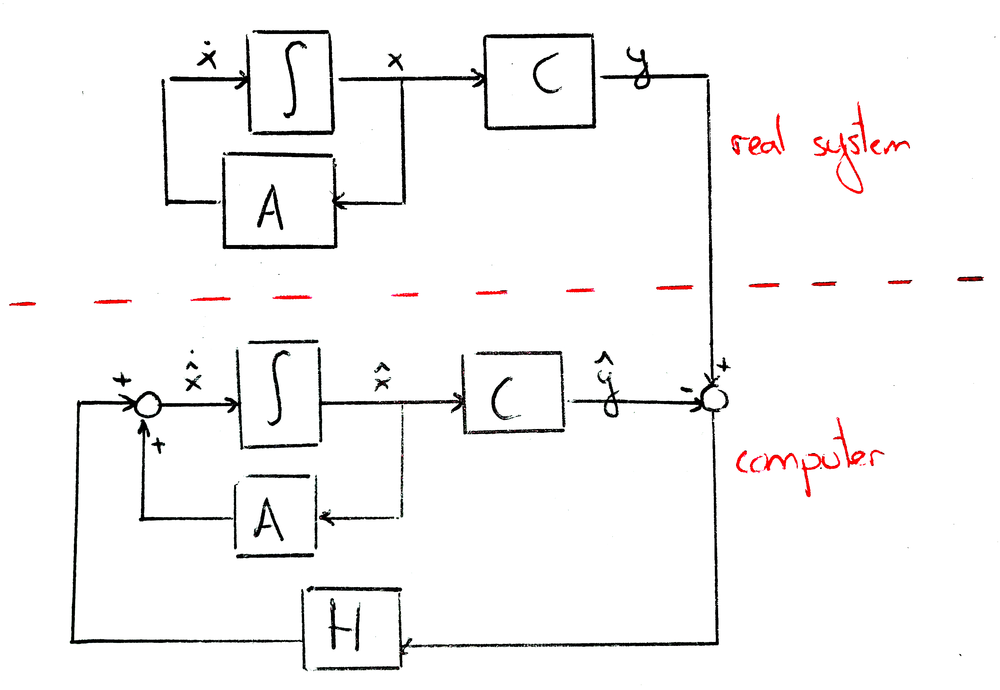
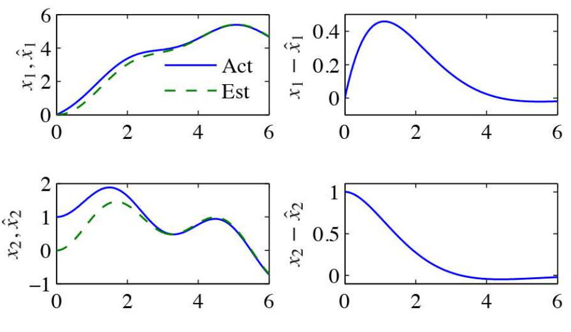

# Lecture 5

## Stabilisation by state feedback

_Book 6.2_

We have a system:
$$
\dot{x} = Ax + Bu
$$
We want to design a controller $u = -K \cdot x$ where $K \in \mathbb{R}^{n \times m}$

{width=50%}

- More generally, can set $u = -Kx + k_r r$, where $r$ is a constant reference signal

{width=60%}

- Obtain closed-loop system $\dot{x} = (A-BK)x + Bk_r r$
- Objective: select $K$ so that closed loop has _assigned_, _desired_ characteristic polynomial. _Eigenvalue assignment -pole placement_. 
- Reachable canonical form can be used for the purpose

> ***
>
> **EXAMPLE**: Consider 2-d model, where
> $$
> A = \begin{bmatrix}
> 0 & 1 \\ 0 & 0
> \end{bmatrix},\quad B = \begin{bmatrix}1\\1\end{bmatrix},\quad
> \begin{bmatrix}1 & 0\end{bmatrix},\quad D = \left[0\right]
> $$
>
> - It is controllable. Introduce _state_ feedback law
>
> $$
> u = -Kx + k_r r = -k_1 x_1 -k_2x_2 + k_rr
> $$
>
> - Obtain
>
> $$
> (A - BK) = \begin{bmatrix}
> -k_1 & 1 - k_2 \\ -k_1 & -k_2
> \end{bmatrix},\quad Bk_r = \begin{bmatrix}k_r \\ k_r\end{bmatrix}
> $$
>
> - Characteristic polynomial is:
>
> $$
> p(s) = s^2 + (k_1+k_2)s + k_1
> $$
>
> - Consider **desired** characteristic polynomial
>
> $$
> p(s) = s^2 + 2\zeta_c\omega_cs + \omega_c^2 \rightarrow s_{1,2} = \omega_c\left(-\zeta_c \pm\sqrt{\zeta_c^2 - 1}\right)
> $$
>
> - Set $k_1 = \omega_c^2,\quad k_2 = 2\zeta_c\omega_c - \omega_c^2$
>
> ***

### State feedback

- Consider the system in reachable canonical form

$$
\dot{z}(t) = \tilde{A}z(t) + \tilde{B}u(t),\quad y(t) = \tilde{C}z(t) + \tilde{D}u(t)
$$

$$
\tilde{A} = \begin{bmatrix}
-a_1 & -a_2 & \cdots & -a_n \\
1 & 0 & \cdots & 0 \\
\vdots & \ddots & \ddots & \vdots \\
0 & \cdots & 1 & 0
\end{bmatrix},\quad \tilde{B} = \begin{bmatrix}
1 \\ 0 \\ \vdots \\ 0
\end{bmatrix}
$$

- With characteristic polynomial

$$
a(s) = s^n + a_1 s^{n-1} + \dotsb + a_{n-1}s + a_n
$$

- Desired characteristic polynomial

$$
p(s) = s^n+p_1s^{n-1} + \dotsb + p_{n-1}s + p_n
$$

- State feedback:

$$
u(t) = -\tilde{K}z(t) + k_rr(t)
$$

- Choose $\tilde{K} = \begin{bmatrix}p_1 - a_1 & p_2-a_2 \cdots p_n-a_n\end{bmatrix}$
- Then we find

$$
\begin{aligned}
\tilde{A} - \tilde{B}\tilde{K} &= \begin{bmatrix}
-a_1 & -a_2 & \cdots & -a_n \\
1 & 0 & \cdots & 0 \\
\vdots & \ddots & \ddots & \vdots \\
0 & \cdots & 1 & 0
\end{bmatrix} - \begin{bmatrix}1 \\ 0 \\ \vdots \\ 0\end{bmatrix}
\begin{bmatrix}
p_1 - a_1 & p_2 - a_2 & \cdots & p_n - a_n
\end{bmatrix} \\
&= \begin{bmatrix}
-p_1 & -p_2 & \cdots -p_n \\
1 & 0 & \cdots & 0 \\
\vdots & \ddots & \ddots & \vdots \\
0 & \cdots & 1 & 0
\end{bmatrix}
\end{aligned}
$$

- With desired characteristic polynomial

$$
p(s) = s^n+p_1s^{n-1} + \dotsb + p_{n-1}s + p_n
$$

***

- Given system consider reachable system (**not** in reachable canonical form)

$$
\dot{x}(t) = Ax(t) + Bu(t),\quad y(t) = Cx(t) + Du(t)
$$

- Given the similarity transformation

$$
z(t) = Tx(t) = \tilde{W}_rW_r^{-1}x(t)
$$

- to obtain reachable canonical form
- State feedback

$$
u(t) = -Kx(t) + k_rr(t) = -\tilde{K}Tx(t) + k_rr(t)
$$

- so

$$
K = \begin{bmatrix}
p_1 - a_1 & p_2 - a_2 & \cdots & p_n - a_n
\end{bmatrix}\tilde{W}_rW_r^{-1}
$$

- Now

$$
\begin{aligned}
A - BK &= T^{-1}\tilde{A}T-T^{-1}\tilde{B}\tilde{K}T \\
&= T^{-1}(\tilde{A} - \tilde{B}\tilde{K})T
\end{aligned}
$$

- With the desired characteristic polynomial

$$
p(s) = s^n+p_1s^{n-1} + \dotsb + p_{n-1}s + p_n
$$

**Theorem** (Eigenvalue assignment by state feedback)

- Consider the system

$$
\dot{x}(t) = Ax(t) + Bu(t),\quad y(t) = Cx(t) + Du(t)
$$

- with characteristic polynomial

$$
a(s) = s^n + a_1s^{n-1} + \dotsb + a_{n-1}s + a_n
$$

- if the system is reachable, then there exists a feedback

$$
u = -Kx + k_rr
$$

- that gives a closed loop system with the characteristic polynomial

$$
p(s) = s^n+p_1s^{n-1} + \dotsb + p_{n-1}s + p_n
$$

- The feedback gain is given by

$$
K = \tilde{K}T = \begin{bmatrix}
p_1 - a_1 & p_2 - a_2 & \cdots & p_n - a_n
\end{bmatrix}\tilde{W}_rW_r^{-1}
$$

## Linear Quadratic Regulator

_Book 6.3_

- Consider the model $\dot{x} = Ax + Bu, \quad x \in \mathbb{R}^n,\ u \in \mathbb{R}^n$. (In particular $p=1$)
- We have learnt to design a feedback controller (find gains of feedback matrix) by placing closed-loop eigenvalues
- Alternatively, can trade off _closed-loop performance_ with _input effort_
  - Minimising following quadratic function:

$$
\int_0^{\infty}(x^TQ_xx + u^TQ_uu)dt,\quad Q_x \ge 0,\ Q_u>0
$$

- we can trade off _convergence rate_ (speed) with _cost of control input_ (energy).
- Solution is given by control (linear state feedback)

$$
u = -Q_u^{-1}B^TPx
$$

- where $P\in\mathbb{R}^{n\times n},\ P > 0$, is the solution of the Algebraic Riccati Equation (ARE):

$$
PA + A^TP - PBQ_u^{-1}B^TP+Q_x = 0
$$

- Solution of ARE exists under proper conditions
- ARE can be solved numerically in MATLAB with command `lqr` (Linear Quadratic Regulator)
- Solution depends on choice of $Q_x$, $Q_u$ (often taken as diagonal matrices)

> ***
>
> **EXAMPLE**:
>
> - Vector thrusted aircraft
>   - Input: pair of forces $F_1$ and $F_2$ due to main downward thruster
>   - State: $z = \begin{bmatrix}x & y & \theta & \dot{x} & \dot{y} & \dot{\theta}\end{bmatrix}$
>   - Outputs: measured position $(x,y)$
> - Consider model: $\dot{z} = Az + B\nu,\quad y = Cx$ with
>
> $$
> \begin{aligned}
> A &= \begin{bmatrix}
> 0 & 0 & 0 & 1 & 0 & 0 \\
> 0 & 0 & 0 & 0 & 1 & 0 \\
> 0 & 0 & 0 & 0 & 0 & 1 \\
> 0 & 0 & -g & -\frac{c}{m} & 0 & 0 \\
> 0 & 0 & 0 & 0 & -\frac{c}{m} & 0 \\
> 0 & 0 & 0 & 0 & 0 & 0
> \end{bmatrix},\quad & B &= \begin{bmatrix}
> 0 & 0 \\ 0 & 0 \\ 0 & 0 \\ \frac{1}{m} & 0 \\ 0 & \frac{1}{m} \\ \frac{r}{J} & 0
> \end{bmatrix} \\
> C &= \begin{bmatrix}
> 1 & 0 & 0 & 0 & 0 & 0 \\
> 0 & 1 & 0 & 0 & 0 & 0
> \end{bmatrix},& D &= \begin{bmatrix}
> 0 & 0 \\ 0 & 0
> \end{bmatrix}
> \end{aligned}
> $$
>
> - Compute LQR as a solution of $\int_0^{\infty} (z^TQ_zZ + \rho\nu^TQ_{\nu}\nu)dt$, where
>
> $$
> Q_z = \begin{bmatrix}
> 1 & 0 & 0 & 0 & 0 & 0 \\
> 0 & 1 & 0 & 0 & 0 & 0 \\
> 0 & 0 & 1 & 0 & 0 & 0 \\
> 0 & 0 & 0 & 1 & 0 & 0 \\
> 0 & 0 & 0 & 0 & 1 & 0 \\
> 0 & 0 & 0 & 0 & 0 & 1 \\
> \end{bmatrix}, Q_{\nu}=\begin{bmatrix}
> 1 & 0 \\ 0 & 1
> \end{bmatrix}
> $$
>
> - Obtain closed-loop system with step responses below
>
> {width=75%}
>
> - If we increase $\rho$ then the system responds slower but we need less energy
>
> ***

## Observer Design: State Estimation

_Book 7.2_

{width=75%}

- Find $\hat{x} \in \mathbb{R}$ and associated linear model (observer)

$$
\frac{d\hat{x}}{dt} = F\hat{X} + Gu + Hy
$$

such that $\hat{x}(t) \rightarrow x(t)$ as $t \rightarrow \infty$

- Consider observer $\dot{\hat{x}} = A\hat{x} + Bu + L(y - C\hat{x})$
  - Error dynamics $\dot{\tilde{x}} = (A - LC)\tilde{x}$
  - Perform _eigenvalue assignment_ through gain matrix $L$ (can make estimation speed faster than model's dynamics)
- We can only observe the system output $y$ and make predictions $\hat{x}$, $\hat{y}$
- $\tilde{x} = x - \hat{x}$
- Observability canonical form can be used for the purpose
- **Observer design** problem is _dual_ to **controller design** (via state feedback) problem

$$
A - LC \leftrightarrow A - BK
$$

### Observer design

- Consider system

$$
\dot{x}(t) = Ax(t) + Bu(t),\quad y(t) = Cx(t)
$$

- with characteristic polynomial

$$
a(s) = s^n + a_1s^{n-1} + \dotsb + a_{n-1}s + a_n
$$

- Given similarity transformation $z(t) = Tx(t) = \tilde{W}_o^{-1}W_o$ to obtain observer canonical form:

$$
\dot{z}(t) = \tilde{A}z(t) + \tilde{B}u(t),\quad y(t) = \tilde{C}z(t)
$$

- Observer model

$$
\dot{\hat{x}} = A\hat{x} + Bu + L(y - C\hat{x})
$$

- Desired characteristic polynomial

$$
p(s) = s^n + p_1s^{n-1} + \dotsb + p_{n-1}s + p_n
$$

- Choose $\tilde{L} = \begin{bmatrix}p_1 - a_1 & p_2 - a_2 & \cdots & p_n - a_n\end{bmatrix}$
- Then we find

$$
\begin{aligned}
\tilde{A} - \tilde{L}\tilde{C} &=\\
&= \begin{bmatrix}
-a_1 & 1 & \cdots & 0 \\
-a_2 & 0 & \cdots & 0 \\
\vdots & \vdots & \ddots & \vdots \\
-a_n & 0  & \cdots & 0
\end{bmatrix} - \begin{bmatrix}
p_1 - a_1 \\ p_2 - a_2 \\ \vdots \\ p_n - a_n
\end{bmatrix}\begin{bmatrix}
1 & 0 & \cdots & 0
\end{bmatrix} \\
&= \begin{bmatrix}
-p_1 & 1 & \cdots & 0 \\
-p_2 & 0 & \cdots & 0 \\
\vdots & \vdots & \ddots & \vdots \\
-p_n & 0 & \cdots & 0
\end{bmatrix}
\end{aligned}
$$

- With desired characteristic polynomial

$$
p(s) = s^n + p_1s^{n-1} + \dotsb + p_{n-1}s + p_n
$$

- **Theorem** (Observer design by eigenvalue assignment)
- Consider the system

$$
\dot{x}(t) = Ax(t) + Bu(t),\quad y(t) = Cx(t)
$$

- with characteristic polynomial

$$
a(s) = s^n + a_1 s^{n-1} + \dotsb + a_{n-1}s + a_n
$$

- If the system is observable, then there exists a observer 

$$
\dot{\hat{x}} = A\hat{x} + Bu + L(y - C\hat{x})
$$

- that gives a closed loop system with the characteristic polynomial

$$
p(s) = s^n + p_1 s^{n-1} + \dotsb + p_{n-1}s + p_n
$$

- The feedback gain is given by

$$
L = T^{-1}\tilde{L} = W_o^{-1}\tilde{W}_o \begin{bmatrix}
p_1 - a_1 & p_2 - a_2 & \cdots & p_n - a_n
\end{bmatrix}^T
$$

> ***
>
> **EXAMPLE**
>
> - Consider the 2-d model, where
>
> $$
> A = \begin{bmatrix}
> 0 & 1 \\ 0 & 0
> \end{bmatrix},\quad B = \begin{bmatrix}1 \\ 1\end{bmatrix},\quad
>  C = \begin{bmatrix}1 & 0\end{bmatrix}
> $$
>
> - It is observable. Introduce observer so that
>
> $$
> (A - LC) = \begin{bmatrix}
> -l_1 & 1 \\ -l_2 & 0
> \end{bmatrix} \implies \det(sI - A+LC) = s^2 +  l_1 s + l_2
> $$
>
> - desired characteristic polynomial
>
> $$
> p(s) = s^2 + 2\zeta_o\omega_os + \omega_o^2 \rightarrow s_{1,2} = \omega_o\left(-\zeta_o\pm\sqrt{\zeta_o^2-1}\right)
> $$
>
> - Set $l_2 = \omega_o^2$, and $l_1 = 2\zeta_o\omega_o$
> - Initially, due to initial conditions, there's an error but this error converges to 0 later
>
> {width=75%}
>
> - You can always reconstruct the model _as long as the system is observable_
>
> ***

### Kalman filtering

_Book 7.4_: From page 217 only the continuous time case

**Preliminaries**:

- Continuous-time random processes
- Estimate the state of a system in the presence of noisy measurements
- Zero mean and Gaussian disturbance:

$$
\operatorname{pdf} v = \frac{1}{\sqrt[n]{2\pi}\sqrt{\det R_v}}e^{-\frac{1}{2}R_v^{-1}v}
$$

- With covariance matrix $R_v$

- Autocorrelation matrix

$$
E\{v(s) v^T(t)\} = R_v \delta(t - s)
$$

- where $\delta(t)$ is the unit impulse function
- Consider the model

$$
\begin{aligned}
\dot{x} &= Ax + Bu + Fv,\quad & E\{v(s)v^T(t)\} &= R_v\delta(t - s) \\
y &= Cx + w & E\{w(s)w^T(t)\} &= R_w\delta(t - s)
\end{aligned}
$$

- Disturbance $v$ and noise $w$ are zero-mean and Gaussian
- Minimise following mean square error

$$
E\left\{\left(x(t) - \hat{x}(t)\right)\left(x(t) - \hat{x}(t)\right)^T\right\}
$$

- Solution is given by Kalman observer gain

$$
\begin{aligned}
\dot{\hat{x}} &= A\hat{x} + Bu + L(y - C\hat{x}) \\
L &= PC^TR_w^{-1}
\end{aligned}
$$

- where $P\in \mathbb{R}^{n\times n},\ P > 0$, is the solution of A.R.E:

$$
AP + PA^T - PC^TR_w^{-1}CP + FR_vF^T=0
$$

- Solution of A.R.E. exists under proper conditions
- A.R.E. can be solved numerically in MATLAB with command `lqe`.

> ***
>
> **EXAMPLE**:
>
> - Consider the state  system
>
> $$
> \begin{aligned}
> \dot{x} &= Ax + Bu + Fv \\
> y&= Cx + w
> \end{aligned}
> $$
>
> - where $A = 3, B=2,F=1$ and $C=3$
> - Assume that the disturbance $v$ and noise $w$ are zero mean and Gaussian and let the covariances be given by $R_v=24$ and $R_w=1$
> - We design a Kalman filter for the system with
>
> $$
> \dot{x} = A\hat{x} + Bu + L(y - C\hat{x})
> $$
>
> - To compute the Kalman gain we solve the A.R.E:
>
> $$
> AP + PA^T - PC^TR_w^{-1}CP +FR_vF =0
> $$
>
> - or
>
> $$
> 3P+P3-P9P+24=-(3P-6)(3P+4)=0
> $$
>
> - Solutions are $P=2$ (feasible) and $P=-4/3$ (not feasible)
> - We find $L=PC^TR_w^{-1}=6$
>
> ***

