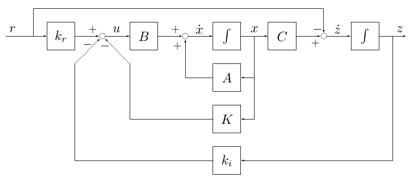
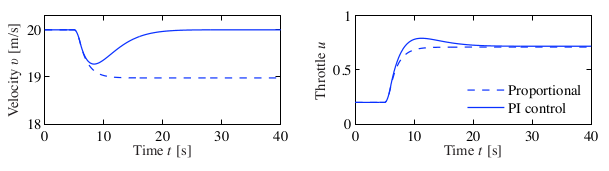
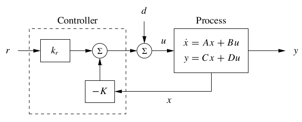
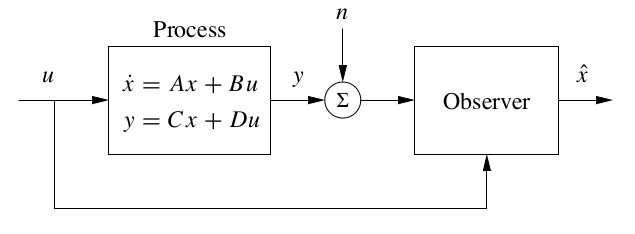
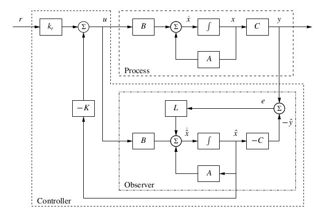
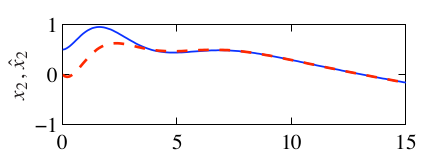
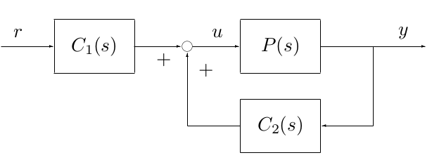
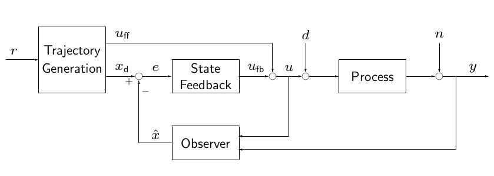

# Lecture 6

Sometimes the measurement has noise and then if we take the derivative then it has a lot more noise. We could take an estimate of the measurement which still has noise but it has way fewer noise than the previous one.

In Kalman filter you want to make the best estimate of the state based in the current system with noise. 

## Similarity tranformation

Consider system
$$
\dot{x}(t) = Ax(t) + Bu(t)
$$
and a similarity transformation $z(t) = Tx(s)$ to obtain
$$
\dot{z}(t) = \tilde{A}z(t) + \tilde{B}u(t)
$$
Transformation:
$$
\begin{alignedat}{2}
\tilde{A} &= TAT^{-1} \qquad& \tilde{B} &= TB \\
\tilde{C} &= CT^{-1}  & \tilde{D} &= D
\end{alignedat}
$$
Inverse transformation
$$
\begin{alignedat}{2}
A &= T^{-1}\tilde{A}T \qquad & B &= T^{-1}\tilde{B} \\
C &= \tilde{C}T & D &= \tilde{D}
\end{alignedat}
$$
Use to bring system in:

- Diagonal form
- Jordan form
- Reachable canonical form
- Observable canonical form

### Similarity transformation 1

Consider system
$$
\dot{x}(t) = Ax(t) + Bu(t)
$$
and a similarity transformation $z(t) = Tx(s)$ to obtain
$$
\dot{z}(t) = \tilde{A}z(t) + \tilde{B}u(t)
$$
Let
$$
\begin{aligned}
W_r &= \begin{bmatrix}
B & AB & \cdots & A^{n-1}B
\end{bmatrix} \\
\tilde{W}_r &= \begin{bmatrix}
\tilde{B} & \tilde{A}\tilde{B} & \dots \tilde{A}^{n-1}\tilde{B}
\end{bmatrix}
\end{aligned}
$$
Then
$$
T = \tilde{W}_rW_r^{-1}
$$

### Similarity transformation 2

Consider system
$$
\dot{x}(t) = Ax(t) + Bu(t),\quad y(t) = Cx(t) + Du(t)
$$
and a similarity transformation $z(t) = Tx(s)$ to obtain
$$
\dot{z}(t) = \tilde{A}z(t) + \tilde{B}u(t),\quad y(t) = \tilde{C}z(t)+\tilde{D}u(t)
$$
Let
$$
W_o = \begin{bmatrix}
C \\ CA \\ \vdots \\ CA^{n-1}
\end{bmatrix}\qquad \tilde{W}_o = \begin{bmatrix}
\tilde{C} \\ \tilde{C}\tilde{A} \\ \vdots \\ \tilde{C}\tilde{A}^{n-1}
\end{bmatrix}
$$
Then
$$
T = \tilde{W}_o^{-1}W_o
$$

> ***
>
> **EXAMPLE**:
> $$
> \dot{x}(t) = Ax(t) + Bu(t)
> $$
> with
> $$
> A = \left[\begin{array}{rr}
> 1 & 1& \\ -4 & -3
> \end{array}\right],\quad 
> B = \left[\begin{array}{r}
> -1 \\ 3
> \end{array}\right]
> $$
> and a similarity transformation $z(t) = Tx(t)$ to obtain the Jordan form
> $$
> \dot{z}(t) = \tilde{A}z(t) + \tilde{B}u(t)
> $$
> with
> $$
> A = \left[\begin{array}{rr}
> -1 & 1& \\ 0 & -1
> \end{array}\right],\quad 
> B = \left[\begin{array}{r}
> 1 \\ 1
> \end{array}\right]
> $$
> We derive
> $$
> \begin{aligned}
> T &= \tilde{W}_rW^{-1}_r \\
> &= \left[\begin{array}{rr}
> 1 & 0 \\ 1 & -1
> \end{array}\right]\left[\begin{array}{rr}
> -1 & 2 \\ 3 & -5
> \end{array}\right]^{-1} \\
> &= \left[\begin{array}{rr}
> 5 & 2 \\ 2 & 1
> \end{array}\right]
> \end{aligned}
> $$
> and so
> $$
> T^{-1} = \left[\begin{array}{rr}
> 1 & -2 \\ -2 & 5
> \end{array}\right]
> $$
> Now we find:
> $$
> \tilde{A} = TAT^{-1}\qquad \tilde{B} = TB
> $$
>
> ***

## Integral Feedback

_Book 6.4_

- Recall that
  - We used $k_r$ to achieve desired steady-state
  - State feedback is very effective, provided that
    1. Model is _perfectly known_
    2. _No disturbance is present_
- Objective of _integral feedback_
  1. Provide zero steady-state error
  2. Achieve robustness
- Introduce new state, a signal $z(t) = \int_0^t(y(\tau)-r)d\tau$
- Motivatio: stable behaviour of $z$ in steady-state yields $y \equiv r$

$$
\dot{z}(t) = y(t) - r
$$

- $r$: Tracking error

- For model

$$
\dot{x} = Ax + Bu
$$

design
$$
u = -Kx + k_rr - k_iz
$$
based on
$$
\dot{z}=y-r = Cx - r
$$

- Obtain

$$
x_e = -(A-BK)^{-1}B(k_rr - k_iz_e)
$$

where
$$
z_e: \dot{z} = y-r=0
$$

$$
\begin{bmatrix}
\dot{x} \\ \dot{z}
\end{bmatrix} = \begin{bmatrix}
A - BK & -Bk_i \\ C & 0
\end{bmatrix}\begin{bmatrix}
x \\ z
\end{bmatrix} + \begin{bmatrix}
Bk_r \\ -1
\end{bmatrix}r
$$

{width=75%}

> ***
>
> **EXAMPLE**: Cruise control
>
> - Consider: $\dot{x}=ax -b_g\theta+bu,\quad y=x$ ($a$, $b_g$, $b$ constants) where $x=$ speed error, $\theta =$ road angle, $\nu_r =$ desired speed
>
> $$
> \frac{d}{dt}\begin{bmatrix}x\\z\end{bmatrix} =
> \begin{bmatrix}
> a & 0 \\ 1 & 0
> \end{bmatrix}\begin{bmatrix}x\\z\end{bmatrix} +
> \begin{bmatrix}b \\ 0\end{bmatrix}u +
> \begin{bmatrix}-b_g \\ 0\end{bmatrix}\theta +
> \begin{bmatrix}0 \\ -\nu_r\end{bmatrix}
> $$
>
> - Controller will be $u=-k_px -k_iz +k_r\nu_r,\quad \dot{z}=y-\nu_r$
>
> 
>
> ***

## Control using estimated state (Separation Principle)

_Book 7.3_

- Recall topic of _stabilization by state feedback_
  - Design: $u=-Kx +k_rr$
  - Objective: select $K$ so that closed loop has assigned characteristic polynomial $\implies$ eigenvalue assignment (pole placement)

{width=60%}

- Now assume that not all the variables are observed: introduce _observer_
  - Error dynamics: $\frac{d\tilde{x}}{dt} = (A - LC)\tilde{x}$
  - Objective: select $L$ so that closed loop has assigned characteristic polynomial $\implies$ eigenvalue assignment (pole placement)

{width=60%}

- Now, consider the following objective: _stabilization by output feedback_
- Design $u=-K\hat{x} +k_rr$ (notice difference with $u=-Kx +k_rr$)
- Consider model with state $(x,\hat{x})^T$. Assume there is no noise

{width=75%}

-  Choose new state: $x_{\textsf{new}} = \begin{bmatrix}x \\ \hat{x}\end{bmatrix}=\begin{bmatrix}x \\ \hat{x} - x\end{bmatrix}$
- Closed-loop system

$$
\frac{d}{dt}\begin{bmatrix}x \\ \hat{x}\end{bmatrix} = 
\begin{bmatrix}
A - BK & BK \\ 0 & A-LC
\end{bmatrix}\begin{bmatrix}x \\ \tilde{x}\end{bmatrix} +
\begin{bmatrix}
Bk_r \\ 0
\end{bmatrix}r
$$

- Objective: (same as above) select $K$ so that closed loop has assigned characteristic polynomial
- Consider characteristic polynomial of closed-loop system:

$$
\lambda(s) = \det(sI - A + BK)\det(sI-A+LC)
$$

- Characteristic polynomial can be _decoupled_
- Characteristic polynomial can be assigned arbitrary roots if
  1. $(A,B)$ is controllable
  2. $(A,C)$ is observable
- **Separation principle**: Eigenvalue assignment for output feedback can be nearly _split_ into two separate problems:
  1. Eigenvalue assignment for state feedback
  2. Eigenvalue asisgnment for observer
- Internal model principle

> ***
>
> **EXAMPLE**:
>
> - Consider 2-d control-dependent model, where
>
> $$
> A = \begin{bmatrix}0 & 1\\ 0 & 0\end{bmatrix},\quad
>  B = \begin{bmatrix}\gamma \\1 \end{bmatrix},\quad 
>  C = \begin{bmatrix}1 & 0\end{bmatrix}
> $$
>
> - Controller design:
>
> $$
> s^2 + p_{c,1}s + p_{c,2} = s^2 + 2\zeta_c\omega_cs + \omega_c^2
> $$
>
> This leads to
> $$
> K = \begin{bmatrix}k_1 & k_2\end{bmatrix} = \begin{bmatrix}\omega_c^2 2\zeta_c\omega_c - \gamma\omega_c^2\end{bmatrix}
> $$
> Observer design:
> $$
> s^2 + p_{o,1}s+p_{o,2}=s^2 + 2\zeta_o\omega_o + \omega_o^2
> $$
> This leads to
> $$
> L = \begin{bmatrix}l_1 \\ l_2\end{bmatrix} = \begin{bmatrix}2\zeta_o\omega_o \\ \omega_o^2\end{bmatrix}
> $$
> Let us combine the observer with the state feedback
> $$
> \begin{aligned}
> \dot{\hat{x}} &= A\hat{x} + Bu + L(y-C\hat{x}) \\
> u &= -K\hat{x} +k_rr \\
> \implies \dot{\hat{x}} &= (A-BK-LC)\hat{x} + Ly + Bk_rr
> \end{aligned}
> $$
>
> - Inputs: $y,r$; output $u$
>
> {width=60%}
>
> ***

## Controller structure

From the figure we derive:
$$
\begin{aligned}
\dot{\hat{x}} &= A\hat{x} + Bu+Le \\
u &= -K\hat{x} + k_rr \\
e &= -C\hat{x} + y
\end{aligned}
$$
this results in controller state space representation:
$$
\begin{aligned}
\dot{\hat{x}} &= (A-BK-LC)\hat{x} + Bk_rr + Ly \\
u&= -K\hat{x} + k_rr
\end{aligned}
$$
{width=60%}

We derive the transfer functions:
$$
\begin{aligned}
C_1(s) &= -K(sI -A+BK+LC)^{-1}Bk_rr+k_r \\
C_2(s) &= -K(sI-A+BK+LC)^{-1}L
\end{aligned}
$$

### A general controller structure

_Book 7.5_

- Conisder **Proces**
  - Input signal $u(t)$
  - Output signal $y(t)$
  - Input disturbance signal $d(t)$
  - Output disturbance signal $n(t)$
- First step: **Trajectory generator**
  - Computes input signal $u_{ff}$ such that $y\approx r$
  - Computes corresponding state $x_d$
- Second step: **Observer**
  - Build observer to reconstruct state $\hat{x}$
- Third step: **State feedback**
  - Build state feedback to handle disturbance and model mismatch

{width=75%}

