# Lecture 7

## Kalman decomposition

_Book 7.5_

Two fundamental system properties: $reachability$ and $observability$

**Case 1: distinct eigenvalues**

Introduce simimlarity transformation such that the system becomes:
$$
\begin{aligned}
\dot{x}(t) &= \begin{bmatrix}
A_{ro} & 0 & 0 & 0 \\
0 & A_{r\bar{o}} & 0 & 0 \\
0 & 0 & A_{\bar{r}o} & 0 \\
0 & 0 & 0 & A_{\overline{ro}}
\end{bmatrix}x(t) + \begin{bmatrix}
B_{ro} \\ B_{r\bar{o}} \\ 0 \\ 0
\end{bmatrix}u(t) \\
y(t) &= \begin{bmatrix}
C_{ro} & 0 & C_{\overline{ro}} & 0
\end{bmatrix}x(t) + Du(t)
\end{aligned}
$$

**Case 2: General case**

Introduce similarity transformation such that the system becomes:
$$
\begin{aligned}
\dot{x}(t) &= \begin{bmatrix}
A_{ro} & 0 & * & 0 \\
* & A_{r\bar{o}} & * & * \\
0 & 0 & A_{\bar{r}o} & 0 \\
0 & 0 & * & A_{\overline{ro}}
\end{bmatrix}x(t) + \begin{bmatrix}
B_{ro} \\ B_{r\bar{o}} \\ 0 \\ 0
\end{bmatrix}u(t) \\
y(t) &= \begin{bmatrix}
C_{ro} & 0 & C_{\overline{ro}} & 0
\end{bmatrix}x(t) + Du(t)
\end{aligned}
$$

## Sensitivity Functions

_Book 11.1_

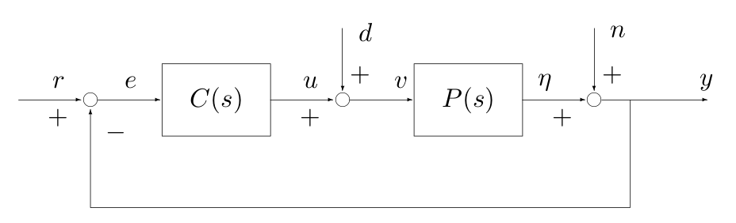{width=75%}

We introduce the loop transfer function
$$
L(s) = P(s)C(s)
$$
which is the transfer function obtained by breaking the feedback loop
$$
\begin{bmatrix}
y \\ \eta \\ v \\ u \\ e
\end{bmatrix} = \begin{bmatrix}
\frac{PC}{1+PC} & \frac{P}{1+PC} & \frac{1}{1+PC} \\
\frac{PC}{1+PC} & \frac{P}{1+PC} & \frac{-PC}{1+PC} \\
\frac{C}{1+PC} & \frac{1}{1+PC} & \frac{-C}{1+PC} \\
\frac{C}{1+PC} & \frac{-PC}{1+PC} & \frac{-C}{1+PC} \\
\frac{1}{1+PC} & \frac{-P}{1+PC} & \frac{-1}{1+PC} \\
\end{bmatrix}\begin{bmatrix}
r \\ d \\ n
\end{bmatrix}
$$

- Sensitivity function $S=\frac{1}{1+PC}$
- Complementary sensitivity function: $T=\frac{PC}{1+PC}$

$$
S+T = 1
$$

- Load sensitivity function: $\frac{P}{1+PC}$
- Noise sensitivity function: $\frac{C}{1+PC}$

Note that:
$$
e = S(s)\Big(r - P(s)d - n\Big)
$$
minimizing sensitivity $\implies$ minimizing tracking error

> Sensitivity improvements in one frequency range must be paid for with sensitivity deteriorations in another frequency range, and the price is higher if the plant is open-loop unstable. This applies to every controller, no matter how it was designet.
>
> Gunter Stein in the inaugural IEEE Bode Lecture, 1989

## Robust stability and performance

_Book 12_

> No mathematical system can exactly model a physical system. Be aware of how modeling uncertainty affects performance.
>
> Doyle, Francis & Tannenbaum (1990)

Compare open-loop and closed-loop begavior

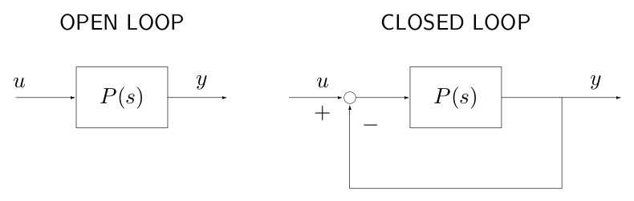{width=75%}

- Small difference in open-loop $\implies$ Small difference in closed-loop
- Large difference in open-loop $\implies$ Large difference in closed-loop

> ***
>
> **EXAMPLE** Influence of modelling uncertainty
>
> Similar in open loop but large differences in closed loop::
> $$
> P_1(s) = \frac{100}{s+1}\qquad P_2(s) = \frac{100}{(s+1)(0.025s+1)^2}
> $$
> 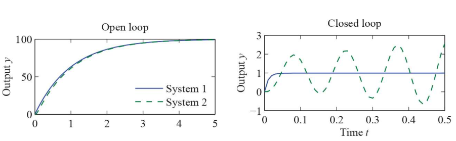{width=75%}
>
> Because there's a small error then the it oscillates
>
> ***

> ***
>
> **EXAMPLE**
>
> Large differences in open loop but similar in closed loop
> $$
> P_1(s) = \frac{100}{s+1}\qquad P_2(s) = \frac{100}{s-1}
> $$
> 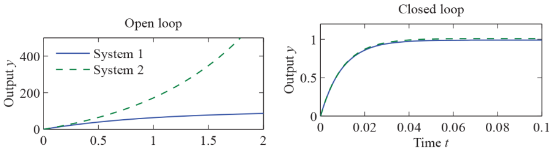{width=75%}
>
> System 2 is unstable while system 1 is stable. However when adding the closed loop both systems behave the same. 
>
> ***

## Modeling uncertainty

Two forms of model uncertainty

- Parameter uncertainty: the system is prepared just in case it changes a bit. For example a plane where the weight changes due to fuel consumption

$$
P(s) = \frac{1}{s+3}\qquad ,\qquad P_{true}(s) = \frac{1}{s+3.1}
$$

- Unmodeled dynamics: there's always some dynamics that we don't know about

$$
P(s)=\frac{1}{s+3}\qquad,\qquad P_{true}(s)=\frac{1}{(s+3)(0.01s + 1)}
$$

### Unmodeled dynamics

$$
\Delta(s) = \delta(s)P(s)
$$

**Additive uncertainty**

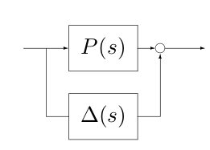{width=50%}

$$
\begin{gathered}
P_{true}(s) = P(s) + \Delta (s) \\
\Delta (s) = P_{true}(s) - P(s)
\end{gathered}
$$

**Multiplicative uncertainty**

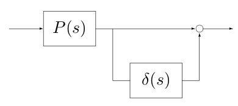{width=50%}

$$
\begin{gathered}
P_{true}(s) = P(s)\Big(1 + \delta(s) \Big) \\
\delta(s) = \frac{P_{true}(s) - P(s)}{P(s)}
\end{gathered}
$$

### Reca: Nyquist plot

_Book 9.2_

It is the curve $L(j\omega)$ in the complex plane parametrized by $\omega$

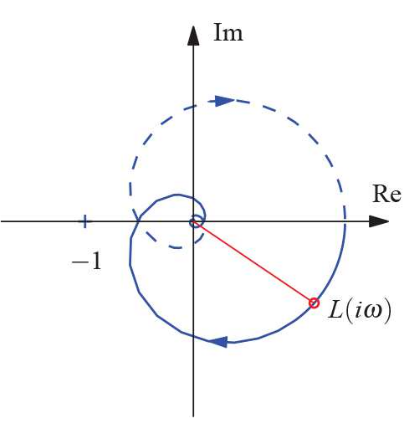{width=50%}

### Stability Margins

The distance from $L$ from the point $-1$ is a measure of stability and damping. Important margins are:

- $\phi_m =$ Phase margin (OK is $45^o-60^o$)
- $g_m=$ Gain margin (OK is $4-6=12-16$ dB)
- $s_m=$ Vector stability margin (also just _stability margin_)

- Study of robustness properties of stability

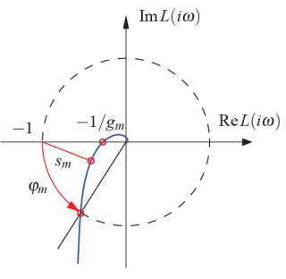{width=50%}

## Stability in the presence of uncertainty

_Book 12.2_

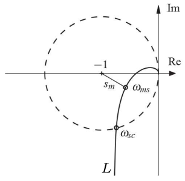{width=50%}

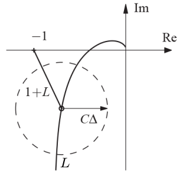{width=50%}

$$
1 + L_{true} = 1+P_{true}C = 1+(P+\Delta)C = 1+L+C\Delta
$$
Condition for robust stability:
$$
|C(i\omega)\Delta(i\omega)|<|1+L(\omega)|\quad,\quad \forall\omega \ge 0
$$
or
$$
|\Delta(i\omega)|| < \left|\frac{1+L(i\omega)}{C(i\omega)}\right|\quad,\quad \forall\omega\ge 0 
$$
Condition for robust stability (multiplicative uncertainty)
$$
|\delta(i\omega)| = \left|\frac{\Delta(i\omega)}{P(i\omega)}\right|<\left|\frac{1+L(i\omega)}{P(i\omega)C(i\omega)}\right|=\left|\frac{1}{T(i\omega)}\right|\quad,\quad\forall\omega\ge 0
$$
Infinity norm:
$$
||H||_{\infty} = \sup_{\omega}|H(i\omega)|
$$
Condition for robust stability (additive uncertainty)
$$
|C(i\omega)\Delta(i\omega)|<|1+L(\omega)|\quad,\quad \forall\omega \ge 0 \implies ||\Delta CS||_\infty < 1
$$
Condition for robust stability (multiplicative uncertainty)
$$
|\delta(i\omega)| = \left|\frac{\Delta(i\omega)}{P(i\omega)}\right|<\left|\frac{1+L(i\omega)}{P(i\omega)C(i\omega)}\right|=\left|\frac{1}{T(i\omega)}\right|\quad,\quad\forall\omega\ge 0 \implies ||\delta T||_\infty < 1
$$

## Performance in the presence of uncertainty

_Book 12.3_

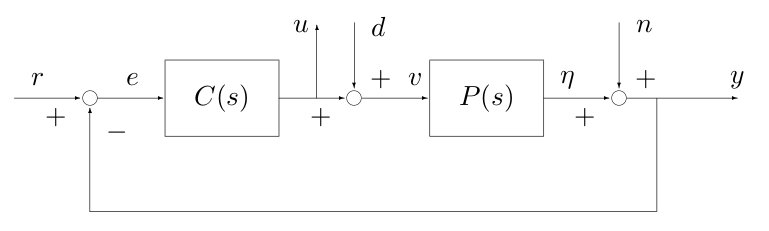{width=75%}

- **Load disturbance**:

$$
G_{yd} = \frac{P}{1+PC}
$$

- **Noise sensitivity**:

$$
G_{un} = \frac{-C}{1+PC}
$$

- **Reference tracking**:

$$
G_{yr} = \frac{PC}{1+PC} = T
$$

### Load disturbance

$$
G_{yd} = \frac{P}{1+PC}
$$

Influence of small variation of $P$ can be studied by:
$$
\frac{d\ G_{yd}}{dP} = \frac{d}{dP}\left(\frac{P}{1+PC}\right) = \frac{1}{(1+PC)^2} = \frac{SP}{P(1+PC)} = S\frac{G_{yd}}{P}
$$
This means that
$$
\frac{d\ G_{yd}}{G_{yd}} = S \frac{d\ P}{P}
$$
Response on load disturbance is not sensitive to process change if $|S|$ is small 

### Noise sensitivity

$$
G_{un} = \frac{-C}{1+PC}
$$

Influence of small variation of $P$ can be studied by
$$
\frac{d\ G_{un}}{d\ P} = \frac{d}{dP}\left(\frac{-C}{1+PC}\right) = \frac{C}{(1+PC)^2}C = -T\frac{G_{un}}{P}
$$
This means that
$$
\frac{d\ G_{un}}{G_{un}} = -T\frac{d\ P}{P}
$$
Input response on measurement noise is not sensitive to process change if $|T|$ is small

  

