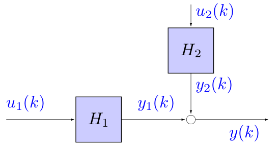
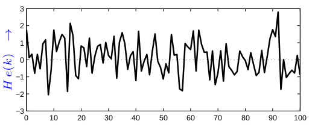
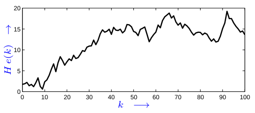
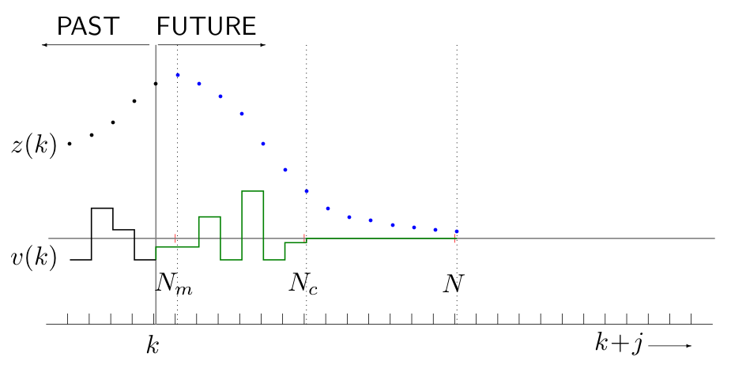

# Model Predictive Control 1

It came up around 30 years ago. It is the most advanced method that it is used. The main difference is that we are going to work in **discrete time**.

## Some properties of discrete time systems

- State space model

$$
\begin{aligned}
\frac{dx(t)}{dt} &= Ax(t) + Bu(t) \rightarrow & x(k + 1) &= Ax(k) + Bu(k) \\
y(t) &= Cx(t) + Du(t) \rightarrow & y(k) &= Cx(k) + Du(k)
\end{aligned}
$$

- Operators

$$
Sx(t) = \frac{dx(t)}{dt} \rightarrow qx(k) = x(k+1)
$$

- Transfer function: we use $z$ (from $z$-transform) instead of $s$

$$
H(s) = C(sI - A)^{-1}B+D \rightarrow H(z)=C(zI-A)^{-1}B+D
$$

***

- Consider two systems with common $A$ and $C$ matrices:

  - $H_1$

  $$
  \begin{aligned}
  x_1(k+1) &= Ax_1(k) + B_1u_1(k) \\
  y_1(k) &= Cx_1(k) + D_1u_1(k)
  \end{aligned}
  $$

  - $H_2$

  $$
  \begin{aligned}
  x_2(k+1) &= Ax_1(k) + B_2u_2(k) \\
  y_2(k) &= Cx_2(k) + D_2u_2(k)
  \end{aligned}
  $$

- Connect the systems

$$
y(k) = y_1(k) + y_2(k)
$$

- New system becomes:

$$
\begin{aligned}
x(k+1) &= Ax(k) + B_1u_1(k) + B_2u_2(k) \\
y(k) &= Cx(k) + D_1u_1(k) + D_2u_2(k)
\end{aligned}
$$

{width=50%}

## Introduction

### Model Predictive Control

- Enormous challenge for industry
  - Tighter product quality specifications
  - Increasing productivity demands
  - Fast changes in the economical market

> Model Predictive Control (MPC) is able to respond in an effective way to these demands

- MPC is more a methodology, not a single technique. Difference in translation into a mathematical formulation
  - Model Predictive Control (MPC)
  - Model Based Predictive Control (MBPC)
  - Receding Horizon Control (RHC)
  - Moving Horizon Control (MHC)

### Ingredients of MPC

- Five ingredients are recognisable
  - Process + disturbance model
  - Performance index
  - Constraint handling
  - Optimisation
  - Receding horizon principle
- Theory
  - Analysis is difficult
- Practice
  - Accurate tuning for stability and robustness

### History of MPC

- Pioneered by Richalet (1979) and Cutler & Ramaker (1979)
- Well accepted by industry
  - MPC can handle multivariate processes with
    - Large time-delays
    - Non-minimum-phase
    - Unstable poles
  - MPC can handle constraints
  - MPC can handle structure changes and actuator failures
- Academic interest
  - Self-tuning control & Minimum Variance control
  - Generalised Predictive Control (GPC)
- Many successful applications have been reported

## Basics of Model Predictive Control

### Process and disturbance model

The models applied in MPC serve two purposes:

- Prediction of the behaviour of the future output of the process on the basis of inputs and known disturbances applied to the process in the past
- Calculation of the input signal to the process that minimises the given objective function

These models are not necessarily the same

Two types of IO models are applied

- Direct Input-Output models (IO models) in which the input signal is directly applied to the model
- Increment Input-Output models (IIO models) in which the increments of the input signal are applied to the model instead of the input directly

Model assumptions (for this course):

- Linear
- Time-invariant
- Discrete time
- Causal
- Finite order
- State space description

#### Input-output (IO) Model

$$
y(k) = G_o(q)u(k)
$$

where
$$
G_o(q) = \text{strictly proper plant model}
$$
State space description:
$$
\begin{aligned}
x_o (k+1) &= A_ox_o(k) + B_ou(k) \\
y(k) &= C_ox_o
\end{aligned}
$$

#### Increment-input-output (IIO) Model

$$
y(k) = G_i(q)\Delta u(k)
$$

where
$$
\begin{aligned}
\Delta u(k) &= \Delta(q) u(k)=u(k)-u(k-1) \\
\Delta(q) &= (1 - q^{-1}) \\
G_i(q) &= \text{strictly proper plant model}
\end{aligned}
$$
State space description:
$$
\begin{aligned}
x_i(k+1) &= A_ix_i(k) + B_i\Delta u(k) \\
y(k) &= C_ix_i(k)
\end{aligned}
$$

- It's like having an **integrator** in your system

#### Standard model

Since we have two types of models we want to use a more general model so instead of $u(k)$ and $\Delta u(k)$ we are going to use a $v(k)$. We can transform both models into a standard model

State space model:
$$
\begin{aligned}
x(k+1) &= Ax(k) + B_1e(k) + B_2w(k) + B_3v(k) \\
y(k) &= Cx(k) + D_{11}e(k) + D_{12}w(k)
\end{aligned}
$$
where:

- $x(k)$ is the state of the system
- $v(k)$ is the input of the system (either $u$ or $\Delta u$)
- $y(k)$ is the output of the system
- $e(k)$ is zero-mean white noise (unmeasurable disturbances)
- $w(k)$ denotes of all known signals (measurable disturbances)

Input-Output relation:
$$
y(k) = H(q)e(k) + F(q)w(k) + G(q)v(k)
$$
Transfer functions:
$$
\begin{aligned}
G(q) &= C(qI - A)^{-1}B_3 \\
F(q) &= C(qI - A)^{-1}B_2 + D_{12} \\
H(q) &= C(qI - A)^{-1}B_1 + D_{11}
\end{aligned}
$$
Noise signal:

- $e(k)$ is ZMWN
- IO-model: $H(q)e(k)$ is zero-mean
- IIO-model: $H(q)e(k)$ is NOT zero-mean, but gives a trend

{width=75%}

{width=75%}

#### Integration in discrete time:

- Continuous

$$
y(t) = \int_{-\infty}^{\infty}h(t - \tau)\cdot u(\tau)d\tau
$$

- Discrete:

$$
y(k) = \sum_{n=-\infty}^{\infty}h(k-n)\cdot u(n)
$$

### Performance index

The MPC controller minimises the standard performance index at time $k$:
$$
J(v,k) = \sum_{j=N_m}^N \hat{z}_1^T(k+j-1|k)\hat{z}_1(k+j-1|k)
+\sum_{j=1}^N\hat{z}_2^T(k+j-1|k)\hat{z}_2(k+j-1|k)
$$
Where $z_1$ reflects tracking error and $z_2$ reflects the control action. Where $\hat{z}_i(k+j-1|k)$ is prediction of $z_i(k+j-1)$ at time $k$.

In MPC literature three performance indices often appear:

- Generalised Predictive Control (GPC) performance index
- Linear Quadratic Predictive Control (LQPC) performance index
- Zone performance index

#### GPC performance index

$$
J(u,k) = \sum_{j=N_m}^N |\hat{y}_p(k+j|k)-r(k+j|k)|^2
+\lambda^2\sum_{j=1}^{N_e}|\Delta u(k+j-1)|^2
$$

where:

- $r(k)$ is the reference trajectory
- $y(k)$ is the process output signal
- $\Delta u(k)$ is the process control increment signal
- $y_p(k) = P(q)y(k)$ is a filter
- $N_m$ is the minimum cost-horizon
- $N$ is the prediction horizon
- $N_c$ is the control horizon. "I will stop controlling in $N_c$ steps ahead"
- $\lambda$ is the weighting on the control signal

#### LQPC performance index

$$
J(u,k) = \sum_{j=N_m}^N |\hat{x}^T(k+j|k)Q\hat{x}(k+j|k)
+\sum_{j=1}^{N}u^T(k+j-1)Ru(k+j-1)
$$

where

- $x(k)$ is the state signal vector
- $u(k)$ is the process control signal
- $Q$ is the state weighting matrix
- $R$ is the control weighting matrix

It's an input-output model since we use $u(k)$ and not $\Delta u(k)$

#### Performance index - GPC $\leftrightarrow$ Standard

Choose:
$$
z(k) = \begin{bmatrix}
z_1(k) \\ z_2(k)
\end{bmatrix} = \begin{bmatrix}
y_p(k+1)-r(k+1) \\ \lambda\Delta u(k)
\end{bmatrix}
$$
Then:
$$
\begin{aligned}
J(k) &= \sum_{j=1}^N \hat{z}_1^T(k+j-1|k)\hat{z}_1(k+j-1|k) + \hat{z}_2^T(k+j-1|k)\hat{z}_2(k+j-1|k) \\
&= \sum_{j=1}^N|\hat{y}_p(k+j|k) - r(k+j|k)|^2 + \lambda^2|\Delta u(k+j-1|k)|^2
\end{aligned}
$$

#### Performance index - LQPC $\leftrightarrow$ Standard

Choose:
$$
z(k) = \begin{bmatrix}z_1(k)\\z_2(k)\end{bmatrix} = 
\begin{bmatrix}
Q^{1/2}x(k+1) \\ R^{1/2}u(k)
\end{bmatrix}
$$
Then:
$$
\begin{aligned}
J(k) &= \sum_{j=1}^N \hat{z}_1^T(k+j-1|k)\hat{z}_1(k+j-1|k) + \hat{z}_2^T(k+j-1|k)\hat{z}_2(k+j-1|k) \\
&= \sum_{j=1}^N \hat{x}^T(k+j|k)Q\hat{x}(k+j|k) + u^T(k+j-1|k)Ru(K+j-1|k)
\end{aligned}
$$

#### Performance index (Minimum cost horizon)

Choose:
$$
\Gamma(j) = \begin{bmatrix}
\Gamma_1(j) & 0 \\ 0 & \Gamma_2(j)
\end{bmatrix} = \begin{cases}
\begin{bmatrix}
0 & 0 \\ 0 & I
\end{bmatrix} & \text{for } 0 \le j < N_m - 1 \\
\begin{bmatrix}
I & 0 \\ 0 & I
\end{bmatrix} & \text{for } N_m - 1 \le j \le N
\end{cases}
$$
Then:
$$
\begin{aligned}
J &= \sum_{j =N_m}^N \hat{z}_1^T(k+j-1|k)\hat{z}_1(k+j-1|k) + \sum_{j=1}^N\hat{z}_2^T(k+j-1|k)\hat{z}_2(k+j-1|k) \\
&= \sum_{j=0}^{N-1}\hat{z}_1^T(k+j|k)\Gamma_1(j)\hat{z}_1(k+j|k) + \hat{z}_2^T(k+j|k)\Gamma_2(j)\hat{z}_2(k+j|k) \\
&= \sum_{j=0}^{N-1}\hat{z}^T(k+j|k)\Gamma(j)\hat{z}(k+j|k)
\end{aligned}
$$
Like in the bicycle example where we first have to go to one side to go to the other one 

### Constraint handling

**Inequality constraints**
$$
\begin{aligned}
u_{min} &\le u(k) \le u_{max} \qquad & \Delta u_{min} &\le \Delta u(k) \le \Delta u_{max} \\
y_{min} &\le y(k) \le y_{max} & x_{min} &\le x(k) \le x_{max}
\end{aligned}
$$
or
$$
\psi \le \Psi(k)\quad \forall k
$$
For future values we use the predicted value of $\psi$
$$
\hat{\psi}(k+j|k) \le \Psi(k+j)\quad \forall j > 0
$$
**Equality constraints**: Motivated by control algorithm itself

- Control horizon constraint: $\Delta u(k+j|k) = 0 \quad \forall j \ge N_c$
- The state end-point constraint: $\hat{x}(k+N|k) = x_{ss}$

or
$$
\phi(k) = 0\quad k \in \kappa
$$
For future values we use the predicted value of $\phi$
$$
A_j\hat{\phi}(k+j|k) = 0\quad \forall j > 0
$$

- Multiple constraints can be combined by stacking
- Two-sided inequality constraint can be translated into two one-sided inequality constraint

#### Structuring the input signal

To obtain tractable optimisation problem. Decrease the degrees of freedom in:
$$
\left\{u(k), u(k+1), \dotsc, u(k+N-1) \right\}
$$

- Control horizon: $N_c$

$$
u(k+j|k) = u(k+N_c-1|k)\quad \forall j \ge N_c
$$

### Optimisation

#### Standard Predictive Control Problem

The MPC controller minimises the following performance index at time $k$:
$$
J(v,k) = \sum_{j=0}^{N-1}\hat{z}^T(k+j|k)\Gamma(j)\hat{z}(k+j|k)
$$
subject to constraints
$$
\begin{aligned}
A_j\hat{\phi}(k+j|k) = 0 &\quad & \forall j \ge 0 \\
\hat{\phi}(k+j|k) \le \Phi(k+j) && \forall j \ge 0
\end{aligned}
$$

An optimisation algorithm will be applied to compute a sequence of future control signals that minimises the performance index subject to the given constraints.

For:

- Linear models
- Linear constraints
- Quadratic (2-norm) performance index

we can use quadratic programming algorithms

For 1-norm or $\infty$-norm performance index: linear programming algorithms

Both types of algorithms are convex and show fast convergence

### Receding horizon principle

- A time $k$: Performance index $J(k)$ is minimised
- First element of optimal control sequence $v(k)$ is applied to the system
- Horizon shifted
- Optimisation restarted for time $k+1$

{width=75%}

