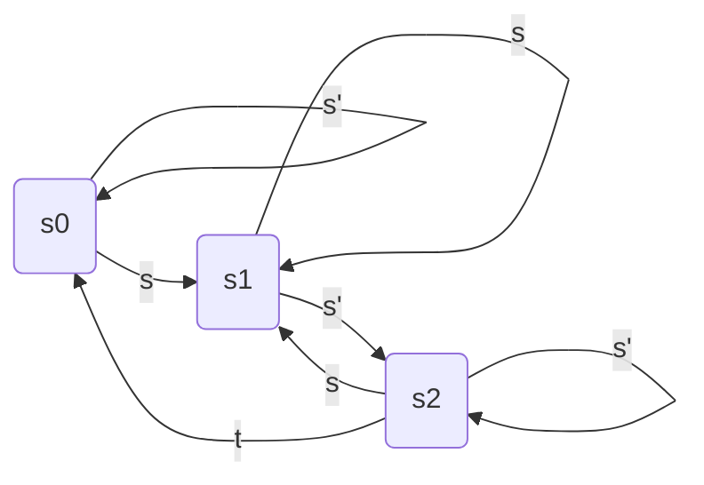
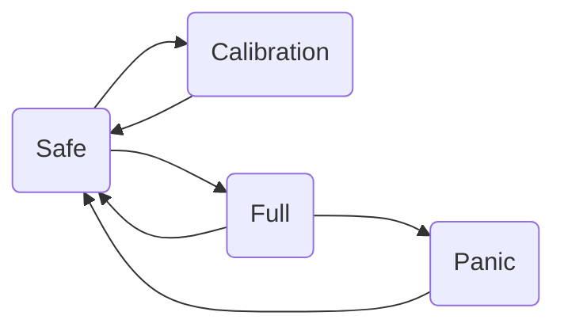

# Lesson 2 - Embedded Software

## Embedded Programming

- More **difficult** than classical programming
    - Interaction with hardware
    - Real-time issues
    - Concurrency
    - Need to understand underlying RTOS principles
    - Event-driven programming (interrupts)
- Lots of (novice) errors

## Specification: Finite State Machine



### Programming State Machines

- Prime design pattern in embedded systems
- Transitions initiated by events
    - Interrupts
    - Polling
- Actions
    - Output
    - Modifying system state

> ***
>
> **EXAMPLE** Code a program in C that reads a text from the standard input stream, line by line, and prints the first word of each line. Words are delimited by spaces.
>
> Solution with a state machine
>
> ```mermaid
> graph LR
>     s0(before)
>     s1(inside)
>     s2(after)
>     s99(done)
> 
>     s0 -->|' ',N| s0
>     s0 -->|A| s1
>     s0 -->|EOF| s99
>     s1 -->|A| s1
>     s1 -->|' '| s2
>     s1 -->|N| s0
>     s2 -->|' ',A| s2
>     s2 -->|N| s0
> 
> 
> ```
>
> **FSM: table-based solution**
>
> ```c
> enum states { before, inside, after} state_t;
> 
> int main(void) {
>     int c;
>     state_t state = before;
>     while ((c = getchar()) != EOF) {
>         // All the magic is in the lookup table
>         edges *edge = &lookup[state, c];
>         edge->action(c);
>         state = edge->next;
>     }
> }
> ```
>
> ***

## Back to quadcopters

### Controller modes

- Manual
- Calibrate
- Control
- Safe
- Panic
- Full control



### Control loop

1. Read sensors
2. Compare with set points
3. Set motor values

### Communication protocol

- PC $\rightarrow$ Drone (send)
    - Periodic: pilot control
    - Ad hoc: mode changing, param tuning
- Drone $\rightarrow$ PC
    - Periodic; telemetry (for visualization)
    - Ad hoc: logging (for post-mortem analysis)
- Packet layout
    - Start/stop byte(s)
    - Header, footer?
    - Fixed/variable length
- Message types
    - Values
    - Frequency
- With wireless communications **bits can get corrupted** 

## System architecture

