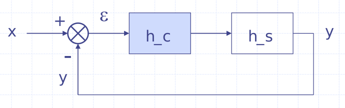
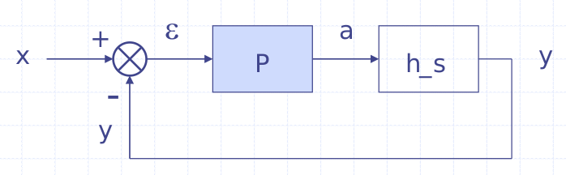
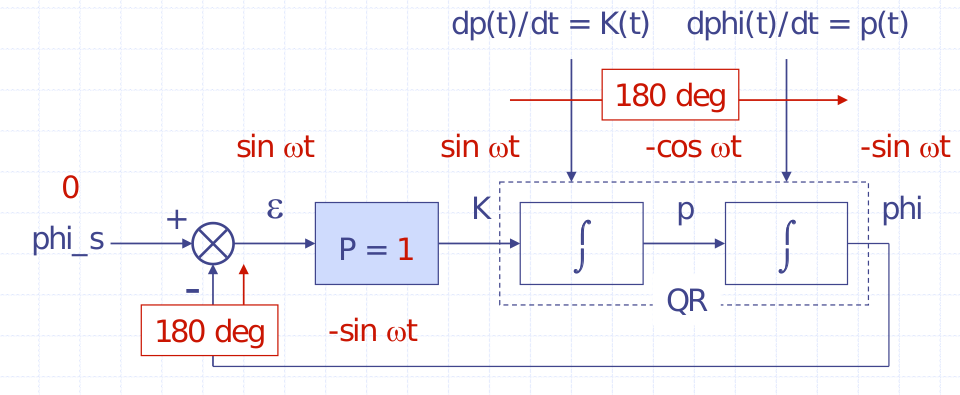

# Lesson 3 - Control theory

### Control is Everywhere

Feedback loops make systems predictable

### Cruise Control

We want to control the speed and we know that some variables are related

- $e$: Enable $\{0, 1\}$
- $T$: Throttle $[\%]$
- $F$: Thrust $[N]$
- $v$: Velocity $[m/s]$
- $V_{setp}$: setpoint
- $V_{meas}$: measured
- $V_{vehicle}$: actual

## Part I: Feedback Control

### Feedback Control Loop

There's a transfer function. 

- Controller function $T = h_c(\varepsilon)$
- **OBJECTIVE**: Adjust $T$ such that $\varepsilon \rightarrow 0$ 

### Standard Loop Format

{width=75%}

- $h_c$: Controller
- $h_s$: System

### Proportional Control

$$
\begin{aligned}
h_c(\varepsilon) &= P \cdot \varepsilon \\
h_s(a) &= c \cdot a
\end{aligned}
$$

$$
\left.\begin{aligned}
\varepsilon &= x - y \\
a &= P(x - y) \\
y &= cP(x - y) \\
\end{aligned}\right\} \implies
y = \frac{cP}{1 + cP}
$$

## Part II: Blessings of Feedback

- High Loop Gain:
    - More Robustness
    - More Linearity
    - More Speed

### More Robustness

A change in a 10% in the system $h_s$ is only represented by a change of 0.2% in $y$

### More Linearity

Suppose $h_s$ is a non-linear function, then the system assumes linearity and, since is trying to get $\varepsilon$ to 0 then $y$ ends up being linear with $x$.

### More Speed

> ***
>
> **EXAMPLE**: Vehicle response
> $$
> 10 \frac{dv(t)}{dt} + v(t) = T(t)
> $$
> Let $T(t)=1 \implies v(t)=1 - \exp(-\frac{t}{10})$ 
>
> ***

## Part III: Harnessing Feedback

- Instability problem
- Classical Control Theory

### Loop Gain Limitations

_Problem_: $P$ should be infinite for control error to become zero. In practice, loop gain must be limited for stability.

> ***
>
> **EXAMPLE 1**: Integrator systems. We want to control the roll angle from the QuadCopter
>
> - $\varphi = 0$: Angle objective
>
> 
> $$
> \int K(t)\ dt = p(t)
> $$
>
> $$
> \int p(t)\ dt = \varphi(t)
> $$
>
> This has the problem that if somehow there's a sine wave the control loop will not try to prevent the sine wave from existing and the quad-copter will continue to move in a sine wave.
>
> ***

> ***
>
> **EXAMPLE 2**: Time Latency
>
> A 0.5 seconds delay can cause instability with a phase lag of 180 degrees at 1 Hz.
>
> ***

