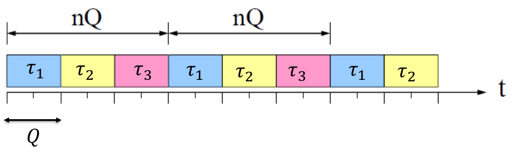
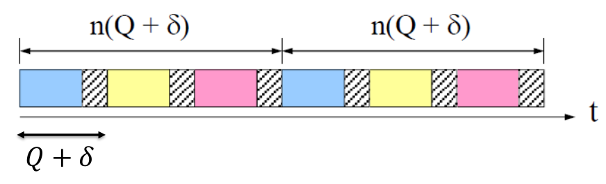

# Lesson 3 - Online Scheduling of Aperiodic Tasks

### FIFO: the judgement day

- Disadvantages:
    - Creates non-preemptive schedule
    - Ignores task's deadline and priority
    - Response times heavily depend on the arrival times
    - Low schedulability

- Advantages:
    - Fast
    - Simple implementation
    - Low runtime overhead
    - Wide applicability in network systems

## Scheduling complexity
### Feasibility vs. schedulability

A scheduling algorithm may not be able to schedule all the feasible tasks but only a subset of them. However, two algorithms could schedule the same tasks, so the intersection is possible.

### General scheduling problem
> Given a set $\tau$ of $n$ tasks, a set $P$ of $p$ processors, and a set $R$ of $r$ resources, find an assignment of $P$ and $R$ to $\tau$ that produces a feasible schedule under a set of constraints

The scheduling problem is an NP-Complete problem. So Complexity in the scheduling algorithms is important. Polynomial time algorithms can be found under particular conditions

**Complexity** is a very important factor but there are other factors:

- Runtime
- Hardware platform capabilities
- Memory consumption
- Memory limits
- ...

### Important things about complexity
Different implementations can have different runtime but similar complexity

- _Addition_ operation is usually faster than multiplication
- _Integer_ operations are usually faster thant floating-point operations
- Different implementations can have different runtime but similar complexity
- Runtime can also depend on how the hardware platform executes it

## Online scheduling policies and their properties

### Work-conserving vs non-work-conserving

- **Work conserving**: Does not leave the processor **idgle** as long as there is a ready task in the system
- **Non-work conserving**: May leave the processor **idle** even if there is a ready task in the system

### Static vs dynamic

- **Static**: scheduling decisions are taken based on fixed parameters assigned to tasks before activation
- **Dynamic**: Scheduling decisions are taken based on parameters _that change with time_ like:
    - Execution time
    - Absolute deadline

### Offline vs online

- **Offline**: all scheduling decisions are taken before task activation, the schedule is stored in a table
- **Online**: scheduling decisions are taken at runtime

### Optimal vs heuristic

- **Optimal**: They generate a schedule that minimizes a cost function
- **Non-optimal (heuristic)**: They generate a schedule according to a heuristic function but _there is no guarantee of success_

> ***
> **EXAMPLE**: Optimality criteria
> 
> - Feasibility: Find a feasible schedule if there is one
> - Minimize the maximum lateness
> - Minimize the number of deadline misses
> - Assign a value to each task and maximize the cumulative value of feasible tasks
> 
> ***

## Scheduling algorithms

### Shortest-job-first (SJF)

It selects the ready task with the shortest computation time. 

- Kind of **static** (if $C_i$ is a constant parameter, it is given beforehand to the algorithm)
- It can be used online or offline
- Can be preemptive or non-preemptive
- It minimizes the average response time. $\bar{R}(\sigma_{SJF})$ is the minimum response time achievable by any algorithm.

#### Is SJF suited for Real-Time?

- It is not optimal in the sense of feasibility

### Fixed-priority scheduling

- Each task has a priority $P_i$, typically $P_i \in [0, 255]$. ($P_i < P_j$ means that task $\tau_i$ has higher priority than task $\tau_j$)
- The task with the highest priority is selected for execution
- Tasks with the same priority are served FIFO

- **Problem**: _starvation_, low priority tasks may experience long delays due to preemption

## Round robin

- The ready queue is served with FIFO, but
- Each task $\tau_i$ cannot execute for more than **Q** time units
- When **Q** expires, $\tau_i$ is put again in the queue

However, there are a lot of context switches

### Upper bound on the WCRT of round robin

- $n$ number of tasks in the system

{width=50%}

$$
R_i \le (nQ) \cdot \frac{C_i}{Q} = nC_i
$$

### Upper bound on WCRT of round robin with context switch overhead

- $\delta$ context switch time

{width=50%}

$$
R_i \le n(Q + \delta) \cdot \frac{C_i}{Q} = nC_i \left(\frac{Q + \delta}{Q}\right)
$$

## Multi-level scheduling

Have a high, medium and low priority queue and each queue is scheduled using a different scheduling policy

## Summary

- Complexity matters, but it is not the only thing that matters
- FIFO is fast and simple to implement, but bad at guaranteeing deadlines
- Non-preemptive SJF minimizes the average response of the tasks
- Fixed-priority scheduling may starve low priority tasks
- Round and robing has a large number of preemptions

