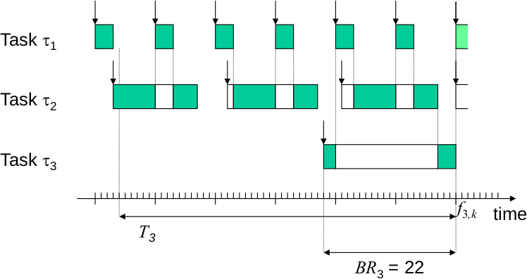

# Lesson 13 - Jitter analysis

What do we call Jitter?

A variation in the system. If you don't know where the variation is coming from we call it random.

### Motivation

- Multi-processor analysis
- $FJ$: **Finalization** jitter, variation in finalization times
- $AJ$: **Activation**, variation in activation times
- When there are some dependence between two tasks

**Example**: multimedia in a networked environment

> ***
> 
> **EXAMPLE**: multiprocessor
> 
> 1. A strictly periodic system event activates task $\tau_1$
> 2. Task $\tau_1$ sends message $\mu_j$
>    - $FJ_j$ causes $AJ_j$
> 3. Message $\mu_j$ triggers task $\tau_k$
>    - $FJ_j$ causes $AJ_k$
> 4. Task $\tau_k$ generates a system response
> 
> $AJ_k$ influences system response and response times of a task $\tau_l$ with a lower priority
> 
> ***

**Goal jitter analysis**:

- Determine schedulability in the context of jitter
- Determine end-to-end response times

## Motivation for Fixed Priority Preemptive Scheduling (FPPS)

- De-facto standard
- Supported by commercial RTOS
- Rate monotonic analysis (RMA)
    - Adopted by leading companines and institutions
    - Usage from simple control applications to large defense and aerospace applications

> ***
> 
> **EXAMPLE**
> 
> Task | Period $T$ | computation time $C$ | Utilization $U$
> -|-|-|-
> $\tau_1$ | 10 | 3 | 0.3
> $\tau_2$ | 19 | 11 | 0.58
> $\tau_3$ | 56 | 5 | 0.09
> 
> - RM priority assignment, with $WD_i = T_i$ and $BD_i = 0$
> - Schedulable?
> $$
> \sum U_i = 0.97 \le 1
> $$
> 
> $$
> HB(n) = \prod_i (U_i + 1) \le 2
> $$
> 
> $$
> HB(3) = 2.05
> $$
> 
> Therefore $HB(3)$ does not hold
> 
> It can be seen that this task is feasible but just exactly.
> 
> ***

### Response times

> ***
> 
> **EXAMPLE**: airbag
> 
> - If the airbag releases too soon or too early it can be fatal
> 
> ***

- Schedulability condition: all jobs of all tasks must meet their deadline constraints
$$
\forall_{i, k, \varphi} BD_i \le R_{i,k}(\varphi) \le WD_i
$$

## Worst-case response times of FPPS

_Book chapter 4_

### Response time analysis

**Calculation**: Recursive equation for task $\tau_i$:

$$
\begin{aligned}
WR_i^{(0)} &= C_i \\
WR_i^{(0)} &= WR_{i - 1} \longrightarrow \text{Optimization} \\
WR_i^{(n)} &= C_i + \sum_{j < i} \left\lceil \frac{WR_i^{(n-1)}}{T_j} \right\rceil \cdot C_j
\end{aligned}
$$

- Assume a task $\tau_j$ with a higher priority than $\tau_i$
    - $\left\lceil \frac{x}{T_j} \right\rceil$ denotes the maximum number of preemptions of task $\tau_i$ in an interval $[0, x)$ by task $\tau_j$
- Intuition
    - LHS: amount of time available
    - RHS: max amount of time requested
- Solution: iterative approach
- Observation
    - Best-case and worst-case notions are duals

## Best-case response times of FPPS

### Introduction
- Formalization
    - Best-case response time $BR_i$ of a periodic task $\tau_i$, where $\varphi$ is the phasing of the task set
$$
BR_i \equiv \inf_{\varphi, k} R_{i, k}(\varphi)
$$

 - Hence:
$$
\forall_{i, k, \varphi} BR_i \le R_{i, k}(\varphi)
$$

- Best-case part of schedulability condition:
$$
\forall i \quad BD_i \le BR_i
$$

- Optimal instant of task $\tau_i : \tau_i$ "assumes" its $BR_i$ incurs the lowest amount of preemption by higher priority tasks

- An optimal instant:
    - Job $\tau_{i, k}$ ends simultaneously with the release of all tasks with a higher priority, and $\tau_{i, k}$'s release time is equal to its start time
    - Specific for each task

### Techniques

#### Calculation

- Recursive calculation for task $\tau_i$:
$$
\begin{aligned}
    BR_i^{(0)} &= WR_i \\
    BR_i^{(l + 1)} &= C_i + \sum_{j < i} \left( \left\lceil \frac{BR_i^{(l)}}{T_j} \right\rceil - 1 \right) \cdot C_j
\end{aligned}
$$

- Assume task $\tau_j$ with a higher priority than $\tau_i$:
    - $\left\lceil \frac{x}{T_j} \right\rceil - 1$ denotes the minimal number of preemptions of task $\tau_i$ in an interval $(0, x)$ by task $\tau_j$
- Intuition
    - LHS: amount of time available (or provided) in $(0, x)$
    - RHS: min amount of time requested in $(0, x)$ by $\tau_i$ and $\forall j < i \tau_j$
- Solution: iterative approach. Stop when $BR_i^{(l+1)} = BR_i^{(n)}$.

> ***
> 
> **EXAMPLE** for task $\tau_3$
> 
> 
> 
> | $C_i$ | $T_i$
> -|-|-
> $\tau_1$ | 3 | 10
> $\tau_2$ | 11 | 19
> $\tau_3$ | 5 | 56
> 
> - Assume $BD_i = 0$
> 
> $$
> \begin{aligned}
> BR_3^{(0)} &= WR_3 = 56 \\
> BR_3^{(1)} &= C_3 + \sum_{j < 3} 
>   \left(\left\lceil \frac{BR_3^{(0)}}{T_j} \right\rceil - 1 \right) C_j = \\
> &= 5 + \left( \left\lceil \frac{56}{10} \right\rceil - 1 \right) \cdot 3
>      + \left( \left\lceil \frac{56}{19} \right\rceil - 1 \right) \cdot 11
>      = 5 + 5 \cdot 3 + 2 \cdot 11 = 42 \\
> BR_3^{(2)} &= 5 
>      + \left( \left\lceil \frac{42}{10} \right\rceil - 1 \right) \cdot 3
>      + \left( \left\lceil \frac{42}{19} \right\rceil - 1 \right) \cdot 11
>      = 5 + 4 \cdot 3 + 2 \cdot 11 = 39 \\
> BR_3^{(3)} &= 5 
>      + \left( \left\lceil \frac{39}{10} \right\rceil - 1 \right) \cdot 3
>      + \left( \left\lceil \frac{39}{19} \right\rceil - 1 \right) \cdot 11
>      = 5 + 3 \cdot 3 + 2 \cdot 11 = 36 \\
> BR_3^{(4)} &= 5 
>      + \left( \left\lceil \frac{36}{10} \right\rceil - 1 \right) \cdot 3
>      + \left( \left\lceil \frac{36}{19} \right\rceil - 1 \right) \cdot 11
>      = 5 + 3 \cdot 3 + 1 \cdot 11 = 25 \\
> BR_3^{(5)} &= 5 
>      + \left( \left\lceil \frac{25}{10} \right\rceil - 1 \right) \cdot 3
>      + \left( \left\lceil \frac{25}{19} \right\rceil - 1 \right) \cdot 11
>      = 5 + 2 \cdot 3 + 1 \cdot 11 = 22 \\
> BR_3^{(6)} &= 5 
>      + \left( \left\lceil \frac{22}{10} \right\rceil - 1 \right) \cdot 3
>      + \left( \left\lceil \frac{22}{19} \right\rceil - 1 \right) \cdot 11
>      = 5 + 2 \cdot 3 + 1 \cdot 11 = 22 \\
> \end{aligned}
> $$
> 
> - Because $BR_3^{(5)} = BR_3^{(6)} = 22 \ge BD_3 = 0, BR_3 = 2$
> 
> ***

## Jitter analysis

Types of (absolute) jitter:

- Activation (or release) jitter $AJ$: variation in activation times
- Response jitter $RJ$: variations in response times
- Finalization (or end) jitter $FJ$: variation in finalization times

> The finalization jitter of the last task is usually the activation jitter of the next task

- Activation jitter $AJ_i$ of a task $\tau_i$
    - Assumption of activation on times:
$$
\varphi_i + k \cdot T_i \le a_{i, k} \le \varphi_i + k \cdot T_i + AJ_i
$$
    - Where $\varphi_i$ denotes the start of the jitter interval

### Response jitter
Response jitter $RJ_i$ of task $\tau_i$

$R_{i,k}$ notation:

- $i \Longrightarrow$ corresponds to task $\tau_i$
- $k \Longrightarrow$ corresponds to job $k$ of task $\tau_i$
$$
RJ_i \equiv \sup_{\varphi, k, l} (R_{i, k}(\varphi) - R_{i,l}(\varphi))
$$

A bound on response jitter:
$$
RJ_i \le WR_i - BR_i
$$

Why is it not equal? When we look at the best case and the worst case we are looking at the critical instant

### Finalization jitter

- Relative finalization time $F_{i, k}$ of a job $\tau_{j,k}$
$$
F_{i,k} \equiv f_{i,k} - (\varphi_i + kT_i)
$$
- Finalization jitter $FJ_i$ of a task $\tau_i$
$$
FJ_i \equiv \sup_{\varphi, k, l} (F_{i, k} (\varphi) - F_{i, l}(\varphi))
$$

### Response and finalization jitter

$$
\begin{aligned}
    WF_i &= AJ_i + WR_i \\
    BF_i &= BR_i \\
    WF_i - BF_i &= AJ_i + WR_i - BR_i \\
    FJ_i &\le AJ_i + WR_i - BR_i
\end{aligned}
$$

### Activation (or release) jitter

- Worst-case response times
    - Critical instant revised
        - Task $\tau_i$ is released simultaneously with all tasks with a higher priority 
        - All tasks with a higher priority experience
          - A maximal release delay at that simultaneous release
          - A minimal release delay at subsequent releases
    - Hence, a _maximal_ preemption of $\tau_i$ occurs
    - Recursive equation for task $\tau_i$
    $$
    WR_i^{(n)} = C_i + \sum_{j < i} \left\lceil \frac{WR_i^{(n-1)} + AJ_j}{T_j}\right\rceil \cdot C_j
    $$
    - Where $AJ_j$ is the activation jitter of $\tau_j$
    - $WR_i$ is the smallest positive solution of the equation
    - Iterative procedure
        - Similar to the case without jitter

> ***
> 
> **EXAMPLE**:
> 
> Task | $T$ | $C$ | $AJ$
> --|--|--|--
> $\tau_1$ | 9 | 3 | 4
> $\tau_2$ | 38 | 11 | 7>
> 
> - $WR_2$ increases 3 due to $AJ_1$
> - $WR_2$ is independent of $AJ_2$
> - $WF_2$ is equal to $AJ_2 + WR_2$
> - $WF_2$ increases 10 due to $AJ_1$ and $AJ_2$
> 
> ***

- Worst-case finalization times
    - $WF_i = AJ_i + WR_i$
- Best-case response times
    - Optimal instant revisited
        - Job $\tau_{i, k}$ ends simultaneously ith the release of all tasks with a higher priority, and $\tau_{i, k}$'s release time is equal to its start time
        - All tasks with a higher priority experience
      - A **maximal** release delay at that simultaneous release
      - A **minimal** release delay at previous releases
    - Hence, a minimal pre-emption of $\tau_i$ occurs
    - Recursive equation for task $\tau_i$
    $$
    BR_i^{(n)} = C_i + \sum_{j <i} \left(\left\lceil \frac{BR_i^{(n - 1)} - AJ_i}{T_j}\right\rceil - 1 \right)^+ \cdot C_i
    $$
    - Where $AJ_i$ is the activation jitter of $\tau_j$, $w^+ = \max\{w, 0\}$
    - $BR_i$ is the largest possible solution of the equation
    - Iterative procedure
        - Similar to the case without jitter
- Best-case finalization times
    - $BF_i = BR_i$

> ***
> **EXERCICE**: Determine the response and finalization jitter
>
> Task | $C_i$ | $T_i$ | $D_i$ | $AJ_i$
> --|--|--|--|--
> $\tau_1$ | 1 | 4 | 2 | 1
> $\tau_2$ | 3 | 6 | 5 | 1
> $\tau_3$ | 3 | 20 | 18 | 2
> 
> $$
> \begin{aligned}
> BR_1 &= C_1 = 1 \\
> WR_1 &= C_1 = 1 \\
> 
> WR_3^{(0)} &= 10 \rightarrow \text{assumption} \\
> WR_3^{(1)} &= 3 + 
>   \left\lceil \frac{10 + 1}{4} \right\rceil\cdot 1 + 
>   \left\lceil \frac{10 + 1}{6} \right\rceil\cdot 3 = 3 + 3 + 6 = 12 \\
> WR_3^{(2)} &= 3 +
>   \left\lceil \frac{12 + 1}{4} \right\rceil\cdot 1 + 
>   \left\lceil \frac{12 + 1}{6} \right\rceil\cdot 3 = 3 + 4 + 9 = 16 \\
> WR_3^{(3)} &= 3 +
>   \left\lceil \frac{16 + 1}{4} \right\rceil\cdot 1 + 
>   \left\lceil \frac{16 + 1}{6} \right\rceil\cdot 3 = 3 + 5 + 9 = 17 \\
> WR_3^{(4)} &= 3 +
>   \left\lceil \frac{17 + 1}{4} \right\rceil\cdot 1 + 
>   \left\lceil \frac{17 + 1}{6} \right\rceil\cdot 3 = 3 + 5 + 9 = 17 \\
> \end{aligned}
> $$
> ***
> 

## Concluding remarks

- Jitter can be reduced by using buffers, changing precedence constraints into data dependency constraints. This, however, may increase latency
- The analysis does not hold for deadlines plus jitter larger than periods, i.e. for $WD_i + AJ_i > T_i$.

