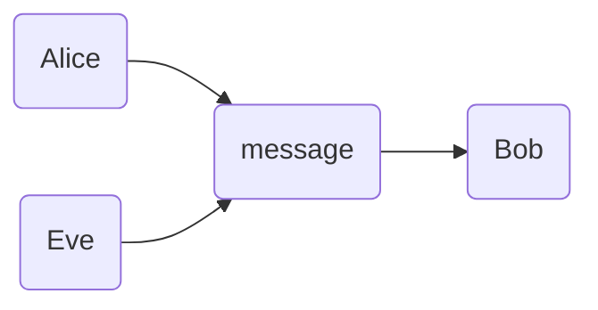

# Lesson 1

## Introduction

### Security is very important

- **Confidentiality**: access to data is limited to authorized parties
- **Integrity** When you receive data you receive the _right_ data
- **Availability**: The data is there when you want it

### Methods of defense

- Prevent it
- Deter it
- Deflect it
- Detect it
- Recover from it

### Defense of computer systems

- Protect hardware/software/data
- Ways to do so:
  - **Cryptography**
  - Software controls
  - Hardware Controls
  - ...

## Cryptography

> "Secret writing" in _Greek_

- **Cryptology**
  - **Cryptography** It's about protecting the content
  - **Cryptanalysis** is about recovering the content

### Objectives

- Protecting data privacy

### Kerkhoff's principle

> The adversary knows all details about a crypto system except the secret key

### Basic idea

Alice and Bob should be able to communicate securely without Eve being able to view the message

# Guest lecture - "The need for security and encryption in Finance"

Leonard Franken - Authority Financial Markets

> Who pays for the risk?

### 

