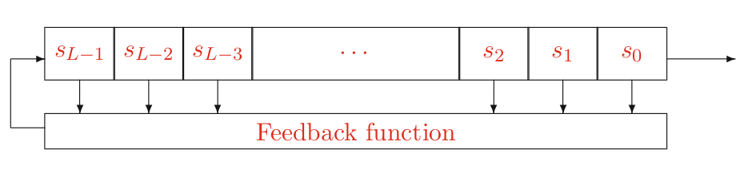
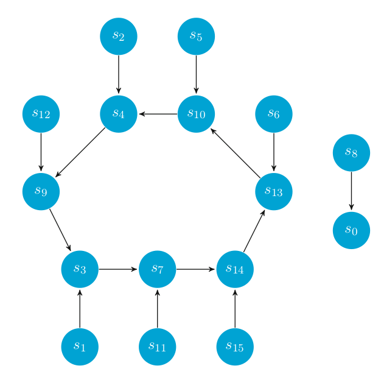
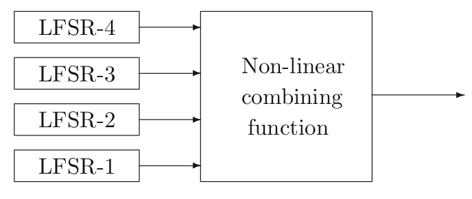
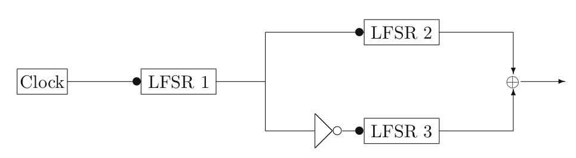
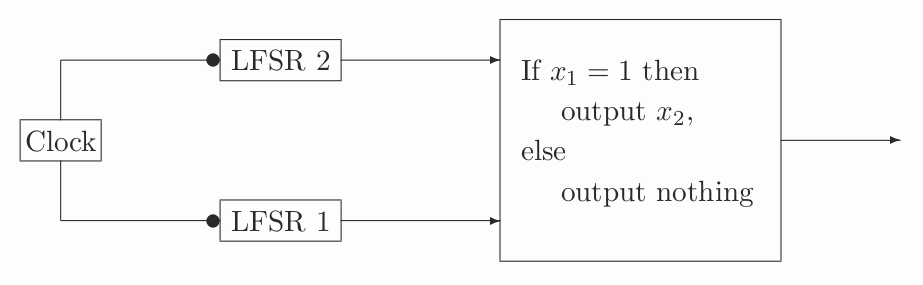
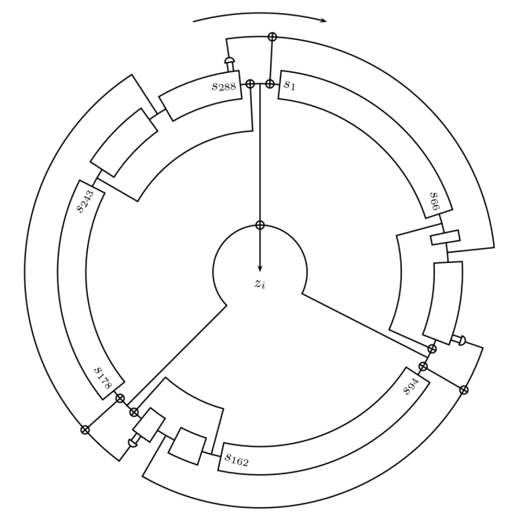

# Lecture 5 - Modern Stream Ciphers

Stream ciphers are important because they use less power. A very simple example is
$$
C = M \oplus K
$$
Delivering a large key is the problem

## Stream Ciphers

- Encrypt bits rather than blocks
- The are fast due to bit operations
  - easy to implement in **hardware** and **software**

### Stream Ciphers from PRFs

- Consider the following stream cipher

$$
c = m \oplus F_k(0)
$$

- This cipher is IND-PASS secure if PRF is secure (See the textbook)
- Then, how are we going to build a secure PRF?

## Linear Feedback Shift Registers (LFSRs)

- For generating a binary stream, we can use feedback shift registers

{width=75}

The registers are single bit registers

### Feedback functions

- **Non-linear**: We would like to have them but they are difficult to design
- **Linear**: We can design more easily and it is easy to determine the period

### Mathematical expression

- Cell is tapped or not: $[c_1, c_2,...,c_L]$
- Initial state of the registers: $[s_{L-1}, ...., s_1,s_0]$
- Output: $[s_0, s_1, ...,s_L,s_{L+1},...]$
- Then for $j\ge L$

$$
s_j = c_1 \cdot s_{j-1} \oplus c_2\cdot s_{j-2} \oplus \cdots \oplus c_L \cdot s_{j-L}
$$

- We need to see a repetition after a certain period, $N$, such that

$$
s_{N+i} = s_i
$$

- $N$ can be maximum $2^L -1$

### Characteristic Polynomial

- Connection polynomial

$$
C(X) = 1 + c_1 \cdot X + c_2 \cdot x^2 + \cdots + c_L \cdot x^L \in \mathbb{F}_2[X]
$$

- Characteristic polynomial

$$
G(X)=X^L \cdot C(1/X)
$$

### Primitive Polynomial

$$
C(X) = 1 + c_1\cdot X + c_2 \cdot x^2 + \cdots + c_L \cdot X^L \in \mathbb{F}_2[X]
$$

- $c_L = 0$, then it is singular
- $c_L=1$, non-singular, there is a period
  - $C(X)$ is irreducible: period smallest $N$ such that $C(X)$ divides $1+X^N$. ($N$ will divide $2^L-1$)

### What does it mean?

> If $N$ is the period, then a characteristic polynomial $f(X)$ is a factor of $1 - x^N$

> ***
>
> **EXAMPLE**:
> $$
> \begin{aligned}
> &m=3,\ p=2^3-1=7\\
> &1 - x^7=(1-x)(1+x+x^3)(1+x^2+x^3)
> \end{aligned}
> $$
>
> - Which one we should **not** use?
>   - $(1 - x)$ because if you don't choose the highest order this polynomial will not be singular
>
> ***

### Period

The initial values are important. Imagine that we have the following polynomial
$$
C(X) = X^3 + X + 1
$$
{width=60%}

- This polynomial is not good because:
  - It is singular
  - Depending on the initial state then $N$ becomes 1

### Security of LFSRs

- With $L$ registers and $2L$ known output bits reveal the connection polynomial
  - First $L$ bits reveal the $s$ values
  - We need to learn the $L$ unknowns: $c$ values

$$
s_j = \sum_{i=1}^L c_i \cdot s_{j-i}
$$

- Therefore, LFSRs are **not secure**

### Linear Complexity

- Linear Complexity
  - $L(s)$ is 0, if $s$ is the zero sequence
  - $L(s)$ is $\infty$ if no LFSR generates $s$
  - $L(s)$ is the length of the shortest LFSR to generate $s$
- Finite set of **n** bits
  - For all $n\ge 1$ we have $0\le L(s^n)\le n$
  - If $s$ is periodic with period $N$ then $L(s) \le N$
  - $L(s \oplus t) \le L(s) + L(t)$

### Combining LFSRs

- Use $n$ LFSRs
- Use the outputs for a **non-linear** combination function

{width=50%}


### Period of a Combination of LSFRs

- There are several functions. E.g.:

$$
f(x_1,x_2,x_3,x_4,x_5) = 1 \oplus x_2 \oplus x_3 \oplus (x_4 \cdot x_5) \oplus (x_1 \cdot x_2 \cdot x_3 \cdot x_5)
$$

- If it is a Boolean function of sums of products, we call it **algebraic normal form**
- Suppose there are $n$ LFSRs with periods $L_1, L_2, ...,L_n$. Then the linear complexity of $f(x_1, x_2, ...,x_n)$ is

$$
f(L_1,...,L_n)
$$

###  Non-linear combiners

- Geffe is not secure (book section 12.3)

#### Alternating-Step Generator

- 3 LFSRs of size $L_1, L_2, L_3$ pairwise co-prime

- Period: $2^{L_1} \cdot (2^{L_2} - 1) \cdot (2^{L_3} - 1)$

- Linear complexity: $(L_2 + L_3) \cdot 2^{L_1}$

  {width=60%}

#### Shrinking Generator

- Period: $(2^{L_2} - 1)\cdot 2^{L_1 - 1}$
- Linear complexity: $L_2 \cdot 2^{L_1}$

{width=60%}

#### Trivium

- Hardware based
- Security unknown

{width=60%}

#### RC4

- Simple
- Broken
- Used for 20 years

```python
i = (i + 1) % 256
j = (j + S[i]) % 256
S[i], S[j] = S[j], S[i]
t = (S[i] + S[j]) % 256
K = S[t]
```

## Summary

- Many modern stream ciphers can be obtained by combining, in a non-linear way, simple bit generators called LSFRs
- LFSR-based stream ciphers are very fast ciphers, suitable for implementation in hardware, to encrypt real-time data such as voice or video. But they need to be augmented with a method to produce a form of non-linear output.
- RC4 provides a fast and compact byte oriented stream cipher for use in software, but it is **no longer considered secure**.