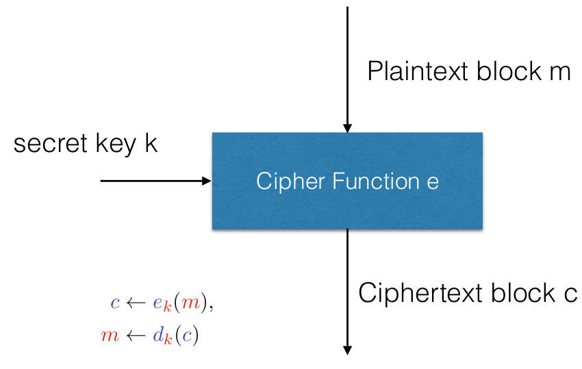
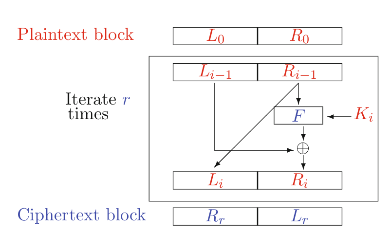
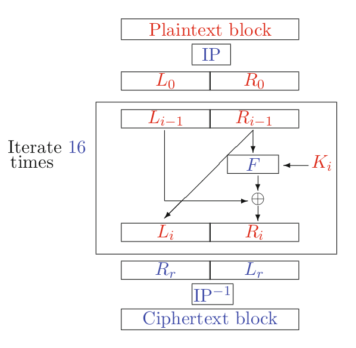
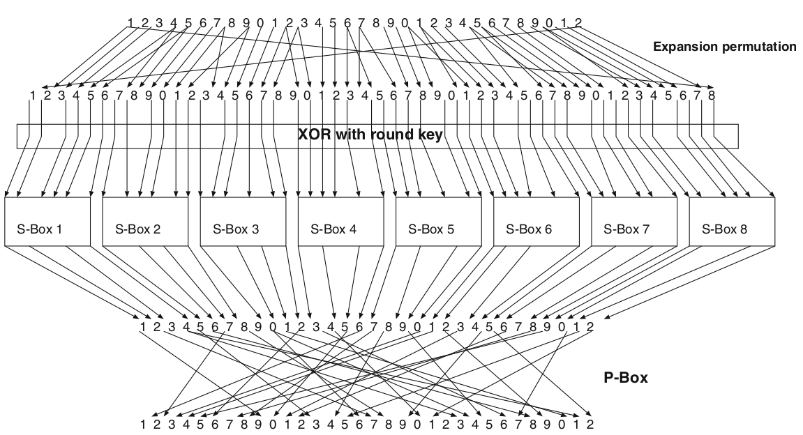
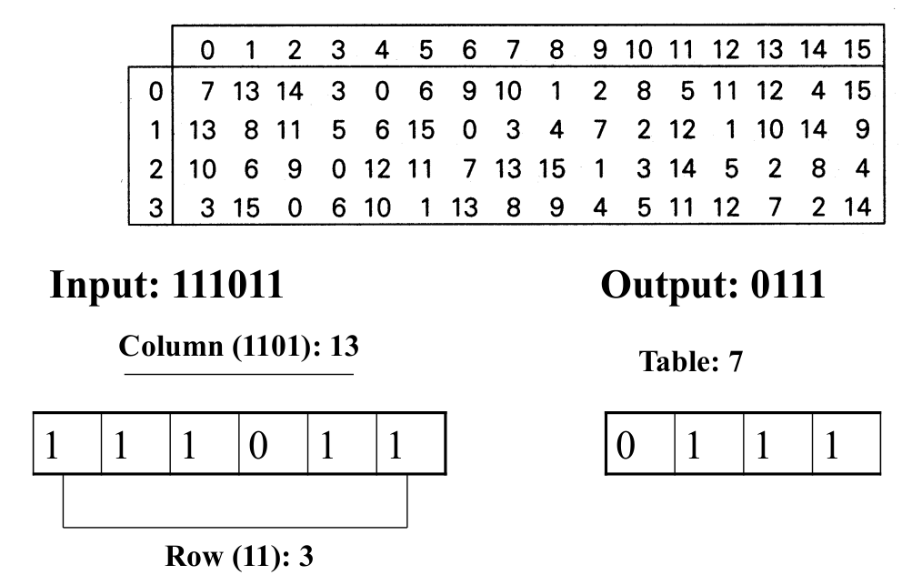
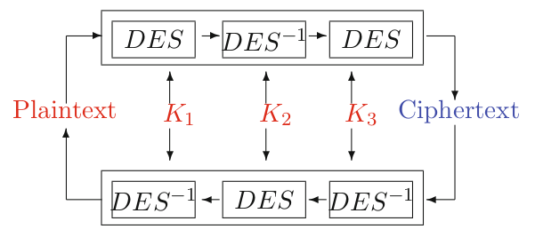

# Lecture 6: Block Ciphers and Modes of Operation

CIA: Confidentiality Integrity Availability

## Block ciphers

{width=60%}

where:

- ${\color{red}m} \in \{0, 1\}^{n}$ is the plaintext block
- ${\color{red}k} \in K$ is the secret key, chosen from key space $K$
- ${\color{blue}e}$ is the encryption function
- $\color{blue}d$ is the decryption function
- ${\color{blue}c}\in\{0, 1\}^b$ is the ciphertext block with $b$ fixed because we are working with blocks

- Block sizes are typically 64 bits (in DES), 128 or more (modern ciphers)
- Block ciphers should act like PRPs. (bijective, hence permutation)
- In order to limit the advantage of an adversary, key space is kept very large
- **Note**:
  - Block cipher is a building block for designing a cipher (a PRP)
  - Block cipher with Mode of Operation is a cipher
    - goal: IND-CCA secure cipher

- DES: Data Encryption Standard, 1970s, secret design
  - 56 bit key
- 3DES
- AES (replacing DES), 1990s, public design, by NIST
  - MARS from IBM
  - RC6 from RSA Security
  - Twofish from Counterpane, UC Berkeley
  - Serpent from 3 academicians (Israel, Norway, UK)
  - Rijndael from KU Leuven

### Design

- DES and AES are iterated block ciphers
  - repeating a simple round function
  - round $r$ can be fixed or variable
  - more rounds, more security
- Each round, a round key, derived from key $k$ is used (by key scheduling algorithm)
- The round function should be invertible; for decryption round keys are used in opposite order
- DES: the round is invertible but not the round function
- AES: both the round function and the round are invertible

### Confusion-diffusion paradigm

- Shannon introduced a paradigm
  - The confusion-diffusion paradigm:
    - confusion: Split the block into smaller blocks and apply a substitution on each block
    - diffusion: Mix permutations so that a local change can effect the whole block
- Substitution-Permutation Networks (SPN)
  - direct implementation of the above paradigm
    - Key mixing
    - Substitution
    - Permutation

### The Avalanche Effect

-  A small change in the input must affect every bit of the output
  - The S-Boxes are designed such that 1 bit effects at least 2 bits in the output of the S-Boxes
  - The mixing permutations are designed
- How many rounds do you need for a good diffusion?
- In principle there should be at least 7 rounds

### Attacking Reduced Round SPNs (Katz and Lindell)

- A trivial case: 1 Round and no final key-mixing (trivial)
- One Round SPN: 1 full round with final key-mixing
  - master key has two parts: $k_1$ and $k_2$, each 64 bits
  - given $(m,c)$, calculate every possibility, total $2^{64}$
  - for each possibility, there are $2^{64}$ items in $2^{64}$ time
- 2-Round SPN
  - same argumentation. Not safe because not sufficient diffusion after 2 rounds
  - Adversary can distinguish between the block cipher and PRP

## Feistel Ciphers

- After Horst Feistel from IBM, non-military research on encryption schemes
- Feistel cipher: the round function is invertible
- Different from an SPN, based on a non-invertible component
- Encryption:

$$
\begin{aligned}
L_i &\leftarrow R_{i-1} \\
R_i &\leftarrow L_{i-1} \oplus F(K_i, R_{i-1}) \\
\end{aligned}
$$

- Decryption:

$$
\begin{aligned}
R_{i-1} &\leftarrow L_i \\
L_{i-1} &\leftarrow R_i \oplus F(K_i, L_i)
\end{aligned}
$$

{width=75%}

- We can chose any $F$ and still the round is invertible
- Same hardware/software can be used both for encryption and decryption
  - just use the keys in reverse order
- Security depends on
  - round keys
  - number of rounds
  - function $F$

## DES

- Based on Lucifer, improved by NSA
- Aka DEA (Data Encryption Algorithm), DEA-1
- Used for 30 years, not anymore
- Feistel Cipher
  - 16 rounds
  - 64 bits block size
  - 56 bits key length
  - rounds keys (16 of them), 48 bits each

### DES operations

- 64 bits of block
  - Perform an Initial Permutation (IP)
  - Split the block into left and right part
  - Perform 16 rounds of identical operations
  - Join the half blocks together
  - Perform a final reverse Permutation

{width=50%}

### Function $F$

- Expansion Permutation: The right half 32 bits is expanded to 48 bits
  - diffusion, 1 bit change in the input introduces 2 S-box changes
- Round Key Addition: XOR with the round key
- Splitting: 48 bits are split into 8 slots of 6-bit values
- S-Boxes: Substitution boxes (non-linear part)
  - output is 32 bits (8 lots of 4-bit values)
- P-Box: Combine the lots to form a 32-bit value and apply permutation to form the output of $F$

{width=75%}

### IP and Reverse IP

- $IP$: 1 bit of the output is the 58th bit of the input
- $IP^{-1}$: 1 bit of the output is the 40th bit of the input

### S-Boxes

- There are 8 S-Boxes

{width=75%}

### P-Box

- Combine 32 bits and apply the following permutation

### DES Key-Scheduling

- 56 bits key, plus 8 parity bits for error detection (bits: $8, 16, 24,\dotsc, 64$)
- Permute: takes 64 bits, outputs 56 bits (PC-1)
- Divide (PC-1) into two halves of 28-bits, C0 and D0 and compute

$$
\begin{aligned}
C_i &\leftarrow C_{i-1} \lll p_i \\
D_i &\leftarrow D_{i-1} \lll p_i
\end{aligned}
$$

- Where $p_i$ is cyclic shift
  - rounds 1, 2, 9, 16, then shift left by one position
  - otherwise, shift left two positions
- Combine the halves and apply PC-2 permutation

### DES decryption

- Decryption is identical to encryption: rounds keys in reversed order
  - 1 algorithm for encryption and decryption
  - Same hardware for both

### Security of DES

- 1, 2 and 3-round DES is not secure
- DES in general is secure. Exhaustive search is needed $2^{56}$
  - 1977, 20 million dollar machine to break DES in one day
  - 1997, DESCHALL Project, 96 days (Internet based)
  - 1998, 56 days, DEEP-Crack, 250K
  - 1999, 22  hours, DEEP-Crack and Internet
  - Now, 23 hours using 48 FPGAs
  - Time-Space trade-off, with more memory, a few minutes is sufficient

## Cryptanalysis of Block Ciphers

- Exhaustive search
- Pre-computed intermediate values
- Divide and conquer
- You need mathematical, puzzle-solving skills and luck
- **Differential Cryptanalysis**: uses pairs of plaintext and ciphertext; observe the difference: BIham and Shamir, time $2^{37}$
- **Linear Cryptanalysis**: Use linear functions to estimate non-linear behaviour: Matsui, requires known $2^{43}$ plaintexts.

### Security of DES

- Key length is the weakest point. Then,
  - Double encrypt using two keys: Key space to search is now $2^{112}$
    - No, it's still $2^{56}$
    - meet-in-the-middle-attack
  - Triple encryption
    - Variant 1: Choose 3 different keys: $E(k_1)\rightarrow D(k_2)\rightarrow E(k_3)$
      - security is $2^{112}$ due to meet-in-the-middle-attack
    - Variant 2: Choose 2 keys: $E(k_1)\rightarrow D(K_2)\rightarrow E(k_1)$
      - security is $2^{112}$
  - Why Decrypt in the middle?

## 3DES

- 56 bit key is not sufficient today
- Use 3DES
  - Key 168 bits, if you use 3 keys
  - 112 bits if you use 2 keys (one used twice): security equivalent to 64-bit version

{width=50%}

## Summary

- Block ciphers are difficult to design
- Mode of operations are important
- A block cipher should be resistant against
  - Differential cryptanalysis
  - Linear cryptanalysis