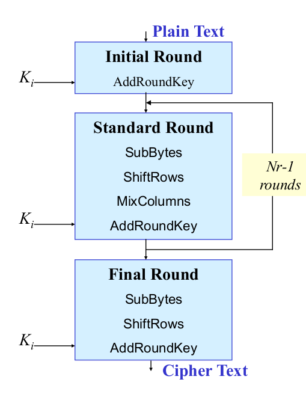
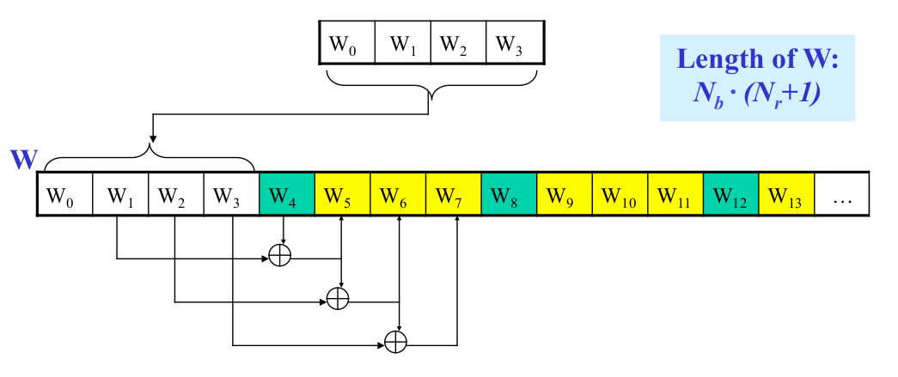
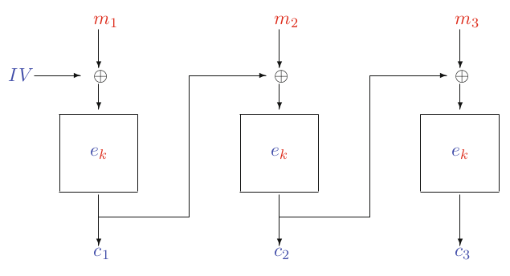
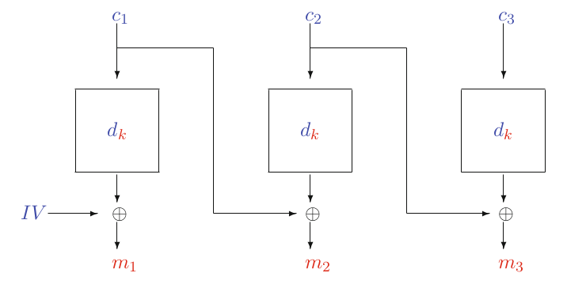
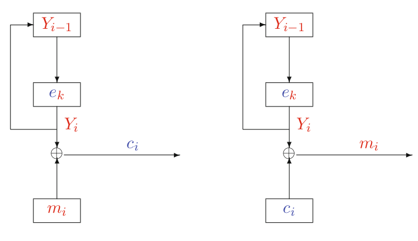
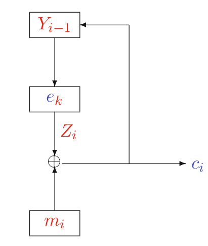
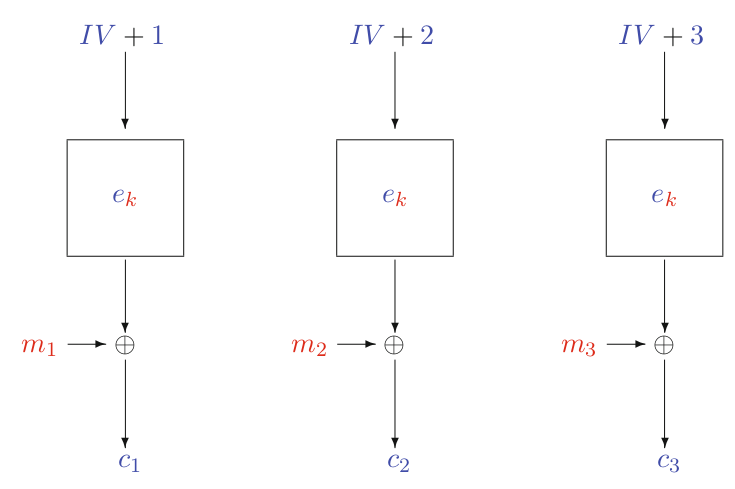

## Advanced Encryption Standard

- AES (replacing DES), 1990s, public design, by NIST, competition:
  - MARS from IBM
  - RC6 from RSA Security
  - Twofish from Counterpane, UC Berkeley
  - Serpent from 3 academicians (Israel, Norway, UK)
  - Rijndael from KU Leuven (Joan Daemen and Vincent Rijmen)

### Design

- AES is not a Feistel Cipher but a Substitution-Permutation Network
- Nevertheless, there are similarities. Each round has
  - A key addition phase
  - A substitution phase (non-linear phase, confusion)
  - A permutation phase (for diffusion, avalanche effect)
- AES is built on a mathematical foundation
  - Finite Fields, $F_2^8$ and $F_2$
  - Encryption and Decryption functions are distinct

## Finite Fields (Galois Fields)

- Permitted operations are $+$, $-$, $\times$, $(\ )^{-1}$
- They provide some security methods
- $GF(p^m)$ with $p$ prime and $m$ integer
- $GF\{7\} = \{ 0, 1, 2, 3,\dotsc,6\}$
  - $a + b \equiv c \mod p$
  - $2 + 4 \equiv 6 \mod 7$
  - $2 \times 4 \equiv 1 \mod 7$
  - $a \times a^{-1} \equiv 1 \mod 7$
  - $3 \times 3^{-1} \equiv 3 \times 5 \equiv 1 \mod 7$
- $m=1$: Prime field
- $m\ge 2$: Extension field
- AES $\rightarrow GF(2^8)$

> ***
>
> **EXAMPLE**: $GF(2^3) = GF(8)$
> $$
> A(x) = a_2 x^2 + a_1 x^1 + a_0 \quad (a_2, a_1, a_0)
> $$
> We have 3 values that can be either 0 or 1: `000`, `001`, `010`, `011`, `100`, `101`, `110`, `111`
> $$
> GF(8) = \{0, 1, x, x+1, x^2, x^2 + 1, x^2 + x, x^2 + x + 1\}
> $$
> Let's say that we pick two elements:
> $$
> (x^2 + x) + (x^2 + x + 1) = (1 + 1)x^2 + (1+1)x + 1 = 0 \cdot x^2 + 0 \cdot x + 1
> $$
> We do this since the coefficients can only have values $\mod 2$ so $1 + 1 \equiv 0 \mod 2$.
> $$
> +/- \implies \oplus
> $$
> Multiplication:
> $$
> \begin{aligned}
> (x^2 + x)(x^2 + x + 1) &= x^4 + x^3 + x^2 + x^3 + x^2 + x \\
> &= x^4 + \cancel{(1 + 1)x^3} + \cancel{(1+1)x^2} + x \\
> &= x^4 + x
> \end{aligned}
> $$
>
> ***

- $F_2^8$ stored as a bit of vectors, representing polynomials
- E.g. `0x83`: `1-0-0-0-0-0-1-1` corresponding to 131 in decimal
- Easy to convert to a polynomial: $x^7 + x + 1$
- Irreducible polynomial: $f(x) = x^8 + x^4 + x^3 + x + 1$

> ***
>
> **EXAMPLE**: 
>
> - D4 = `11010100` $\rightarrow x^7 + x^6 + x^4 + x^2$
> - E0 = `11100000` $\rightarrow x^7 + x^6 + x^5$
> - Addition: D4+E0 = `00110100`
>
> ***

### Multiplication

$$
\begin{aligned}
a(x) &= a_3x^3 + a_2 x^2 + a_x1 x^1 + a_0 \\
b(x) &= b_3x^3 + b_2 x^2 + b_x1 x^1 + b_0 \\
c(x) &= a(x) \cdot b(x) = c_6 x^6 + c_5 x^5 + c_4 x^4 + c_3 x^3 + c_2 x^2 + c_1 x^1 + c_0
\end{aligned}
$$

- A bigger polynomial is obtained and thus the length needs to be reduced
- A division with the irreducible polynomial is made

### Division

$$
\frac{g(x)}{h(x)} \mod f(x) = g(x) \cdot h(x)^{-1} \mod f(x) \implies
$$

Euclidean algorithm

### Arithmetic in AES

- Arithmetic in AES is performed using polynomial **arithmetic modulo irreducible polynomial**
- AES uses 32-bit words with polynomials in $F_2^8[X]$ of degree less than 4

$$
\begin{gathered}
a_0 || a_1 || a_2 || a_3 \quad \text{8-bits each} \\
a_3 \cdot X^3 + a_2 \cdot X^2 + a_1 \cdot X + a_0
\end{gathered}
$$

- Arithmetic on polynomials in $F_2^8[X]$ modulo reducible polynomial

$$
M(X) = X^4 + 1
$$

### Multiplication in AES

- AES supports 128, 192, and 256-bit blocks
- Then, the keys are 128, 192, or 256 bits
- Different rounds for 128, there are 10 rounds
- AES operates on a $4\times 4$ matrix of bytes, called state matrix
- Each round key is also a $4\times 4$

### AES operations

{width=50%}

 

- We need to design a system where a single bit change changes multiple bits/bytes.

#### Initial Round:

- Add Round Key
- Perform a XOR operation

#### Standard Round:

- SubBytes
  - Principle of **confusion**
  - Replace every single byte with the values of the S-Box. **There is one single public S-Box**
  - Criteria for S-Box
    - Must be resistant against linear and differential cryptanalysis
    - Must be simple
    - Must be invertible
- ShiftRows
  - Principle of **diffusion**
  - First row stays as is
  - Second row shifts one byte
  - Third row shifts two bytes
  - Fourth row shifts three bytes
- MixColumns
  - Multiply every column with a polynomial and then reduce it with the modulo polynomial
- AddRoundKey
  - Taking the round key and XOR with the data

### AES Key Schedule

- From 12bit key, we need 11 round keys: $K_0,\dotsc,K_{11}$ each consisting of four 32-bit words
- $W_4$ is obtained by applying substitution and permutation parts to $W_3$

{width=75%}


###  AES Encryption Algorithm

```python
S = addRoundKey(S, K[0])
for i in range(1, 10):
    S = subBytes(S)
    S = shiftRows(S)
    S = mixColumns(S)
    S = addRoundKey(S, K[i])
S = subBytes(S)
S = shiftRows(S)
S = addRoundKey(S, K[10])
```

### AES Decryption Algorithm

```python
S = addRoundKey(S, K[10])
S = inverseShiftRows(S)
S = inverseSubBytes(S)
for i in range(9, 0, -1):
    S = addRoundKey(S, K[i])
    S = inverseMixColumns(S)
    S = inverseShiftRows(S)
    S = inverseSubBytes(S)
S = addRoundKey(S, K[0])
```

### DES and AES

- DES
  - Fast in hardware, slower in software
  - One key length (not expandable)
  - One block length (not expandable)
  - Many iterations (Feistel structure)
- AES
  - Fast in hardware and software
  - Multiple key lengths (expandable in the future)
  - Multiple block lengths
  - Relatively small amount of iterations

## Modes of operation

- There were originally 4 standard modes:
  - ECB: Electronic Code Book mode
  - CBC: Cipher Block Chaining mode
  - OFB: Output Feedback mode (stream cipher)
  - CFB: Cipher Feedback mode (stream cipher)
- Over the years, many more
  - CTR: Counter mode

### Electronic Code Book

- Simplest version
- Divide the message into blocks and encrypt them individually
- If the block is the same message then the cipher is the same message
- Problems
  - Same input block, same output block
  - Deletion possible without detection
  - Replay attack is possible, take a block from another message
- ECB is **not** IND-PASS secure, **not** OW-CCA secure but OW-CPA secure

### CBC: Cipher Block Chaining Mode

{width=50%}

{wdith=50%}


- We chain blocks and doing an initial XOR with an Initial Vector
- The output is used to XOR the plaintext
- A single bit error in transmission causes the whole block being decrypted wrongly and a single bit in the next block
- IV is needed
  - used once, never repeated - then the system is nonce based
    - IND-PASS secure
  - fixed - then CBC is deterministic
    - IND-PASS secure
  - truly random
    - IND-CPA secure
  - Each choice has different security results

### OF: Output Feedback Mode

- Block cipher can be used as a stream cipher

{width=60%}


- Security
  - Fixed IV: **not** IND-CPA secure, also **not** OW-CPA secure
  - Nonce based IV: **not** OW-CPA secure
  - Random IV: IND-CPA secure

### CFB: Cipher Feedback Mode

- Block cipher can be used as a stream cipher

{width=50%}


- Security
  - Nonce based IV: **not** IND-CPA secure but OW-CPA secure
  - Random IV: IND-CPA

### CTR: Counter Mode

- IV is chosen and incremented

{width=60%}


- Security
  - Fixed IV: **not** IND-CPA secure, also **not** OW-CPA secure
  - Nonce based IV: **not** OW-CPA secure
  - Random IV: IND-CPA secure 
- Parallel computation is possible
- Same input, different output
- IND-CPA secure

### How to achieve CCA security?

- More advanced modes, authenticated modes, are needed
  - CCM (Counter with CBC-MAC) and GCM (Galois Counter Mode)
- It is possible to have IND-CCA security from IND-CPA cipher (CBC, CTR)
  - The problem with previous schemes, adversary can create ciphertext without knowing the key
- Encrypt-then-MAC (secure)
- Encrypt-and-MAC (not secure)
- MAC-then-Encrypt (not secure)

### Encrypt-then-MAC

- KeyGen: generate two keys $K_1$ for encryption and $K_2$ for MAC
- Encrypt the message using $K_1$ and compute the MAC of the **ciphertext** using $K_2$
- Verify MAC and decrypt the text
- IND-CCA

### Encrypt-and-MAC

- KeyGen, generate two keys $K_1$ and $K_2$
- Encrypt the message and compute the MAC of the **plaintext**
- Decrypt the ciphertext and verify the MAC
- **not** IND-CPA secure

### MAC-then-Encrypt

- KeyGen, generate two keys $K_1$ and $K_2$
- Compute MAC and encrypt the message and the MAC
- Decrypt the ciphertext and then verify the MAC
- **not** IND-CPA secure (if used with a deterministic MAC)

## Summary

- Block ciphers are difficult to design
- DES and AES take its security from repeated rounds
- A block cipher should be resistant against
  - Differential
  - Linear cryptanalysis
- Mode of operations are important
  - Use CBC or CTR
  - Block ciphers can be used as a stream cipher in CFB, OFB and CTR modes


