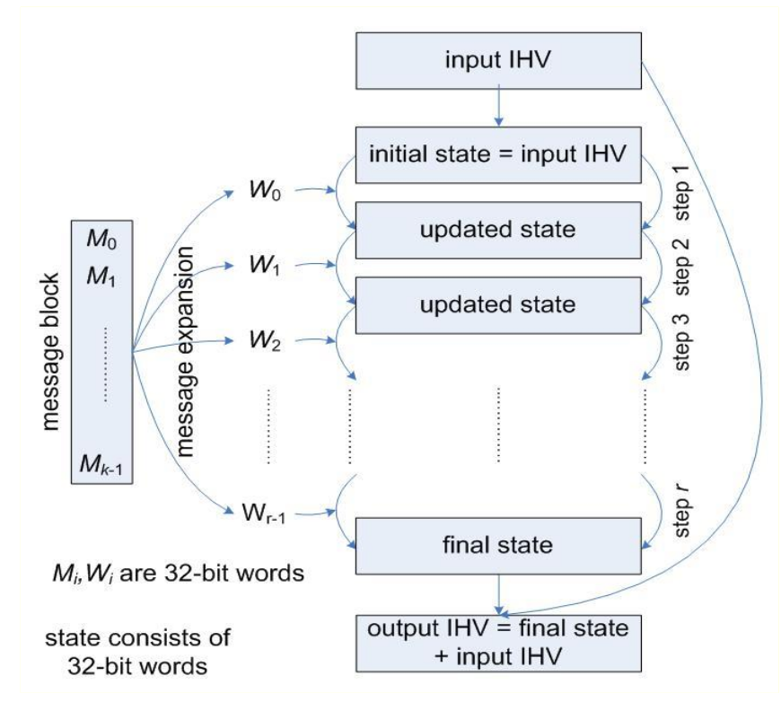
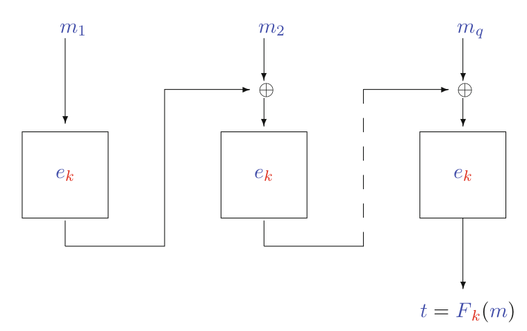
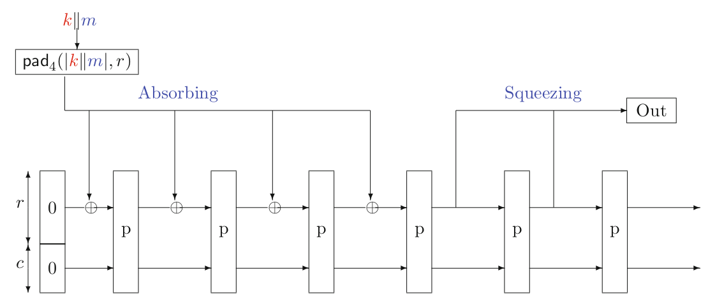
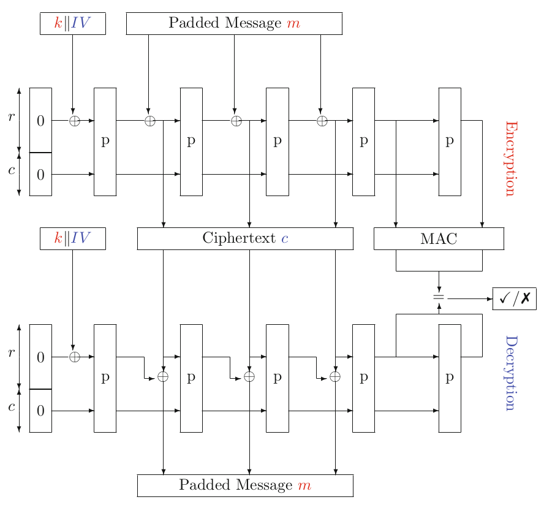

# Lecture 7: Hash functions and MACs

CIA:

- Confidentiality
- Integrity
- Availability

## Hash Functions

- Integrity protection
  - Strong checksum
  - For file system integrity or software downloads
- One-way 'encryption'
  - Password protection
- Asymmetric digital signatrue
- MAC - message authentication code
  - Efficient symmetric 'digital signature'
- Key derivation
- Pseudo-random number generator

### Preimage Resistance

- Takes an arbitrary length input and the output is fixed

- Hash functions:

  - receive an arbitrary length bit strings
  - output a fixed length string called: hash value, digest,  hashcode

- **Cryptographic** hash functions

  - One-way: easy to compute $y$ given $x$ but infeasible to find $x$ given $y: H: \{0,1\}^*\rightarrow\{0,1\}^n$

  $$
  H(x) = y
  $$

- Or more formally, it should be preimage resistant: given an output of $t$ bits, it should take $O(2^t)$ time to find a preimage ($x$ is preimage of $y$)

### Second Preimage Resistance

- A (cryptographic) hash function should also be second preimage resistant: Given $m$, it should be hard to find an $m'$ which is $H(m)=H(m')$.

{width=60%}

- We need to make it infeaseable to find the second preimage

### Collision Resistance

- Assume Domain is much larger than Codomain
- Given $H$, it should be infeasible to compute $m$ and $m'$ such that $H(m)=H(m')$

{width=60%}

- The adversary will compute multiple hashes and compare all against each other. So collision resistance is difficult to achieve **but it is mandatory otherwise the hash function will not be secure**
- But such an adversary does exist and wins
- There are several collusion: pigeonhole principle

### Human Ignorance

- We solved the same problem in PRFs using a keyed version of the functions
- However, we need unkeyed hash functions

**Definition**: A function $H$ is said to be collision resistant (by human ignorance) or HI-CR secure if it is believed to be infeasible to write down a collision for the function, i.e. two elements in the domain mapping to the same element in the codomain

- The probability to have a collision is $\sqrt{2^{t+1}}$ [Birthday paradox]

### Summary

- A cryptographic hash function

  1. **Preimage Resistant**: It should be hard to find a message with a given hash value

  2. **Second Preimage Resistant**: Given one message it should be hard to find another message with the same hash value

  3. **Collision Resistant**: It should be hard to find two messages with the same hash value

- (1) is weaker than (2) and (3)

- (2) is weaker than (3)

### Terminology

- One-way: preimage and second preimage resistant
  - Sometimes only preimage resistant
- Weak collision resistant: Second preimage resistant
- Strong collision resistant: Collision resistant
- OWHF: One Way Hash Function
  - Preimage and second preimage resistant
- CRHW: Collision Resistant Hash Function
  - Second preimage resistant and collision resistant

## Padding

- When you divide a message into smaller blocks, how can you pad it?
- Given an $l$ bit message $m$, and block size $b$, we want to have $m$ length $kb$
- Notation:

$$
m||\operatorname{pad}_i(|m|,b)
$$

- In theory padding can be added at the beginning or at the end
- In practice, all algorithms pad at the end
- Padding with $0$ at the end is not secure because there could be many messages that end with 0

### Padding methods

- We define 5 of them
  - **Method 0**: $v = b - |m| \mod b$ and padding is $v$ zeros: $m||0^*$
  - **Method 1**: $v = b - (|m| + 1) \mod b$ and padding is: $m||10^*$
  - **Method 2**: $v=b-(|m|+65) \mod b$ and padding is: $m||10^*||L$ where $L$ is 64 bit integer encoding of |m|
  - **Method 3**: $v=b-(|m|+64)\mod b$ and padding is: $m||0^*|||L$
  - **Method 4**: $v = b-(|m|+2)\mod b$ and padding is: $m||10^*1$
- Any can be used, apart from Method 0, but will effect the security

## The Merkle-Damgard Construction

- **Compression Function**: A hash function that receives a fixed length input
- How to construct a hash function that receives an arbitrary length input from a compression function?

![The Merkle-Damgard construction $\operatorname{MD}[{\color{blue}f}_{\color{red}k},s]$](images/07/md_construction.png){width=75%}


### MD Algorithm

- Function $f$ maps $l+n$ bit input to $n$ bit output
- There is an internal state $s$

```{.python caption="Merkle-Dangard construction algorithm"}
def md(m, t, l, s_0):
    m = pad(m, length=l)
    blocks = divide_in_blocks(m, number=t, length=l)
    s = s_0
    for i in range(t):
        s = f(concat(blocks[i], s))
    return s
```

### Benefits of MD Construction

- This design makes streaming possible
- Hash function analysis becomes compression function analysis
- Analysis easier because domain of $CF$ is finite

### Properties of MD Construction

- Collision resistance depends on the padding method
  - Imagine ther are two messages $m=0b0$ and $m'=0b00$
  - Using Method 0, both of them will be mapped to $0b0000$: collision
  - The original message can be
    - $0b0$, $0b00$, $0b000$ or $0b0000$
  - Thus, MD based hash functions should **not** use Method 0
  - Bu use Method 2
  - **Method 2**: $v=b-(|m|+65)\mod b$ and padding is: $m||10^*||L$ where $L$ is 64 bit integer encoding of $|m|$

### 3 Interpretations

1. $\boldsymbol{s}$ is fixed to an **IV**, $\boldsymbol{f_k}$ is also fixed then if $\boldsymbol{f}$ is HI-CR secure so thus $H(m)$
2. $\boldsymbol{s_0}$ is a key, $\boldsymbol{f_k}$ is a fixed function then if $\boldsymbol{f}$ is HI-CR secure so thus $H_s(m)$.
3. $\boldsymbol{f_k}$ is from a PRF family, $s$ is fixed, then if $f$ is CR secure then thus $H_k(m)$ (does not mean anything in practice)

### MD-4 family

- MD construction with a fixed (unkeyed) $\boldsymbol{f}$
  - MD-4 (128-bit output) function $f$ has 3 rounds 16 steps
  - MD-5 (128-bit output) function $f$ has 4 rounds 16 steps
  - RIPEMD-160 (160-bit output) function $f$ has 5 rounds 16 steps
  - SHA-1 (160-bit output) function $f$ has 4 rounds 20 steps
  - SHA-2
    - SHA-256 (256-bit output) function $f$ has 64 rounds
    - SHA-384 (384-bit output) same as SHA-512 but truncated
    - SHA-512 (512-bit output) function $f$ has 80 rounds
  - MD-4, MD-5 and SHA-1 have weaknesses
  - Use SHA-2 or SHA-3 which is the new sponge function

{width=75%}


### Trivial (Brute Force) Attacks

- Assume: hash function behaves like random function
- Preimages and second preimages can be found by random guessing search
  - Search space $\approx n$ bits, $\approx 2^n$ hash function calls
- Collisions can be found by birthdaying
  - Search space $\approx \frac{1}{2}n$ bits, $\approx 2^{\frac{1}{2}n}$ hash function calls
- This is a big difference
  - MD5 is a 128 bit hash function
  - (second) preimage random search: $\approx 2^{128} \approx 3 \times 10^{38}$ MD5 calls
  - Collision birthday search: only $\approx 2^{64} \approx 2\times 10^{19}$ MD5 calls

### Birthday paradox

- How many people in the class have his/her birthday on
  - Jan 10?
  - Dec 17?
  - June 7?

- Given a set of $t \ge 10$ elements
  - Take a sample of size $k$ (drawn with repetition) in order to get a probability $\ge \frac{1}{2}$ on a collision (i.e. an element drawn at least twice)
  - $k$ has to be $> 1.2\sqrt{t}$
- Consequence
  - If $F: A\rightarrow B$ is a random function
  - $\# A \gg \#B$
  - Then one can expect a collision after about $\sqrt{\#B}$ random function calls

### Meaningful Birthdaying

- Random birthdaying
  - Do exhaustive search on $\frac{1}{2}n$ bits
  - Messages will be 'random'
  - Messages will not be 'meaningful'
- Yuval (1979)
  - Start with two meaningful messages $m_1$, $m_2$ for which you want to find a collision
  - Identify $\frac{1}{2}n$ independent positions where the messages can be changed at bit-level without changing the meaning, e.g. tab-space, space-newline...
  - Do random search on those positions

### Implementing Birthdaying

- **Naive**
  - Store $2^{\frac{n}{2}}$ possible messages for $m_1$ and $2^{\frac{n}{2}}$ possible messages for $m_2$ and check all 2 pairs
- **Less naive**
  - Store $2^{\frac{n}{2}}$ possible messages for $m_1$ and for each possible $m_2$ check whether its hash is in the list
- **Smart**: Pollard-$\rho$ with Floyd's cycle finding algorithm
  - Computational complexity still $O\left(2^{\frac{n}{2}}\right)$  - but only constant small storage required 

## HMAC

-  It is desired to have a keyed hash from unkeyed hash function, e.g.:

$$
{\color{blue}t} = {\color{blue}H}({\color{red}k}||{\color{blue}m}||\mathsf{pad}_i (|{\color{red}k}| + |{\color{blue}m}|, \boldsymbol{b}))
$$

- However, this is not secure. Imagine that the adversary asks for

$$
{\color{blue}t} = \mathsf{MD}[{\color{blue}f},{\color{blue}s}]\Big({\color{red}k}||{\color{blue}m}||\mathsf{pad}_i(l+|{\color{blue}m}|,l)\Big)
$$

- Then it is possible for her to construct valid keyed hashes in the form of

$$
{\color{blue}m}||\mathsf{pad}_i(\mathcal{l} + |{\color{blue}m}|, \mathcal{l})||{\color{blue}m'}
$$

### Nested MAC: NMAC

- How to achieve a secure keyed hash based on MD construction?
- Nested MAC

$$
\mathsf{NMAC}_{{\color{red}k_1},{\color{red}k_2}}({\color{blue}m}) = {\color{blue}F}_{\color{red}k_1}({\color{blue}G}_{\color{red}k_2}({\color{blue}m}))
$$

$$
\begin{aligned}
{\color{blue}F}_{\color{red}k_1}({\color{blue}x}) &= {\color{blue}f}\Big(\Big({\color{blue}x}||\mathsf{pad}_2(l+|{\color{blue}x}|,l)\Big) ||{\color{red}k_1}\Big) = \mathsf{MD}[{\color{blue}f},{\color{red}k_1}]^*({\color{blue}m}) \\
{\color{blue}G}_{\color{red}k_2}({\color{blue}m}) &= \mathsf{MD}[{\color{blue}f},{\color{red}k_2}]^*({\color{blue}m})
\end{aligned}
$$

### HMAC from NMAC

- Now we can construct HMAC as follows

$$
\begin{aligned}
\mathsf{HMAC}_{\color{red}k}(m) &= {\color{blue}H}\Big(({\color{red}k}\oplus {\color{blue}\mathsf{opad}}) || {\color{blue}H}(({\color{red}k}\oplus {\color{blue}\mathsf{ipad}}) || {\color{blue}m}))\Big) \\
&= \mathsf{MD}[{\color{blue}f},{\color{blue}IV}](({\color{red}k}\oplus {\color{blue}\mathsf{opad}})||\mathsf{MD}[{\color{blue}f},{\color{blue}IV}](({\color{red}k}\oplus {\color{blue}\mathsf{ipad}})||{\color{blue}m})))
\end{aligned}
$$

- Opad: outer pad: `0x36` repeated $l/8$ times
- Ipad: inner pad: `0x5c` repeated $l/8$ times

### MAC from a Block Cipher

- Because of the padding methods, this is not secure

{width=75%}


- In practice, we pick block cipher keys $k_1$ and $k_2$ and compute

$$
\mathsf{EMAC}_{{\color{red}k_1},{\color{red}k_2}}({\color{blue}m}) = {\color{blue}e}_{\color{red}k_2}(\textsf{CBC-MAC}_{\color{red}k_1}({\color{blue}m})))
$$

- This one is secure given that underlying block cipher is secure


## SHA-3

- Attacks against MD-5 and SHA-1 lead to a competition in 2007
  - 64 applicants
  - Reduced to 5 in 2010
    - BLAKE, a proposal based on the ChaCha stream cipher
    - Grostl, a Merkle-Damgard construction using components, such as the S-Box, from AES
    - JH, a sponge-like construction with a similar design philosophy to AES
    - **Keccak**, a sponge construction, and the eventual winner
    - Skein, a function based on the Threefish block cipher
  - Winner announced in October 2012

### The Sponge Function

- A modern technique to create
  - Hash functions
  - MACs
  - Key Derivation Functions and more

{width=75%}


### IND-CCA Secure Encryption


{width=75%}


## Summary

- Keyed hash functions have well-defined security mode
- Unkeyed hash functions rely on "Human ignorance"
- Collision Resistance is required due to birthday paradox

- Most hash functions are iterative, built on MD4, which are surprisingly weaker than expected

- Best functions now are SHA-2 and SHA-3

- MAC is a keyed hash function
- KDF is hash function with arbitrary length codomain

- MAC and KDF can be created out of either block ciphers or hash functions

- Hash functions have several properties:
  - Arbitrary length input
  - Fixed output
  - Efficient
  - Preimage resistant
  - Second preimage resistant $\rightarrow 2^n$
  - Collision resistant $\rightarrow \sqrt{2^n} \rightarrow 2^{\frac{1}{2}n}$

- Need to know: **HMAC**