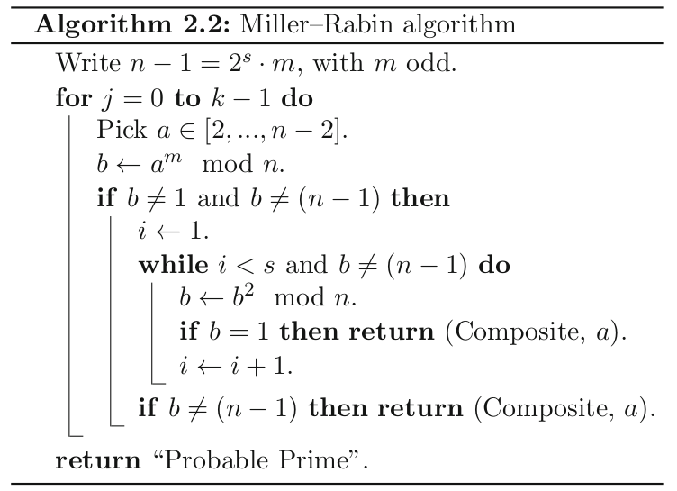
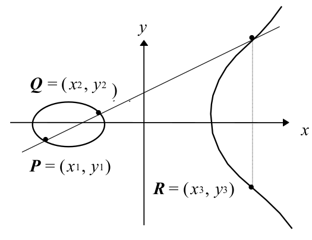
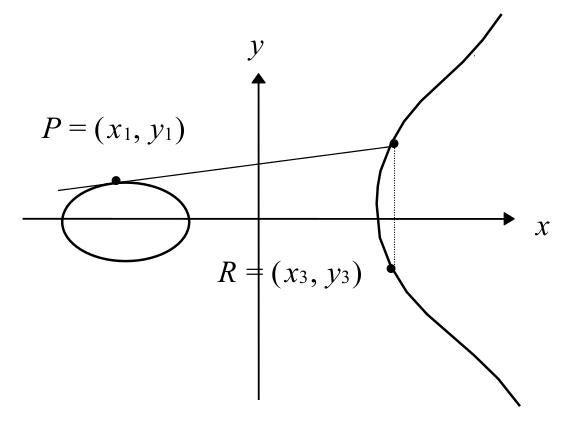

# Lecture 8: Number Theory and Elliptic Curves

## Modular Arithmetic

- A positive integer $N$, called modulus
- $a = b \mod N$ if $N$ divides $a -b$
- $a$ and $b$ are congruent modulo $N$

- The set of values produced by postfix operation mod $N$:
  - $\mathbb{Z}/N\mathbb{Z} = \{ 0, 1, \dotsc, N-1\}$
  - Or $\mathbb{Z}_N$
- $\#$ denotes the number of elements in a set
  - $\#(\mathbb{Z}/N\mathbb{Z})=N$

### Properties

1. Addition is closed: $\forall a,b\in \mathbb{Z}/N\mathbb{Z}: a + b \in \mathbb{Z}/N\mathbb{Z}$
2. Addition is associative: $\forall a,b\in \mathbb{Z}/N\mathbb{Z}: (a+b)+c = a+(b+c)$
3. $0$ is an additive identity: $\forall a \in \mathbb{Z}/N\mathbb{Z}: a + 0 = 0 + a = a$
4. The additive inverse always exists: $\forall a \in \mathbb{Z}/N\mathbb{Z}: a + (N - a) = (N - a) + a = 0$
5. Addition is commutative: $\forall a,b\in \mathbb{Z}/N\mathbb{Z}: a + b = b + a$
6. Multiplication is closed: $\forall a, b \in \mathbb{Z}/N\mathbb{Z}: a \cdot b \in \mathbb{Z}/N\mathbb{Z}$
7. Multiplication is associative: $\forall a,b\in \mathbb{Z}/N\mathbb{Z}: (a \cdot b) \cdot c = a \cdot (b\cdot c)$
8. $1$ is a multiplicative identity: $\forall a \in \mathbb{Z}/N\mathbb{Z}: a \cdot 1 = 1 \cdot a = a$
9. Multiplication and addition satisfy the distributive law: $\forall a,b\in \mathbb{Z}/N\mathbb{Z}: (a+b)\cdot c = a\cdot c + b\cdot c$
10. Multiplication is commutative: $\forall a,b\in\mathbb{Z}/N\mathbb{Z}: a\cdot b = b \cdot a$

### Group

- A A group
  - Is closed
  - Has an identity
  - Is associative
  - Every element has an inverse
- A group which is commutative is called **abelian**
- Properties 1,2,3,4 Group
- Properties 1,2,3,4,5 Abelian Group
- **Examples**:
  - The integers, the reals or the complex numbers under addition. Here the identity is $0$ and the inverse of $x$ is $-x$, since $x+(-x) = 0$

### Group types

- **Multiplicative Group**: group operation is multiplication
  - $(G,x): f = g \cdot h$ and $g^5 = g \cdot g \cdot g \cdot g \cdot g$
- **Additive Group**: group operation is addition
  - $f = g + h$ and $5 \cdot g = g + g + g + g + g$
- **Cyclic Abelian Group**: if there is a special element (generator) from which every other element can be obtained.
  - $G = <g>$: Cyclic group $G$ with a generator $g$
    - Integer under addition $1$ is a generator
      - $7 = 1 + 1 + 1 + 1 + 1 + 1 + 1$
    - Additive group: $h = x \cdot g$
    - Multiplicative group: $h = g^x$

### Rings

- A ring has two operations $(+,\times)$ with properties 1 to 9
- Denoted as $(R,+,\times)$
- If multiplication is commutative (property 10), then the ring is commutative
- Infinite rings: integers, real and complex numbers
- Finite rings: modulo $N$, $\mathbb{Z}/N\mathbb{Z}$
  - An abelian group if you consider only addition
  - A ring if you also consider multiplications

### Divisors

- An integer $a$ divides integer $b$ if and only if $b = k \cdot a$ for some integer $k$
- **Prime**: Integer $p$ is prime if and only if $1$ and $p$ are its only divisors

$$
\frac{3}{2} \mod 7 \equiv 3 \cdot 2^{-1} \mod 7 \equiv 5
$$

$$
2 \cdot x = 1 \implies x = 4
$$

$$
3 \cdot 4 \equiv 5 \mod 7
$$

### Greatest Common Divisor

- **GCD**: $c = \operatorname{gcd}(a,b)$ if and only if $c$ is the largest number that divides both $a$ and $b$
- **Theorem**: Every positive integer can be written as a product of primers in an unique way

### Euler's Totient Function

- What is the solution for $a \cdot x = b \mod N$?
- Compute the greatest common divisor (gcd) of $a$ and $N$
  1. If $\operatorname{gcd}(a,N)=1$ there is exactly one solution
  2. If $\operatorname{gcd}(a,N)=g \ne 1$ and $\operatorname{gcd}(a,N)$ divides $b$, there are $g$ solutions
  3. Otherwise there is no solution

- The number of integers in $\mathbb{Z}/N\mathbb{Z}$ that are co-prime to $N$ is given by Euler's Totient Function:

$$
\phi(N) = \prod_{i=1}^np_i^{e_i - 1}(p_i-1)
$$

where
$$
N = \prod_{i=1}^n p_i^{e_i}
$$
For $\mathbb{Z}_8 = \{0, 1, 2, 3, 4, 5, 6, 7\}$, $\phi(8) = 4 \implies$ there are 4 co-primes in this set

### Multiplicative Inverse Modulo $N$

- Solution for $a\cdot x = b \mod N$
- We need to find $c$ such that $a \cdot c = c\dot a = 1 \mod N$
- Such a $c$ is called the multiplicative inverse modulo $N$ of $a$: $a^{-1}$
- $a^{-1}$ exists only when $\operatorname{gcd}(a,N)=1$

### Fields

- If $N$ is a prime $p$, then all none-zero elements have a multiplicative inverse in $\mathbb{Z}/p\mathbb{Z}$
- Thus, $a \cdot x = b \mod p$ has unique solution
- A ring like $\mathbb{Z}/p\mathbb{Z}$ with all none-zero elements having a multiplicative inverse is called a field

**Definition**: A field is a set with two operations $(G,\times,+)$ such that:

- $(G,+)$ is an abelian group
- $(G\setminus 0,x)$ is an abelian group
- $(G,\times,+)$ satisfies the distribution law

- $(\mathbb{Z}/N\mathbb{Z})^*$ is the set of all elements that are invertible (the set of elements that are co-prime of $N$)

$$
(\mathbb{Z}/N\mathbb{Z})^* = \{x \in \mathbb{Z}/N\mathbb{Z}: \operatorname{gcd}(x,N)=1\}
$$

- The size of $(\mathbb{Z}/N\mathbb{Z})^*$ is $\phi(N)$
- If $N$ is a prime $p$

$$
(\mathbb{Z}/p\mathbb{Z})^* = \{1, \dotsc, p -1\}
$$

### Theorems

- **Lagrange's Theorem**: If $(G,\times)$ is a group of order (size) $n = \# G$ then for all $a$ in $G$ we have $a^n = 1$
- So, if $x$ is in $(\mathbb{Z}/N\mathbb{Z})^*$, then:

$$
x ^{\phi(N)} = 1 \pmod{N}
$$

- **Fermat's Little Theorem**: Suppose $p$ is a prime and $a$ is in $\mathbb{Z}$, then

$$
a^p = a \pmod{p}
$$

## Basic Algorithms

### Greatest Common Divisor

- If we could factor numbers, it would be easy to find gcd
- However, computing factors is not easy

### The Euclidean Algorithm

- Computation of $\operatorname{gcd}(a,b)$
- $a = qb + r$ where $r$ is less than $b$

Set $r_0 = a$ and $r_1 =b$ and compute $r_2,r_3,\dotsc$ by $r_{i+2} = r_i \mod r_{i+1}$ until $r_{m+1}=0$

### Extended Euclidean Algorithm

- For $\operatorname{gcd}(a,b)=r$, this algorithm computes $ax + by=r$
- Hence, for $\operatorname{gcd}(a,N)=d$ where $d=1$ we can compute $ax+yN=1$
- Here $\boldsymbol{x}$ is the multiplicative inverse of $a$ in modulo $N$

- $\operatorname{gcd}(a,b)=ax+by=r$
- If $\operatorname{gcd}(a,b)=1\implies ax+by=1$

> ***
>
> **EXAMPLE**:
>
> - $\operatorname{gcd}(7,11) = 1$
> - $11=7 \cdot 1 + 4$
> - $7 = 4 \cdot 1 + 3$
> - $4 = 3 \cdot 1 + 1$
> - $1 = 4 - 3$: Now go back
> - $1 = 4 - (7 - 4) = 2\cdot 4 - 7$
> - $1 = 2 \cdot (11-7) - 7$
> - $1 = 2 \cdot 11 - 3 \cdot 7$
>
> ***

```{.python caption="Extended Euclidean Algorithm"}
def inverse(a, b):
    (s, s1) = (0, 1)
    (t, t1) = (1, 0)
    (r, r1) = (b, a)
    while r != 0:
        q = r1 // r
        (r1, r) = (r, r1 - q*r)
        (s1, s) = (s, s1 - q*s)
        (t1, t) = (t, t1 - q*t)
    d = r1
    x = t
    y = s
    return d, x, y
```

### CRT: Chinese Remainder Theorem

- Ancient Chinese army needs to be fed
- But how many soldiers are there?

Let $m_1,\dotsc,m_r$ be pairwise relatively prime and let $x = a_i \mod m_i$ for all $i$ and $M = \prod_i^r m_i$. The Chinese Remainder Theorem guarantees a unique solution given by
$$
x = \sum_{i=1}^r a_iM_iy_i \mod M
$$
where
$$
M_i = M/m_i
$$
and
$$
y_i = M_i^{-1} \mod m_i
$$

### Legendre Symbol

- Let $p$ be a primer bigger than $2$
- And consider the mapping

$$
\begin{aligned}
\mathbb{F}_p \longrightarrow \mathbb{F}_p \\
\alpha \longrightarrow \alpha^2
\end{aligned}
$$

- The mapping is 2-to-1, meaning therea rea two values that map to the same value
- This means, half of the elements in the set are quadratic residues, and there are $(p-1)/2$ of them
- The other half is quadratic non-residuess

$$
\begin{aligned}
Q_{11} &= \{1, 3, 4, 5, 9\} \\
NQ_{11} &= \{2, 6, 7, 8, 10\}
\end{aligned}
$$

$$
\begin{aligned}
a &\longrightarrow b \\
-a &\longrightarrow b
\end{aligned}
$$

- To detect squares modulo a prime $p$, we define a symbol

$$
\left(\frac{a}{p}\right) = a^{(p-1)/2} \pmod p
$$

- Legendre symbol is
  - $0$
  - $+1$ if $a$ is a quadratic residue
  - $-1$ if $a$ is a non-quadratic residue

#### Computing Legendre Symbol

$$
\left(\frac{q}{p}\right) = \left(\frac{p}{q}\right)(-1)^{(p-1)(q-1)/4}
$$

which means,
$$
\left(\frac{q}{p}\right) = \begin{cases}
- \left(\frac{p}{q}\right) & \text{If } p=q=3\pmod 4 \\
\left(\frac{p}{q}\right) & \text{Otherwise}
\end{cases}
$$

- Additional formulae

$$
\begin{aligned}
\left(\frac{q}{p}\right) &= \left(\frac{q\pmod p}{p}\right) \\
\left(\frac{q \cdot r}{p}\right) &= \left(\frac{q}{p}\right) \cdot \left(\frac{r}{p}\right) \\
\left(\frac{2}{p}\right) &= (-1)^{(p^2-1)/8}
\end{aligned}
$$

### Jacobi Symbol

- Legendre symbol is defined for $p$ being a prime
- For composite values we have Jacobi symbol

$$
\left(\frac{a}{n}\right) = \left(\frac{a}{p_1}\right)^{e_1} \left(\frac{a}{p_2}\right)^{e_2} \dotsm\left(\frac{a}{p_k}\right)^{e_k}
$$

where
$$
n = p_1^{e_1}\cdot p_2^{e_2}\dotsm p_k^{e_k}
$$

- If $\boldsymbol{a}$ is square, Jacobi symbol will be 1
- However, if the Jacobi symbol is $1$, $\boldsymbol{a}$ might not be square!

## Primality Tests

### The Prime Number Theorem

The number of primes less than $X$ can be given estimated with the following function:
$$
\pi(X) \approx \frac{X}{\log X}
$$

- There are many prime numbers!
- The probability of a random value to be prime is

$$
\frac{1}{\log p}
$$

### Trial Division

- Divide $p$ with all the numbers starting from $2$ to $\sqrt{p}$
- Not feasible
  - exponential computation depending on the input

### Prime Numbers

- If we need a real prime number with 100% certainty: Proof of primality!
  - After Miller-Rabin Tests
  - Based on Elliptic curves
- You can also use AKS Algorithm since 2002 

### Fermat's Test

- Recall that

$$
a^{\Phi(n)} = 1 \mod n
$$

- If $\boldsymbol{n}$ is a prime, this equality holds
- However, if this equality holds, not necessarily $\boldsymbol{n}$ is a prime
- Probably prime
  - $n$ is composite with a probability $1/2^k$
  - Prime or so-called probably prime
  - Be careful with Carmichael numbers
    - always returns "probably prime"

### Miller-Rabin Test

- Fermat's test is not useful due to Carmichael numbers
- Miller-Rabin tests is an improved version
- The chance is $1/4$ for a base $\boldsymbol{a}$: so repeat!

{width=50%}


  

## Elliptic Curves

$$
F: y^2 = x^3 + ax + b \mod p
$$

Requeriments:

- $p > 3$, otherwise $x^3 = x$ (Fermat)
- $4a^3 + 27b^2 \ne 0 \mod p$ otherwise $F$ is singular
- If a point $P$ is on $F$, then also $P+P$, $P+P+P$, etc.

### Point Addition

$$
\begin{aligned}
F &: y^2 = x^3 + ax + b \mod p \\
R &= P+Q
\end{aligned}
$$

1. Draw a line from $P$ to $Q$
2. Find the 3rd intersection on $F$
3. Reflect on the $x$ axis

{width=60%}


### Point Addition: Doubling

$$
\begin{aligned}
F &: y^2 = x^3 + ax + b \mod p \\
R &= P+P=2P
\end{aligned}
$$

1. Draw tangent line from $P$
2. Find the unique intersection on $F$
3. Reflect on $x$ axis

{width=60%}


### Zero-Point

- $P + (-P) = 0$
- $Q + (-Q) = 0$
- $P+0=0+P=P$

### Addition Rules

We are adding two points $P=(x_1,y_1)$ and $Q=(x_2,y_2)$, the result is $R=(x_x,y_3)$

- If $x_1=x_2$ and $y_1=-y_2$, then $(x_3,y_3) = 0$ (special point at infinity)
- Else

$$
\begin{aligned}
x_3 &= \lambda^2 - x_1 - x_3 \mod p \\
y_3 &= \lambda (x_1 - x_3) - y_1 \mod p
\end{aligned}
$$

where
$$
\begin{aligned}
\lambda &= \frac{y_2 - y_1}{x_2 - x_1} \mod p \text{ IF } P\ne Q \\
\lambda &= \frac{3x_1^2 + a}{2y_1} \mod p \text{ IF } P=Q
\end{aligned}
$$


> ***
>
> **EXAMPLE**:
> $$
> F: y^2 = x^3 + x + 5 \mod 11\quad a=1, b=5, p=11
> $$
> We want to check if:
>
> -  $P_1=(0,7) \rightarrow$ yes
> - $P_2=(1,3)$
>
> $$
> 3^2 = 9 \mod 11
> $$
>
> $$
> 1^3 + 1 + 5 = 7 \mod 11
> $$
>
> $$
> 7 \ne 9 \mod 11
> $$
>
> - $Q=2P=P+P$
>
> $$
> \lambda = \frac{3x_1^2 + a}{2y_1} = \frac{3\cdot 0 + 1}{2\cdot 7} \mod 11 = \frac{1}{14} \mod 11 = \frac{1}{3} \mod 11 = 4\mod 11
> $$
>
> $$
> x_3 = 4^2 - 0 - 0 = 16 \mod 11 = 5 \mod 11
> $$
>
> $$
> y_3 = 4(0 - 5) - 7 \mod 11 = 6 \mod 11
> $$
>
> ***

 