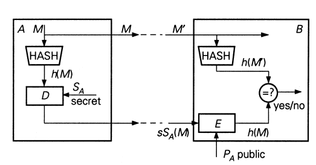

# Lecture 9: The "Naive" RSA

## Public Key Algorithm

- Symmetric encryption algorithms are fast
- However, key distribution is a problem

- Public key encryption algorithms are slow
- However, key distribution is easier
  - Public key is broadcasted
  - Private key is kept secret

- Choose primes $p$ and $q$ with $p,k \in \{0, 1\}^\kappa$, $\kappa$ is a security parameter
- $N = p\cdot q$
- $e \in_R \mathbb{Z}_N^*$ ($\in_R$ means choose a random value)
- $\phi(N) = (p-1)(q-1)$
- $e \cdot d \equiv 1 \mod \phi(N)$
- In practice $e \in \{3,7,65537\}$
- Public: $(e, N)$
- Private: $(d)$, $(p, q, d)$

- Encryption:
  - $m \in \mathbb{Z}_N$
  - $c = m^e \mod N$
- Decryption:
  - $m = c^d \mod N$

### Why does it work?

$$
\begin{alignedat}{2}
a^{\phi(N)} & = 1 \mod N, \quad a \in Z_N^* \qquad &c^d \mod N& = (m^e)^d \mod N  \\
&&&= m^{e\cdot d} \mod N \\
e\cdot d &= 1 + s\cdot \phi(N) \implies &&= m^{1+s\cdot\phi(N)} \mod N \\
&&&= m\cdot \left(\underbrace{m^{\phi(N)}}_1\right)^s \mod N \\
&&&= m
\end{alignedat}
$$

## Security of RSA

- Computing $\boldsymbol{d}$ given $\boldsymbol{e}$ and $\boldsymbol{N}$
- No harder than factoring $\boldsymbol{N}$
  - If you can factor $\boldsymbol{N}$, you can compute $\boldsymbol{d}$
- Current suggestion: Modulo to be 2048 bits
- RSA is OW-CPA
- RSA is **not** IND-CPA secure

- Deterministic encryption is not the only problem
- RSA is malleable due to homorphism

**Definition** (Homomorphic Property). An encryption scheme has the (multiplicative) homomorphic property if given the encryptions of $m_1$ and $m_2$ we can determine the encryption of $m_1 \cdot  m_2$, without knowing $m_1$ or $m_2$.

- RSA is multiplicative homomorphic

$$
({\color{red}m_1}\cdot{\color{red}m_2})^e\pmod N = (({\color{red}m_1}^e \pmod N) \cdot ({\color{red}m_2}^e \pmod N)) \pmod N
$$

- The naive RSA is **not** OW-CCA secure

- Remember that we have a decryption oracle

  - ${\color{blue}c^*} = ({\color{red}m^*})^e \pmod {{\color{blue}N}}$
  - ${\color{blue}c} = 2^{\color{blue}e} \cdot {\color{blue}c^*}$
  - Use decryption oracle

  $$
  \begin{aligned}
  \frac{\color{blue}m}{2} &= \frac{{\color{blue}c}^{\color{red}d}}{2} = \frac{(2^{\color{blue}e}\cdot {\color{blue}c^*})^{\color{red}d}}{2} \\
  &= \frac{2^{{\color{blue}e}\cdot {\color{red}d}}\cdot ({\color{blue}c^*})^{\color{red}d}}{2} = \frac{2\cdot {\color{red}m^*}}{2} = {\color{red}m^*}
  \end{aligned}
  $$

## Rabin Encryption

- After Michael Rabin
- OW-CPA secure based on factoring problem
- Mapping is not injective

- Key Generation: Choose $\boldsymbol{p}$ and $\boldsymbol{q}$ such that $p=q=3 \mod 4$
- Private key: $(p,q)$
- Public key: $N$

- Encryption:

$$
{\color{blue}c} \leftarrow {\color{red}m}^2 \pmod{{\color{blue}N}}
$$

- Decryption:

$$
\begin{aligned}
{\color{red}m} &= \sqrt{\color{blue}c} \pmod {{\color{blue}N}} \rightarrow \text{not feasible}\\
{\color{red}m_p} &= \sqrt{\color{blue}c} \pmod {{\color{red}p}} = {\color{blue}c}^{({\color{red}p}+1)/4} \pmod {{\color{red}p}} \\
{\color{red}m_q} &= \sqrt{\color{blue}c} \pmod {{\color{red}q}} = {\color{blue}c}^{({\color{red}q}+1)/4} \pmod {{\color{red}q}} \\
\end{aligned}
$$

- There are 4 possible plaintext? How to find the right one?

### Security of Rabin

- OW-CPA secure
- Not OW-CCA secure (malleable)
- Not IND-CPA secure (deterministic)

## The "Naive" RSA Signature

- Sender "signs" a message by decrypting it
- Receiver "verifies" the signature by encryption and obtains the message

- Singing: ${\color{blue}s} \leftarrow {\color{blue}m}^{\color{red}d} \pmod {{\color{blue}N}}$
- Verification: ${\color{blue}m} \leftarrow {\color{blue}s}^{\color{blue}e} \pmod{{\color{blue}N}}$

### Checking validity

- We need to check the validity of the signature
- Padding is required

- $m$ is $t$ bits, and $N$ is $k$ bits with $t < k$-32 bits
- Pad $m$ with zeros on the left to make it a multiple of 8 bits
- Add $(k-t)/8$ bytes to the left of $m$:

$$
m \leftarrow 00||01||FF||FF\dots||FF||00||m
$$

- This way of padding prevents trivial existential forgery attack

### Selective Forgery

- This padding also prevents selective forgery attack

- Suppose we have a signing oracle
- Attacker wants to obtain signature $\boldsymbol{s}$ of $\boldsymbol{m}$
- Generate a random message $m_1 \in \mathbb{Z}_N^*$

$$
m_2 \leftarrow \frac{m}{m_1}
$$

- Ask the oracle to sign $m_1$ and $m_2$

$$
\begin{aligned}
{\color{blue}s_i} &= {\color{blue}m_i}^{\color{red}d} \pmod{{\color{blue}N}} \\
{\color{blue}s} &\leftarrow {\color{blue}s_1}\cdot{\color{blue}s_2} \pmod{{\color{blue}N}}
\end{aligned}
$$

### Signing Documents

- You need to divide $m$ into blocks
- Serial numbers and redundancy are needed
- Time-consuming!

- Separate message recovery and verification!
- Use a hash function
- Compute the hash of $\boldsymbol{m}$ and then sign the hash

{width=50%}

###  More on the Security of RSA

- Knowledge of $d$ and factoring: if you know $d$, you can factor $N$ using a Las Vegas algorithm
- Knowledge of $\phi(N)$ and factoring: if you know $\phi(N)$ you can factor $N$
- Shared modulus $N$: Not a good idea!
- Use of a small public exponent: using CRT, RSA can be broken
  - Padding is important
- Hastad's Attack
- Franklin-Reiter Attack and Coppersmith's Generalization
- Wiener's Attack
- Partial Exposure Attacks
- Fault Analysis

### Knowledge of $\phi(N)$ and factoring

$$
\begin{aligned}
{\color{blue}\phi(N)} &= ({\color{red}p}-1)\cdot ({\color{red}q-1}) = {\color{blue}N}-({\color{red}p}+{\color{red}q})+1 \\
{\color{blue}S} &= {\color{blue}N} + 1 - {\color{blue}\phi(N)} \\
{\color{blue}S} &= {\color{red}p} + {\color{red}q}
\end{aligned}
$$

$$
f(X) = (X - {\color{red}p})\cdot (X - {\color{red}q}) = X^2 - {\color{blue}S}\cdot X + {\color{blue}N}
$$

$$
\begin{aligned}
{\color{red}p} &= \frac{{\color{blue}S}+\sqrt{{\color{blue}S}^2-4\cdot{\color{blue}N}}}{2} \\
{\color{red}q} &= \frac{{\color{blue}S}-\sqrt{{\color{blue}S}^2-4\cdot{\color{blue}N}}}{2}
\end{aligned}
$$

### Use of a Shared Modulus

- There are people sharing the same modulus
- There are 2 cases
  1. Attacker shares the modulus with another person
  2. Attacker is not one of the two people

- Case 1: Attacker is one of the 2 people sharing the modulus
  - From $\boldsymbol{d_1}$, the attacker can compute $\boldsymbol{p}$ and $\boldsymbol{q}$
  - Then the attacker computes $d_2$ from $\boldsymbol{e_2}$, $\boldsymbol{p}$ and $\boldsymbol{q}$
- Case 2: Attacker is none of the 2 people sharing the modulus
- TODO: I have not finished yet this lecture (second 1:03:35)