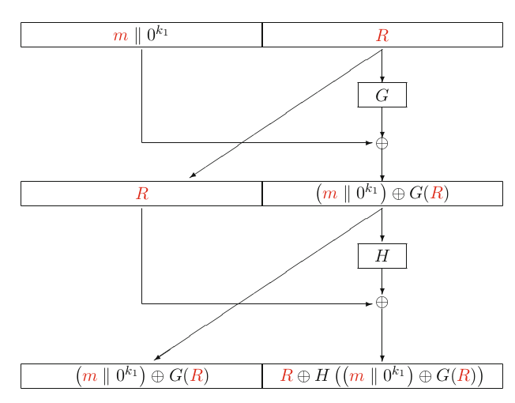
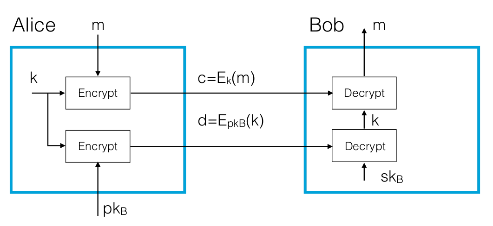

# Lecture 10: Public Key Encryption and Signature Algorithms

## Passively Secure Encryption Schemes

- Goldwasser-Micali
- ElGamal
- Paillier

### Goldwasser-Micali Encryption

- RSA is not IND-CPA secure
- Can we have IND-CPA secure schemes based on factoring assumption?
- GM is one such encryption
  - Not being used in practice, not practical
  - But simple construction to help us to build others

#### Hardness Assumption

- GM is based on QUADRES problem
  - Given a composite integer $\boldsymbol{N}$ and an integer $\boldsymbol{e}$, it is hard to test whether $\boldsymbol{a}$ is a quadratic residue or not.

$$
\begin{aligned}
Q_N &= \{x^2 \pmod N: x \in (\mathbb{Z}/N\mathbb{Z})^*\}, \\
J_N &= \{a \in (\mathbb{Z}/N\mathbb{Z})^* : \left(\frac{a}{N}\right) = 1 \} \\
N &= {\color{red}p}\cdot{\color{red}q}
\end{aligned}
$$

- Size of $Q_N = ({\color{red}p} - 1)\cdot({\color{red}q} - 1)/4$
- Size of $J_N = ({\color{red}p} - 1)\cdot({\color{red}q} - 1)/2$

#### Key Generation

$$
\begin{aligned}
{\color{blue}N} &\leftarrow {\color{red}p}\cdot {\color{red}q} \\
{\color{blue}y} &\in J_{\color{blue}N} \setminus Q_{\color{blue}N} \\
{\color{red}\mathfrak{sk}} &= ({\color{red}p},{\color{red}q}) \\
{\color{blue}\mathfrak{pk}} &= ({\color{blue}N},{\color{blue}y})
\end{aligned}
$$

- How to find $\color{blue}y$?

$$
\begin{aligned}
{\color{red}y_p} &\in \mathbb{F}_{\color{red}p}^* \\
{\color{red}y_q} &\in \mathbb{F}_{\color{red}q}^* \\
\left(\frac{\color{red}y_p}{\color{red}p}\right) &= \left(\frac{\color{red}y_q}{\color{red}q}\right) = -1
\end{aligned}
$$

and then use CRT
$$
\left(\frac{\color{blue}y}{\color{blue}N}\right) =
\left(\frac{\color{blue}y}{\color{red}p}\right) \cdot 
\left(\frac{\color{blue}y}{\color{red}q}\right) = 
\left(\frac{\color{red}y_p}{\color{red}p}\right) \cdot
\left(\frac{\color{red}y_q}{\color{red}q}\right) =
(-1) \cdot (-1) = 1
$$

#### Encryption and Decryption

- **Encryption**: a single big $\boldsymbol{b}$

$$
\begin{aligned}
{\color{red}x} &\leftarrow (\mathbb{Z}/{\color{blue}N}\mathbb{Z})^* \\
{\color{blue}c} &\leftarrow {\color{blue}y}^{\color{red}b} \cdot {\color{red}x}^2 \pmod{{\color{blue}N}}
\end{aligned}
$$

- **Decryption**: Compute

$$
\left(\frac{\color{blue}c}{\color{red}p}\right)
$$

- If $b=0$, $c$ is a quadratic residue $(+1)$
- If $b=1$, $c$ is a non-quadratic residue $(-1)$

#### Security

- GM is IND-CPA secure
- GMA is **not** IND-CCA secure
  - Malleable (homomorphic)

### ElGamal Encryption

- We want to h ave an encryption scheme that is
  - IND-CPA secure
  - Efficient
- Domain parameters
  - Prime $\boldsymbol{p}$ such that $\boldsymbol{p-1}$ is divisible by another prime $\boldsymbol{q}$
  - $\boldsymbol{g}$ is an element in finite field $p$, with an order $\boldsymbol{q}$

$$
{\color{blue}g} = {\color{blue}r}^{({\color{blue}p} - 1)/{\color{blue}q}} \pmod{{\color{blue}p}} \ne 1 \text{ for some } {\color{blue}r} \in \mathbb{F}_{\color{blue}p}^*
$$

$$
p = 2\cdot q + 1 \longrightarrow \text{ safe prime}
$$

#### Key Generation

- Secret key: ${\color{red}x} \leftarrow [0, \dotsc, {\color{blue}q} - 1]$
- Public key: ${\color{blue}h} \leftarrow{\color{blue}g}^{\color{red}x} \pmod{{\color{blue}p}}$

#### Encryption and Decryption

- **Encryption**: to encrypt a message $\boldsymbol{m}$ in $G$

$$
\begin{aligned}
{\color{red}k} &\leftarrow \{0, \dotsc, {\color{blue}q} - 1\} \\
{\color{blue}c_1} &\leftarrow {\color{blue}g}^{\color{red}k} \\
{\color{blue}c_2} &\leftarrow {\color{red}m}\cdot{\color{blue}h}^{\color{red}k} \\
{\color{blue}c} &\leftarrow ({\color{blue}c_1},{\color{blue}c_2}) \in {\color{blue}G} \times {\color{blue}G}
\end{aligned}
$$

- **Decryption**: 

$$
\frac{\color{blue}c_2}{{\color{blue}c_1}^{\color{red}x}} = \frac{{\color{red}m}\cdot{\color{blue}h}^{\color{red}k}}{{\color{blue}g}^{{\color{red}x}\cdot{\color{red}k}}} = \frac{{\color{red}m}\cdot{\color{blue}g}^{{\color{red}x}\cdot{\color{red}k}}}{{\color{blue}g}^{{\color{red}x}\cdot{\color{red}k}}} = {\color{red}m}
$$

- **Recall**: ${\color{blue}h} \leftarrow{\color{blue}g}^{\color{red}x} \pmod{{\color{blue}p}}$

#### Security of ElGamal

- IND-CPA
- But still not IND-CCA secure
  - ElGamal is malleable. (multiplicative homomorphic)

$$
\begin{aligned}
({\color{blue}c_1},{\color{blue}c_2}) &= ({\color{blue}g}^{\color{red}k},{\color{red}m}\cdot{\color{blue}h}^{\color{red}k}) \\
({\color{blue}c_1},\boldsymbol{2}\cdot{\color{blue}c_2}) &= ({\color{blue}g}^{\color{red}k},\boldsymbol{2}\cdot{\color{red}m}\cdot{\color{blue}h}^{\color{red}k}) \\
\end{aligned}
$$

### Paillier Encryption

- IND-CPA secure
- Efficient
- **Additively** homomorphic

#### Carmichael's Theorem

Let $n=pq$ where $p$ and $q$ are large numbers, $\phi(n)$ is Euler's totient function and $\lambda(n) = lcm(p-1,q-1)$. For any $w \in \mathbb{Z}_{n^2}^*$
$$
\begin{aligned}
w^{\lambda} &= 1 \mod n \\
w^{n\lambda} &= 1 \mod n^2
\end{aligned}
$$

#### Key Generation

Let $n=pq$ and $g$ is a generator of group $\mathbb{Z}_{n^2}^*$, with an order of $n$ that is, $g^n \equiv 1 \mod n^2$. And $\lambda = lcm(p-1,q-1)$. Secret key is $(\lambda)$, public key is $(g,n)$

- How to find such a $\boldsymbol{g}$?

$$
\begin{aligned}
(1 + n) &\equiv 1 + n \mod n^2 \\
(1 + n)^2 &= 1 + 2n + n^2 \equiv 1 + 2n \mod n^2 \\
(1 + n)^3 &= 1 + 3n + 3n^2 + n^3 \equiv 1 + 3n \mod n^2 \\
&\ \ \vdots \\
(1 +n)^k &\equiv 1 + kn \mod n^2 \\
\text{then } (1+n)^n &= 1 + n\cdot n \equiv 1 \mod n^2 \\
g &= 1 + n
\end{aligned}
$$

#### Encryption and Decryption

- **Encryption**

$$
\begin{gathered}
m \in \mathbb{Z}_n, \qquad r \in_R \mathbb{Z}_n^* \\
E_{pk}(m) = g^mr^n \mod n^2
\end{gathered}
$$

- **Decryption**:

$$
D_{sk}(c) = \frac{L(c^\lambda \mod n^2)}{L(g^\lambda \mod n^2)} \mod n
$$

where
$$
L(u) = \frac{u-1}{n}
$$

- Why does it work?

$$
\begin{aligned}
c^\lambda \mod n^2 &= (g^mr^n)^\lambda = g^{m\lambda} \cdot \underbrace{r^{n\lambda}}_{1 \text{ Carmichael}} \mod n^2 \\
&= (1+n)^{m\lambda}\mod n^2 = 1 + nm\lambda \\
g^\lambda \mod n^2 &= (1+n)^\lambda = 1+n\lambda \\
\frac{L(1+nm\lambda)}{L(1+n\lambda)} &= \frac{m\lambda}{\lambda}\mod n \equiv m \mod n
\end{aligned}
$$

#### Additive Homorphism

- Homorphism

$$
E_{pk}(m_1) \otimes E_{pk}(m_2) = E_{pk}(m_1 \oplus m_2)
$$

- Additive homorphism

$$
\begin{aligned}
&E_{pk}(m_1) \times E_{pk}(m_2) = E_{pk}(m_1+m_2) \\
&\underbrace{E_{pk}(m) \times E_{pk}(m) \times \dotsm \times E_{pk}(m)}_{c \text{ times}} =
E_{pk}(m)^c = E_{pk}(m\cdot c)
\end{aligned}
$$

### RSA-OAEP

- RSA is not IND-CPA secure
- Thus we need redundancy
- Padding can help but it should be random too

- There have been many padding proposals for RSA
- Bellare-Rogoway is the most successful one
  - OAEP: Optimized Asymmetric Encryption Padding

#### OAEP

{width=75%}

- Let $f$ be any $k$-bit to $k$-bit trapdoor one-way permutation
- Let $k_0$ and $k_1$ be numbers such that the effort of $2^{k_0}$ and $2^{k_1}$ is impossible ($k_0, k_1 > 128$ bits)
- Let $n$ be $k-k_0-k_1$
- Define the following hash functions

$$
\begin{aligned}
G: \{0, 1\}^{k_0} &\longrightarrow \{0,1\}^{n+k_1} \\
H: \{0, 1\}^{n+k_1} &\longrightarrow \{0, 1\}^{k_0}
\end{aligned}
$$

- Let $\boldsymbol{m}$ be a message of size $n$ bits

$$
{\color{blue}c} \leftarrow E({\color{red}m}) = f\Big(\{({\color{red}m}||0^{k_1}) \oplus G({\color{red}R})\} || \{ {\color{red}R} \oplus H(({\color{red}m}||0^{k_1})\oplus G({\color{red}R}))\}\Big) = f({\color{red}A})
$$

- ${\color{red}m} || 0^{k_1}$ means $\color{red} m$ followed by $k_1$ zero bits
- $\color{red} R$ is a random bit string of length $k_0$
- $||$ denotes concatenation

#### Decryption

- Apply the trapdoor to $f$ to recover ${\color{blue}A} = f^{-1} = \{{\color{blue}T} || \{ {\color{red}R} \oplus H({\color{blue}T}) \} \}$
- Compute $H({\color{blue}T})$ and recover $\color{blue}R$ from ${\color{red}R} \oplus H({\color{blue}T})$
- Compute $G({\color{blue}R})$ and recover $v = {\color{blue}m} || 0^{k_1}$ from ${\color{blue}T} = {\color{red}m}||0^{k_1} \oplus G({\color{red}R})$
- If $v$ ends in $k_1$ zeros output ${\color{blue}m}$, otherwise return $\perp$

- In the Random Oracle Model
  - If $g$ and $H$ are secure then
  - RSA-OAEP is IND-CCA secure

### Fujisaki-Okamoto Transform

- We can use this transform to obtain IND-CCA secure schemes from IND-CPA secure schemes
- Simple and elegant
  - Original scheme: $E({\color{red}m},{\color{red}r})$
  - New scheme: $E'({\color{red}m}, {\color{red}r}) = E({\color{red}m}||{{\color{red}r}}, H({\color{red}m}||{\color{red}r}))$

## Hybrid Ciphers

### Secure communication

- Symmetric key algorithms: fast but key distribution problem
- Asymmetric key algorithms: slow but key distribution is easier

- In practice KEM/DEM approach is used
  - Encrypt the data using a symmetric cipher
  - Send the encryption key using an asymmetric cipher

- KEM: Key Encapsulation Mechanism
  - Public key component
- DEM: Data Encapsulation Mechanism
  - Private key component

{width=75%}

## KEM/DEM

- To encrypt a message $m$ to a user with $(pk, sk)$
  - $({\color{red}k},{\color{blue}c_1}) \leftarrow {\color{blue}\textsf{Encap}_{\mathfrak{pk}}}()$
  - ${\color{blue}c_2} \leftarrow {\color{blue}e}_{\color{red}k}({\color{red}m})$
  - ${\color{blue}c} \leftarrow ({\color{blue}c_1},{\color{blue}c_2})$
- Upon receiving $\color{blue}c$, the recipient performs the following steps:
  - ${\color{red}k}\leftarrow \textsf{Decap}_{\color{red}\mathfrak{sk}}({\color{blue}c_1})$
  - If ${\color{red}k} = \perp$ return $\perp$
  - ${\color{red}m} \leftarrow {\color{blue}d}_{\color{red}k}({\color{blue}c_2})$
  - Return $\color{red}m$
- Given that KEM and DEM are secure separate, the hybrid system is secure as well

#### Construction of KEM

- Two examples:
  - RSA-KEM (compare it with RSA-OAEP)
  - DHIES-KEM (compare it with ElGamal with FO-transform)

### RSA-KEM

- Let $N$ be the RSA modulus, product of two primes $p$ and $q$
- Function $f$ is the encryption algorithm for RSA
- Then encapsulation works as follows
  - ${\color{red}x} \leftarrow \{1,\dotsc,{\color{blue}N} - 1\}$
  - ${\color{blue}c} \leftarrow f_{{\color{blue}N},{\color{blue}e}}({\color{red}x})$
  - ${\color{red}k} \leftarrow H({\color{red}x})$
  - Output $({\color{red}k},{\color{blue}c})$
- Decapsulation is as follows, performed by the holder of the secret key
  - ${\color{red}x} \leftarrow f_{\color{blue}N}^{-1}({\color{blue}c})$
  - ${\color{red}k} \leftarrow H({\color{red}x})$
  - Output ${\color{red}k}$
- RSA-KEM is IND-CCA secure under ROM (Random Oracle Model)

### DHIES-KEM

- Diffie-Hellman Integrated Encryption Scheme
- **Key Generation**:
  - A cyclic finite abelian group $G$ of prime order $\boldsymbol{q}$
  - A generator $\boldsymbol{g}$
  - Key space $\boldsymbol{K}$
  - Key derivation function $\boldsymbol{H}$
  - Generate $x$ in $\mathbb{Z}/q\mathbb{Z}$
  - Compute $h=g^x$
- **Encapsulation**:
  - ${\color{red}u} \leftarrow \mathbb{Z}/{\color{blue}q}\mathbb{Z}$
  - ${\color{red}v}\leftarrow {\color{blue}h}^{\color{red}u}$
  - ${\color{blue}c}\leftarrow{\color{blue}g}^{\color{red}u}$
  - ${\color{red}k}\leftarrow H({\color{red}v}||{\color{blue}c})$
- **Decapsulation**:
  - ${\color{red}k}\leftarrow {\color{blue}c}^{\color{red}x}$
  - ${\color{red}k}\leftarrow H({\color{red}v}||{\color{blue}c})$
- This scheme is IND-CCA secure under ROM

