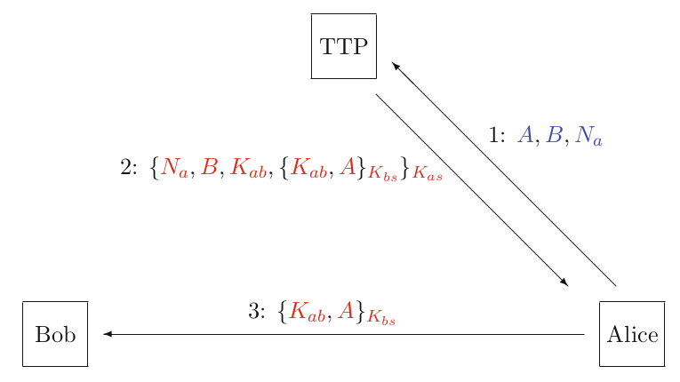
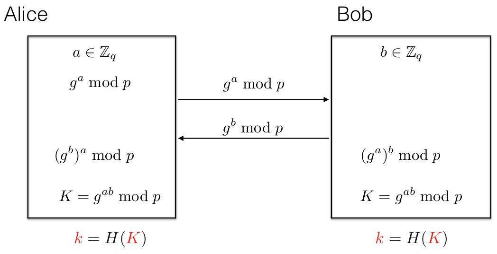
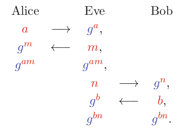

# Lecture 11: Certificates, Key Transport and Key Agreement

### Secure Communication

- Now we know
  - Symmetric systems
  - Asymmetric systems
  - Integrity (Hash functions, MACs...)
  - To design hybrid systems based on KEM/DEM
- But
  - How to use the same key for symmetric encryptions
  - How to obtain the public keys of others?
- We have solutions for that... building cryptographic protocols!

## Key Management

> In a well designed cryptographic system, only the key needs to be secret; there should be no secrecy in the algorithm
>
> Auguste Kerchkhoff, 1883

Using the right cryptographic algorithms, the problem of protecting data is transferred to the problem of protecting keys.

Key management is the backbone of cryptography

### What is Key Management

- Key Generation
- Key Distribution
- Key Storage
- Key Change
- Key Usage
- Key Destruction

### Key Generation

- Requirements
  - Secret
  - Unpredictable
  - Strong key
- Methods
  - Manual (Tossing)
  - (Pseudo) Random Number Generator (FSR)
- Secure hardware, secure room, secure procedures are needed

### Key Freshness

- It is often desirable to frequently change the key in a cryptographic system
  - If a key is exposed (e.g. through hackers), there is limited damage if the key is changed often
  - Some cryptographic attacks become more difficult if only a limited amount of ciphertext was generated under one key
  - If an attacker wants to recover long pieces of ciphertext, he has to recover several keys which makes attacks harder

### Types of Keys and Key Distribution

- Static (or Long-term) Key: few hours to few years
- Ephemeral or Session (or Short-term) Keys: a few seconds or a day
- Key Distribution
  - Physical Distribution
  - Distribution Using Symmetric Key Protocols
  - Distribution Using Public Key Protocols

### Key Distribution Problem

- Symmetric system: $n(n-1)/2$
- TU Delft with 25000 students
  - How many keys needed?

## Certificates and Certificate Authorities

- Symmetric keys between Alice and Bob
  - We assume the have a shared, long-term key $K_{ab}$
  - Distributed via a secure channel
- Asymmetric keys are different: Alice has Bob's public key
  - How can she be sure that it is Bob's key?
- Binding: linking a public key to an entity
  - Physical tokens such as smart cards
    - PIN number / biometrics
  - Digital certificates!

### Certificate Authorities

- Trusted Third Party (TTP) or CA
  - All users have a copy of the public key of CA
  - CA signs the data string (Alice, Alice's public key) [This is the certificate]
  - Alice sends people her public key and the certificate

### Certificates

- Contain the following information
  - User's name
  - User's public key
  - Is this an encryption or signing key?
  - Name of the CA
  - Serial number of the certificate
  - Expiry date of the certificate

### Certificate Authorities

- Usually the task is split into two
  - **Registration Authority (RA)**: Verifies personal data, accepts, registers; contact with client
  - **Certification Authority (CA)**: Generation, management and distribution of PK-certificates

### Revocation

- Key is compromised
- Employee left
- Key is no longer valid
- Everybody should be warned. Certificate revocation
  - CRL: Certificate Revocation List
- The system of CAs and certificates is called **Public Key Infrastructure (PKI)**

### Implicit Certificates

- Typical certificates can be large
- We can also have a smaller certificate that binds the public key and the data in the form of $X|Y$
  - $X$ is the data being bound to the public key
  - $Y$ is the implicit certificate on $X$
- From $Y$ we can obtain the public key bound to $X$

#### Protocol

- **System Set-up**: CA chooses public group $G$ of order $n$, and an element $P$, private key $\color{red}c$, public key ${\color{blue}Q}=P^c$
- **Certificate Request**: $ID$, ephemeral key is $t$, public key $R=P^t$. Sends $ID$ and $R$ to CA.
- **Processing of the request**: CA picks another random $k$, computes
  - $g \leftarrow P^kR = P^kP^t = P^{k+t}$
  - $s \leftarrow c H(ID||g) + k \pmod{n}$
  - CA sends $({\color{blue}g},{\color{blue}s})$ to Alice
- **Alice's Key Discovery**: From $t$, $s$, $R = P^t$
  - Her key is $P^a = P^{t+s} = P^tP^s = R\cdot P^s$
- **User's Key Discovery**: $P^a = Q^{H(ID||g)}g$
- Problems:
  - CA is compromised
  - CA has the same level security with the users, not good

## Fresh Ephemeral Symmetric Keys from Static Symmetric Keys

- Key number: $n(n-1)/2$
- Short-term keys from Long-term keys
  - Using symmetric systems
- Definitions
  - Parties: $A$, $B$, and TTP
  - Shared keys: $K_{ab}, K_{bs}, K_{as}$
  - Nonces: numbers used only once, unique but not necessarily random
  - Timestamps: $T_a$, $T_b$

$$
A \longrightarrow B: {\color{blue}M},{\color{blue}A},{\color{blue}B},\{{\color{red}N_a}, {\color{red}M}, {\color{red}A},{\color{red}B}\}_{\color{red}K_{as}}
$$

### Wide-Mouth Frog Protocol

{width=75%}

### Needham-Schroeder Protocol

- Let's build step by step

{width=75%}

{width=75%}

#### Man-in-the-middle Attack

$$
\begin{aligned}
A &\longrightarrow E: {\color{blue}A},{\color{blue}B} \\
E &\longrightarrow S: {\color{blue}A},{\color{blue}E} \\
S &\longrightarrow E: \{{\color{red}K_{ae}}\}_{\color{red}K_{es}}, \{{\color{red}K_{ae}}\}_{\color{red}K_as} \\
E &\longrightarrow A: \{{\color{red}K_{ae}}\}_{\color{red}K_{es}}, \{{\color{red}K_{ae}}\}_{\color{red}K_as} \\
A &\longrightarrow E: \{{\color{red}K_{ae}}\}_{\color{red}K_{es}}, {\color{blue}A} \\
\end{aligned}
$$

{width=75%}

{width=75%}

- Final protocol:

{width=75%}

### Kerberos

- Authentication system based on symmetric encryption
- Ideas from Needham-Schroeder Protocol
- MIT, 1987
- Windows OS and many others are using Kerberos
- Authentication Server
- Clients: Users, programs, services
- Also a ticket-granting service (TGS) to enable access control
  - Suitable for real life e.g. a company

{width=75%}

- Now we use timestamps but this requires synchronised clocks

### Fresh Ephemeral Symmetric Keys from Static Public Keys

- Symmetric key systems: key distribution problem
- TTP based solutions like Kerberos are also problematic: we assume there is a long-term key
- Two techniques to solve this problem
  - Key Transport on public key cryptography
  - Ket Agreement that outputs a symmetric key

### Key Transport

- Alice checks Bob's public key
- Alice sends the symmetric key to Bob by encrypting it with Bob's public key

- Bob is not sure about the source (Alice)

{width=50%}

- Eve can fool Bob

{width=50%}

- Replay attack

{width=505%}

## Forward Secrecy

- A compromise on key should not lead to security problem on the previous messages decrypted before that time
  - All schemes up to now are not forward secure
  - Once compromised, all messages in the past can be decrypted

### Diffie-Hellman Key Exchange Protocol

- Enables two entities to establish a symmetric key even though they have never met before
- Based on discrete log problem
  - Finite field version on abelian group $G$ of order $q$
  - Elliptic curve version

 {width=75%}

- Man-in-the-middle attack is possible

{width=50%}

### Station-to-Station (STS) Protocol

The idea is to connect the identity of the people to the key
$$
\begin{alignedat}{2}
A &\longrightarrow B: {\color{blue}\mathfrak{ek}_A} = {\color{blue}g}^{\color{red}a}, \\
B &\longrightarrow A: {\color{blue}\mathfrak{ek}_B} = {\color{blue}g}^{\color{red}b},{\color{blue}e}_{\color{red}k}({\color{blue}\mathsf{Sig}_{\color{red}\mathfrak{sk}_B}}({\color{blue}\mathfrak{ek}_B},{\color{blue}\mathfrak{ek}_A})) & \qquad\qquad\text{where } {\color{red}k} &\leftarrow H({\color{blue}\mathfrak{ek}_A}^{\color{red}b}), \\
A &\longrightarrow B: {\color{blue}e}_{\color{red}k}({\color{blue}\mathsf{Sig}_{\color{red}\mathfrak{sk}_A}}({\color{blue}\mathfrak{ek}_A},{\color{blue}\mathfrak{ek}_B})) & \qquad\qquad\text{where } {\color{red}k} &\leftarrow H({\color{blue}\mathfrak{ek}_B}^{\color{red}a}),
\end{alignedat}
$$

- Another variant with MAC

$$
\begin{alignedat}{2}
A &\longrightarrow B: {\color{blue}\mathfrak{ek}_A} = {\color{blue}g}^{\color{red}a}, \\
B &\longrightarrow A: {\color{blue}\mathfrak{ek}_B} = {\color{blue}g}^{\color{red}b},{\color{blue}e}_{\color{red}k}({\color{blue}\mathsf{Sig}_{\color{red}\mathfrak{sk}_B}}({\color{blue}\mathfrak{ek}_B},{\color{blue}\mathfrak{ek}_A})),{\color{blue}\mathsf{Mac}}_{\color{red}k'}({\color{blue}S_B}) & \qquad\qquad\text{where } {\color{red}k}||{\color{red}k'} &\leftarrow H({\color{blue}\mathfrak{ek}_A}^{\color{red}b}), \\
A &\longrightarrow B: {\color{blue}e}_{\color{red}k}({\color{blue}\mathsf{Sig}_{\color{red}\mathfrak{sk}_A}}({\color{blue}\mathfrak{ek}_A},{\color{blue}\mathfrak{ek}_B})),{\color{blue}\mathsf{Mac}}_{\color{red}k'}({\color{blue}S_A}) & \qquad\qquad\text{where } {\color{red}k}||{\color{red}k'} &\leftarrow H({\color{blue}\mathfrak{ek}_B}^{\color{red}a}),
\end{alignedat}
$$

### Blake-Wilson-Menezes Protocol

- Can we achieve authentication without signatures and MACs?
- Alice has a long-term key $(g^a, a)$
- Bob has a long-term key $(g^b, b)$
- They obtain each others public key via certificates
- And then,

$$
\begin{aligned}
A &\longrightarrow B: {\color{blue}\mathfrak{ek}_A} = {\color{blue}g}^{\color{red}x} \\
B &\longrightarrow A: {\color{blue}\mathfrak{ek}_B} = {\color{blue}g}^{\color{red}y}
\end{aligned}
$$

- Alice computes: ${\color{red} k}\leftarrow H({\color{blue}\mathfrak{pk}_B}^{\color{red}x},{\color{blue}\mathfrak{ek}_B}^{\color{red}a}) = H({\color{blue}g}^{{\color{red}b}\cdot {\color{red}x}},{\color{blue}g}^{{\color{red}y}\cdot{\color{red}a}})$
- Bob computes: ${\color{red} k}\leftarrow H({\color{blue}\mathfrak{pk}_A}^{\color{red}x},{\color{blue}\mathfrak{ek}_A}^{\color{red}a}) = H({\color{blue}g}^{{\color{red}x}\cdot {\color{red}b}},{\color{blue}g}^{{\color{red}a}\cdot{\color{red}y}})$

### Menezes, Qu and Vanstone (MQV) Protocol

- Alice and Bob should perform 3 exponentiations in the previous version
- MQV protocol
  - Alice has a long-term key $(g^a, a)$
  - Bob has a long-term key $(g^b, b)$
  - They obtain each others public key via certificates

$$
\begin{aligned}
A&\longrightarrow B : {\color{blue}\mathfrak{ek}_A} = {\color{blue}g}^x \\
B&\longrightarrow A: {\color{blue}\mathfrak{ek}_B} = {\color{blue}g}^y
\end{aligned}
$$

- The last step
- I denotes half the bit size of the order of $G$

- Alice computes
  - Convert $\color{blue}\mathfrak{ek}_A$ to integer ${\color{blue}i}$
  - ${\color{blue}s_A} \leftarrow({\color{blue}i}\pmod{2^{\color{blue}l}}) + 2^{\color{blue}l}$
  - Convert $\color{blue}\mathfrak{ek}_B$ to an integer $\color{blue}j$
  - ${\color{blue}t_A} \leftarrow ({\color{blue}j}\pmod{2^{\color{blue}l}}) + 2^{\color{blue}l}$
  - ${\color{red}h_A}\leftarrow{\color{red}x}+{\color{blue}s_A}\cdot{\color{red}a}\pmod{{\color{blue}q}}$
  - ${\color{red}K_A}\leftarrow({\color{blue}\mathfrak{ek}_B},{\color{blue}\mathfrak{pk}_B^{t_A}})^{\color{red}h_A}$
- Bob computes
  - Convert $\color{blue}\mathfrak{ek}_B$ to integer ${\color{blue}i}$
  - ${\color{blue}s_B} \leftarrow({\color{blue}i}\pmod{2^{\color{blue}l}}) + 2^{\color{blue}l}$
  - Convert $\color{blue}\mathfrak{ek}_A$ to an integer $\color{blue}j$
  - ${\color{blue}t_B} \leftarrow ({\color{blue}j}\pmod{2^{\color{blue}l}}) + 2^{\color{blue}l}$
  - ${\color{red}h_B}\leftarrow{\color{red}x}+{\color{blue}s_B}\cdot{\color{red}b}\pmod{{\color{blue}q}}$
  - ${\color{red}K_B}\leftarrow({\color{blue}\mathfrak{ek}_A},{\color{blue}\mathfrak{pk}_A^{t_B}})^{\color{red}h_B}$

## Summary

- Certificates bind a key to some other information e.g. an identity
- There are several PKI with advantages and disadvantages
- Implicit certificates reduce the bandwidth needed but introduce other drawbacks
- There are several key agreement protocols based on e.g. TTP symmetric encryption
- Diffie-Hellman can be used for key agreement but man-in-the-middle attack is possible
- To overcome this problem, STS, BWM and MQV protocols were proposed

