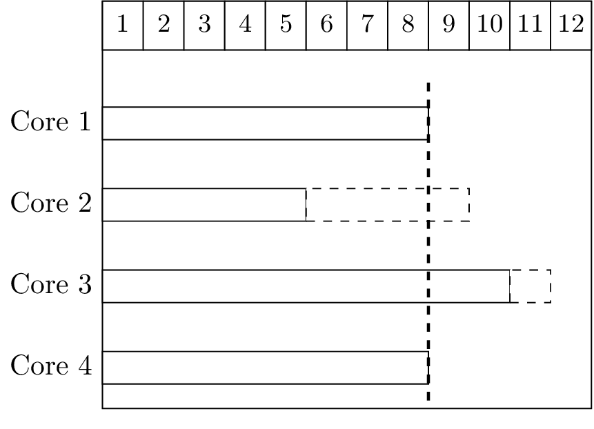
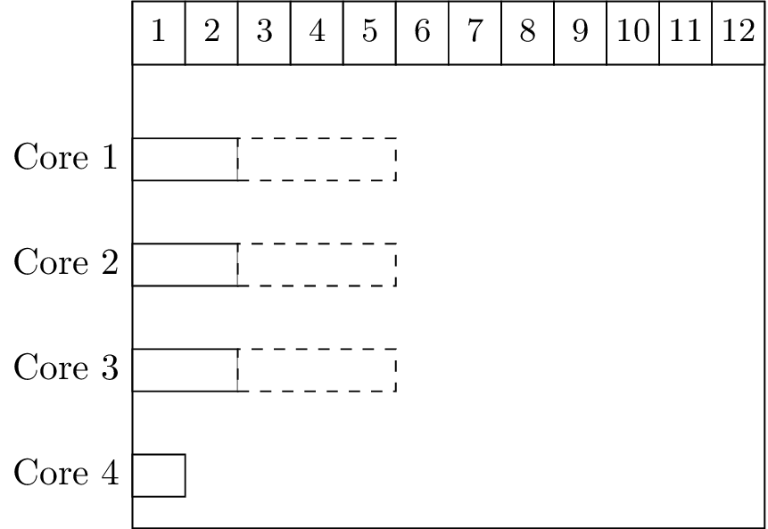

# Meeting 2019-11-05

In this meeting we met together Geoffrey, Paris and me in order to explain to Paris all the formulation regarding Fixed Priority Gang Scheduling.

During the discussion an idea came regarding the scheduling of some tasks. When computing $LFT_i$ we have $t_{wc}$ and $t_{high}$ but for $t_{high}$ we are assuming that we have to start before the higher priority task can start. 

However, if we have a higher priority job $J_i$ and a lower priority job $J_j$ and we want to obtain $LFT_j$ when computing $t_{high}$ if $J_i$ has been released but $A^{max}_{s_i^{min}}$ is higher than $r_j$ then $t_{high}$ would give a higher value. This assumption is pessimistic as if in this case if $s_i^{min} \le s_j^{max}$ then that means that if $J_j$ can start so does $J_i$ and, since $J_i$ has a higher priority, then $J_j$ would never execute in this scenario.

> ***
>
> **Example**:
>
> {width=50%}
>
> | $i$  | $r_i^{\min}$ | $r_i^{\max}$ | $S_i^{\min}$ | $S_i^{\max}$ | $EST_i^1$ | $EST_i^2$ | $EST_i^3$ | $EST_i^4$ | $LST_i$ |
> | ---- | ------------ | ------------ | ------------ | ------------ | --------- | --------- | --------- | --------- | ------- |
> | 1    | 5            | 5            | 1            | 4            | 6         | 8         | 8         | 11        | 8       |
> | 2    | 6            | 10           | 1            | 4            | 6         | 8         | 8         | 11        | 7       |
>
> In this case the lower priority job $J_2$ has a Latest Start Time of 7 because if it starts at 8 then for sure the higher priority job $J_1$ is going to be executing however, $J_2$ has assumed that $J_1$ cannot start because core 2 is busy but if $J_2$ can start because core is no longer busy then $J_1$ can also start too and it will be scheduled instead of $J_2$ because it has a higher priority
>
> ***

There's is another example where the formulation is wrong\begin{aligned}
EST_i^p &\le LST_i \land (p=s_i^{\max} \lor EST_i^p< A_{p+1}^{\max}) \\
2 &\le 3 \land(1 = 3 \lor 1 < 2) \\
\top &\land (\bot \lor \top) = \top
\end{aligned}

> ***
>
> {width=50%}
>
> | $i$  | $r_i^{\min}$ | $r_i^{\max}$ | $S_i^{\min}$ | $S_i^{\max}$ | $EST_i^1$ | $EST_i^2$ | $EST_i^3$ | $EST_i^4$ | $LST_i$ |
> | ---- | ------------ | ------------ | ------------ | ------------ | --------- | --------- | --------- | --------- | ------- |
> | 1    | 0            | 3            | 1            | 3            | 2         | 3         | 3         |           | 3       |
>
> Eligibility condition with $p=1$:
> 
> $$
> \begin{aligned}
> EST_i^p &\le LST_i \land (p=s_i^{\max} \lor EST_i^p< A_{p+1}^{\max}) \\
> 2 &\le 3 \land(1 = 3 \lor 1 < 6) \\
> \top &\land (\bot \lor \top) = \top
> \end{aligned}
> $$
> 
> Eligibility condition with $p=2$
>
> 
> $$
> \begin{aligned}
> EST_i^p &\le LST_i \land (p=s_i^{\max} \lor EST_i^p< A_{p+1}^{\max}) \\
> 3 &\le 3 \land(2 = 3 \lor 1 < 6) \\
> \top &\land (\bot \lor \top) = \top
> \end{aligned}
> $$
> 
> So we say that execution with $p=2$ is possible while it is clearly not possible since a work conserving scheduler will have executed us with $p=1$
>
> ***

