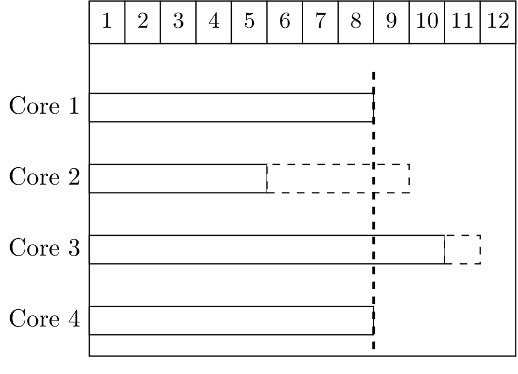
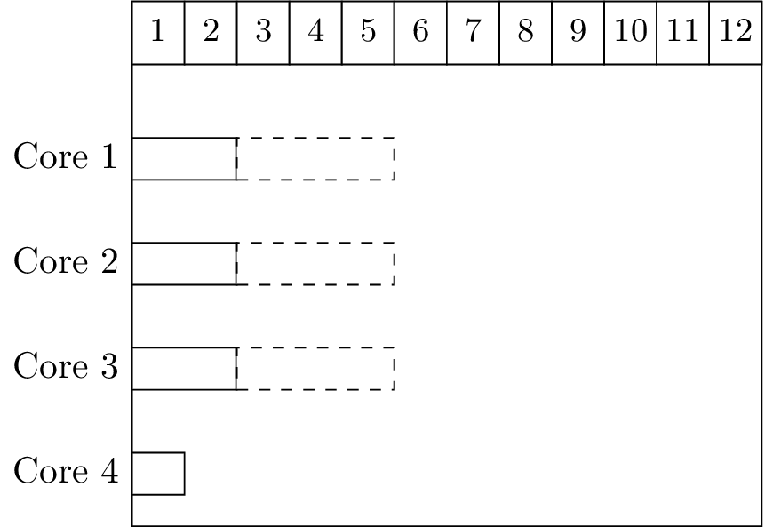

# Meeting 2019-11-20

## Types of Gang scheduling

- Bag of Gangs (BoG)
- Adapted first come first served (AFCSFS): When a job arrives if there are enough cores available then it will be scheduled, if not it will have to wait until the number of cores are available. If a smaller job comes and there are enough cores for it then the smaller job will be scheduled
- Largest gang first served (LGFS)
- Paired gang scheduling

## Papers

### Performance and Cost Evaluation of Gang Scheduling in a Cloud Computing System with Job Migrations and Starvation Handling

- Gang studied in the area of distributed systems
- Integrates two important features:
  - Job migrations
  - Starvation handling
- Important related papers:
  - Z. C. Papazachos and H. D. Karatza, "The impact of task service time variability on gang scheduling performance in a two-cluster system"
  - I. Moschakis and H. Karatza, "Evaluation of gang scheduling performance and cost in a cloud computing system"
- Important metrics
  - Response time
  - Slowdown ($s_j = r_j / e_j$ where $e_j$ is the execution time)

### Evaluation of gang scheduling performance and cost in a cloud computing system

- Gang scheduling has been extensively studied in Grid systems
- They compare **AFCFS** and **LJFS**
- Improved utilization and responsiveness with gang schedulingTested in Amazon's EC2 cloud computing instances
- It's non-preemptive

### Packing schemes for gang scheduling

- View gang scheduling as a matrix
  - Rows are time slots
  - Columns are PEs
  - Multiple slots available. **This does not have the concept of $A_p$ as there can be multiple slots at the same tim**
- Capacity Based Algorithms
  - First Fit: The first slot with sufficient capacity is allocated
  - Best Fit: Slots are sorted by capacity. The smallest one with sufficient space is chosen
- Left-Right based Algorithms
  - Left-Right by Size: 
    - Small jobs are allocated left-to-right
    - Large jobs are allocated right-to-left
  - Left-Right by Slots
    - When a new slot is created a direction is chosen and then the jobs are allocated in that direction
- Load Based Algorithms
  - Minimal Maximum Load: 
    - PEs are sorted according to the load on them
    - The ones with the smallest maximum load are chosen
  - Minimal Average Load:
    - PEs are sorted according to the load on them
    - Use the ones with the smallest average load
- Buddy Based Algorithm
  - PEs are assigned in groups instead of individually
  - PEs are partitioned recursively into groups that are powers of 2. Each group has a controller
  - It assigns contiguous processors
- Migration Based Algorithm
  - Migrates jobs from one

### In general

- Classic algorithms care about fragmentation. I still have not fully understood what they mean in this case
- Cloud computing
  - They do care about response times although they do not have deadlines
  - They also care about Slowdown
- Two classical gang schedulers
  - AFCFS
  - LJFS

## What is the objective of the project?

- Create a more advanced analysis for Flexible FP?
- Malleable Gang scheduling Analysis?
- Moldable Ga
- Are we taking into account CPU migration?

## FP Gang scheduling

There is an example where the formulation is wrong:

> ***
>
> **Example**:
>
> {width=50%}
>
> | $i$  | $r_i^{\min}$ | $r_i^{\max}$ | $S_i^{\min}$ | $S_i^{\max}$ | $EST_i^1$ | $EST_i^2$ | $EST_i^3$ | $EST_i^4$ | $LST_i$ |
> | ---- | ------------ | ------------ | ------------ | ------------ | --------- | --------- | --------- | --------- | ------- |
> | 1    | 5            | 5            | 1            | 4            | 6         | 8         | 8         | 11        | 8       |
> | 2    | 6            | 10           | 1            | 4            | 6         | 8         | 8         | 11        | 7       |
>
> In this case the lower priority job $J_2$ has a Latest Start Time of 7 because if it starts at 8 then for sure the higher priority job $J_1$ is going to be executing however, $J_2$ has assumed that $J_1$ cannot start because core 2 is busy but if $J_2$ can start because core is no longer busy then $J_1$ can also start too and it will be scheduled instead of $J_2$ because it has a higher priority
>
> ***

There's is another example where the formulation doesn't quite match

> ***
>
> {width=50%}
>
> | $i$  | $r_i^{\min}$ | $r_i^{\max}$ | $S_i^{\min}$ | $S_i^{\max}$ | $EST_i^1$ | $EST_i^2$ | $EST_i^3$ | $EST_i^4$ | $LST_i$ |
> | ---- | ------------ | ------------ | ------------ | ------------ | --------- | --------- | --------- | --------- | ------- |
> | 1    | 0            | 3            | 1            | 3            | 2         | 3         | 3         |           | 3       |
>
> Eligibility condition with $p=1$:
> 
> $$
> \begin{aligned}
> EST_i^p &\le LST_i \land (p=s_i^{\max} \lor EST_i^p< A_{p+1}^{\max}) \\
> 2 &\le 3 \land(1 = 3 \lor 1 < 6) \\
> \top &\land (\bot \lor \top) = \top
> \end{aligned}
> $$
> 
> Eligibility condition with $p=2$
>
> 
> $$
> \begin{aligned}
> EST_i^p &\le LST_i \land (p=s_i^{\max} \lor EST_i^p< A_{p+1}^{\max}) \\
> 3 &\le 3 \land(2 = 3 \lor 1 < 6) \\
> \top &\land (\bot \lor \top) = \top
> \end{aligned}
> $$
> 
> So we say that execution with $p=2$ is possible while it is clearly not possible since a work conserving scheduler will have executed us with $p=1$
>
> However: It is actually possible since we don't know if the three cores will actually become available at the same time or not
>
> ***

## Additional notes

- Makespan
- For papers
  - Goals
  - Assumptions
  - How do they do it
- Organize papers
  - Related
  - Related but not useful
  - May be related but they are not: I may have started to read a paper because it looks similar but its actually different
- Gang scheduling embedded platforms
  - Cong Liu (US)
  - Joel Goessens (Brussels)
  - Vandy Berten, working with Joel
  - Pascal Richard
  - Shinpei Kato (Japan)
  - Not that interesting: Heechul Yun (Kansas)
- Giorggio Butazzo (Pisa): Elastic scheduling
  - Extended by: Tam Chantem
  - University of Washington: Christopher Gil, Sanjoy Baruah
    - They played with the vertical aspect but with federated scheduling (reserve a certain number of cores to do a single task) (they reduce threads without increasing execution time, allowed by application)
- State of the art:
  - Doing in the whole master thesis
  - Try to complete the state of the art by **the end of the month**

