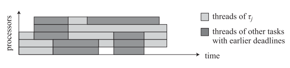
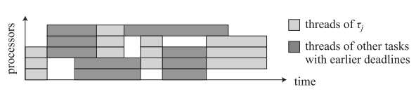

# Meeting 2019-12-03

## Intuition about higher priority formulation

$$
\begin{aligned}
t_{high}(J_i) &= \min_{J_j \in \{hp_i\} \cap \{\mathcal{J} \setminus \mathcal{J}^v\}}\{t_{cores}(J_i, J_j)\} \\
t_{cores}(J_i, J_j) &= \begin{cases}
r_j^{\max} & \text{ if } s_j^{\min} \le s_i^{\max} \\
\max\{r_j^{\max}, A_{s_j^{\min}}^{\max}\} & \text{ otherwise}
\end{cases}
\end{aligned}
$$

Proof

- First part:
  - Assumptions: $s_j^{\min} \le s_i^{\min}$, $r_j^{\max} \le r_i$ and $J_j \in hp_i \cap \{\mathcal{J} \setminus \mathcal{J}^v\}$. 
  - By contradiction, assume that $J_i$ starts executing before $J_j$
  - Let $t$ be the time at which $J_i$ starts executing. At least $s_i^{\min}$ cores are available at $t$ to execute $J_i$. At least $s_j^{\min} \le s_i^{\min}$ cores are available to execute $J_j$. 
  - Since $r_j^{\max} \le r_i$, by the (Job-level fixed-priority) JLFP scheduling policy, $J_j$ is chosen first by the scheduler to be dispatched at time $t$
  - This contradicts the assumption the $J_i$ starts executing before $J_j$. Either $r_j^{\max} > r_i$ or $s_j^{\min} > s_i^{\min}$
- Second part (v1):
  - Assumptions: $s_j^{\min} > s_i^{\min}$, $r_j^{\max} \le r_i$, $A_{s_j^{\min}}^{\max} \le r_i$ and $J_j \in hp_i \cap \{\mathcal{J} \setminus \mathcal{J}^v\}$
  - By contradiction, assume that $J_i$ starts executing before $J_j$
  - Let $t$ be the time at which $J_i$ starts executing. At least $s_j^{\min}$ cores are available, since $A_{s_j^{\min}}^{\max} \le r_i$, to execute $J_j$.
  - Since $r_j^{\max} \le r_i$, by the JLFP scheduling policy, $J_j$ is chosen first by the scheduler to be dispatched at time $t$
  - This contradicts the assumption that $J_i$ starts executing before $J_j$. Either $r_j^{\max} > r_i$, $A_{s_j^{\min}}^{\max} > r_i$ or $s_j^{\min} \le s_i^{\min}$
- Second part (v2):
  - Assumptions: $s_j^{\min} > s_i^{\min}$ and $A_{s_i^{\min}}^{\max} < r_i^{\max} < A_{s_j^{\min}}^{\max}$ and $J_j \in hp_i \cap \{\mathcal{J} \setminus \mathcal{J}^v\}$
  - By contradiction, assume that $J_j$ starts executing before $J_i$
  - Let $t$ be the time at which $J_j$ starts executing. At least $s_i^{\min} < s_j^{\min}$ cores are available to execute $J_j$ and $t \ge \max\{r_j, A_{s_j^{\min}}^{\max}\}$
  - Since $t \ge A_{s_j^{\min}}^{\max} > r_i^{\max} > A_{s_i^{\min}}^{\max}$, by the JLFP scheduling policy $J_i$ should have been chosen first by the scheduler to be dispatched at time $\max\{r_i^{\max}, A_{s_i^{\min}}^{\max} \}$ instead of time $t$
  - This contradicts the assumption that $J_j$ starts executing before $J_i$.

## Papers

### An Optimal Multiprocessor Scheduling Algorithm without Fairness (2006)

Geoffrey Nelissen, Vandy Berten, Joël Goosens

- This is not Gang scheduling
- **Not related**

### Gang EDF scheduling of Parallel Task Systems

Shinpei Kato, Yutaka Ishikawa

- Coscheduling
- Number of cores:
  - **Rigid**: number of processors fixed a priory
  - **Moldable**: Number of processors not fixed but determined before execution
  - **Malleable**: Number of processors can change at runtime

#### Goals

- Create Gang EDF
- Provide schedulability analysis of Gang EDF
- Provide guarantees for all tasks to be schedulable when $C_i$ and $v_i$ are given

#### Assumptions

- Task generates same number of threads as used processors before the execution
- Each thread is handled as an individual task
- Task: $t_i = (v_i, C_i, D_i, T_i)$
  - No jitter used, only Worst Case Execution Time $C_i$
  - No release jitter
  - Constrained-deadline case $D_i \le T_i \rightarrow$ what's this?
  - Total execution time: $C_i \times v_i$ rectangle
  - $C_i$ is determined by $v_i$
- Jobs are **preemptive with no cost**

#### How do they do it

{width=75%}

{width=75%}

- Scheduler:
  - Same as Global EDF: *jobs with earlier deadlines are assigned higher priorities*
    - Take into account spacial limitation on the number of available processors
  - Two scheduling policies for a task $\tau_i$ with less than $v_i$ available cores
    - Coscheduling: schedule first only the available threads and schedule the remaining ones when more cores are available. *Appropiate for malleable task model*. It can also increase the total execution time if some threads require synchronization
    - Gang: block all the threads of $\tau_i$ until more or equal $v_i$ cores are available
  - Gang EDF:
    - Selects the job with the earliest deadline
    - If the job cannot start due to spatial limitations select next job **according to first fit heuristic**
- Analysis:
  - [BAR] test
  - Case by case demonstration
  - They provide schedulability conditions

- **Related but not useful**

### A Loadable Real-Time Scheduler Suite for Multicore Platforms

Shinpei Kato, Ragunathan (Raj) Rajkumar, and Yutaka Ishikawa

#### Goals

- Linux support for Real-Time schedulers
  - Runtime schedulability
  - Fixed-priority preemptive scheduling policies
  - Multicore Platforms
- Not modify Linux kernel source code

#### Assumptions

- Works on the Linux kernel
- Tasks **do not have parallelism**
- $C_i \le D_i \le T_i$
- There are no shared resources and critical sections

#### How do they do it

- They create an API so the user can interact with the RT scheduler that is a module on top of the linux kernel
- Implemented schedulers:
  - Partitioned scheduling: Each CPU has its own scheduler
  - Semi-partitioned scheduling: Tasks are assigned to CPUs except some tasks that are allowed migration
  - Global scheduling
- Develop SchedBench a schedulability benchmark tool

#### Conclusions

- It works
- Gang scheduling (EDF) not implemented yet

### Gang FTP scheduling of periodic and parallel rigid real-time tasks

Joël Goossens, Vandy Berten

#### Goals

- Implement Fixed Task Priority Gang scheduler. Sub-classes:
  - Parallelism Monotonic
  - Idling
  - Limited Gang
  - Limited Slack Reclaiming
- Study predictability of the schedulers
- Provide schedulability test (exact)

#### Assumptions

- Identical multiprocessor platforms
- Parallel real-time tasks

#### How do they do it

