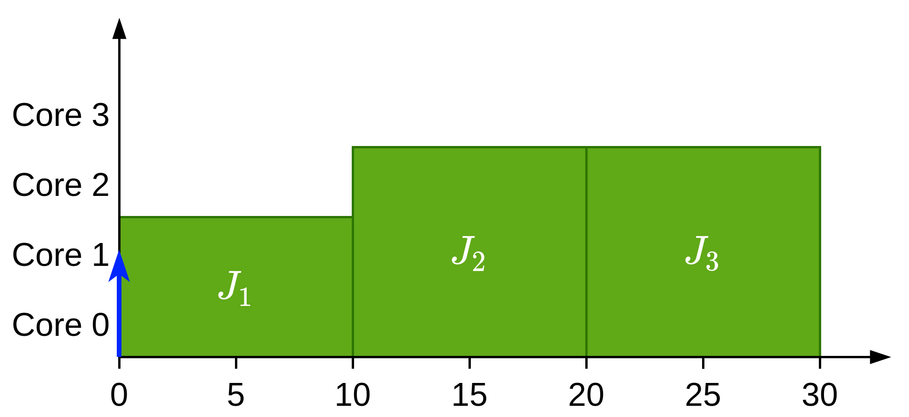
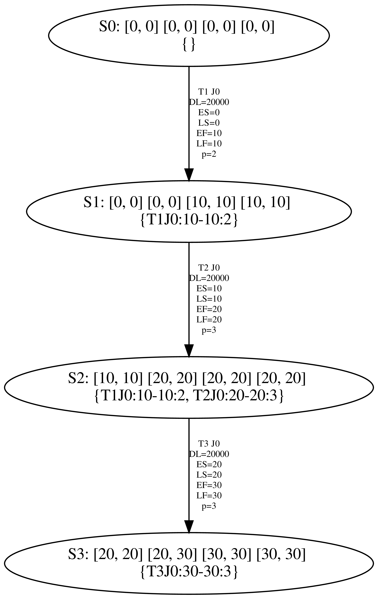

# Certainly running jobs

## The problem

The set of certainly running jobs is defined according to:
$$
\mathcal{X}(v'_p) \leftarrow \{J_i\} \cup \{J_x | J_x \in \mathcal{X}(v_p) \setminus pred(J_i) \land LST_i \le EFT_x(vp) \}
$$
When creating the new availability times we need the array of Possible Available (PA) and Certainly Available (CA) times. CA is computed as follows:
$$
\begin{aligned}
CA = &\Big\{p \times \{LFT_i^p\}\Big\} \\ 
&\cup\Big\{\min\{LST_i^p, \max\{A_k^{\max}(v), EST_i^p\}\} | p < k \le m_{pred}\Big\} \\
&\cup \Big\{\max\{A_k^{\max}(v), EST_i^p | m_{pred} < k \le m \Big\}
\end{aligned}
$$
Where $m_{pred}$ is defined as follows:
$$
m_{pred} = \max\Big\{p, \sum_{J_x \in \{\mathcal{X}(v) \cap \mathcal{P}(J_i)} p_x(v)\Big\}
$$

The problem is that $\mathcal{X}(v)$ can have jobs that are certainly not running, let's see that with an example:

$m= 4$

| $J_i$ | $C_i$ | $s_i$ | $p_i$ | $\mathcal{P}(J_i)$ |
| ----- | ----- | ----- | ----- | ------------------ |
| $J_1$ | 10    | 2     | 1     | $\emptyset$        |
| $J_2$ | 10    | 3     | 2     | $\emptyset$        |
| $J_3$ | 10    | 3     | 3     | $J_1, J_2$         |

Which produces the following schedule:

So if we create the states one by one we get:

{width=40%}

The problem is that in state S2 $\mathcal{X}(v)$ should only contain T2J0 and not T1J0 as T2J0 has started executing by replacing T1J0. However this happens because one of the conditions to a job in $\mathcal{X}(v)$ is:
$$
\{J_x | J_x \in \mathcal{X}(v_p) \setminus pred(J_i) \land \boldsymbol{LST_i \le EFT_x(vp)} \}
$$
However this condition considers that jobs T1J0 and T2J0 intersect and thus execute together even though this is false.

## Solving the problem

### Paris' approach:

He decided to leave the certainly running jobs as is and just change the way $m_{pred}$ is computed from:
$$
m_{pred} = \max\Big\{p, \sum_{J_x \in \{\mathcal{X}(v) \cap \mathcal{P}(J_i)} p_x(v)\Big\}
$$
to:
$$
m_{pred} = \max\Big\{p, \sum_{J_x \in \{\mathcal{X}(v) \cap \mathcal{P}(J_i) \land \boldsymbol{LST_i < LFT_x}} p_x(v)\Big\}
$$
This works for the tested examples

- **Pros**: It works
- **Cons**: It may just hide other problems

### Joan's approach:

Change the condition:
$$
\{J_x | J_x \in \mathcal{X}(v_p) \setminus pred(J_i) \land LST_i \le EFT_x(vp) \}
$$
into (change the equality $\le$ into $<$:
$$
\{J_x | J_x \in \mathcal{X}(v_p) \setminus pred(J_i) \land LST_i \boldsymbol{<} EFT_x(vp) \}
$$
This would make sense as jobs that can finish at the same time that another job is starting are **not certainly** running but possibly. However, jobs that finish at least a delta after a job can start for sure are running together.

- **Pros**: It works
- **Cons**: We may have to prove that all the conditions are still valid and probably change this condition too in ECRTS'19

