# Reducing precedence constraints pessimism

## Formulation

$$
\mathcal{R}(v) = \{ J_i, | J_i \in \mathcal{J} \setminus \mathcal{S}(v) \land pred(J_i) \subseteq \mathcal{S}(v) \}
$$

$$
EST^p_i = \max\{R_i^{\min}(v), t_{gang}(v)\}
$$

$$
t^p_{gang}(v) = \begin{cases}
A_p^{\min}(v) & \text{if } p = m_i^{\max} \\
A_p^{exact}(v) & \text{otherwise}
\end{cases}
$$

$$
LST_i^p = \min\{t^p_{avail}(v), t_{wc}(v), t_{high}(v) - 1\}
$$

$$
t^p_{avail}(v) = \begin{cases}
A_{p+1}^{\max}(v) - 1 & \text{if } p < m_i^{\max} \\
+\infty & \text{otherwise}
\end{cases}
$$

$$
t_{wc}(v) = \min_{J_j \in \mathcal{R}(v)}\{\max\{R_j^{\max}(v), A_{m_j^{\min}}^{\max}\}\}
$$

$$
t^p_{high}(v) = \min^{\infty}_{J_j \in \{\operatorname{hp}_i \cap \mathcal{R}(v)\}} \Big\{\max\big\{t_h^p(J_i, J_j), \max^0\{LFT_y^*(v) | J_y \in pred(J_i) \setminus pred(J_j)\}\big\}\Big\}
$$

$$
t^p_h(J_i, J_j) = \begin{cases}
r_j^{\max} & \text{if } m_j^{\min} \le p \\
\max\{r_j^{\max}, A_{m_j^{\min}}^{\max}\} & \text{otherwise}
\end{cases}
$$

## The problem

When using precedence constraints and we are evaluating a low priority task $J_i$, we use $t_{high}$ to compute the time at which a high priority job can start. This works well for jobs without precedence constraints however, when such jobs exist as it can be possible that $J_i$ cannot start as a high priority segment could always start as soon as its predecessor finishes. The current formulation provides a pessimist answer to this problem.

Let's visualise this with an example. Let's suppose that we have the following system:

| $J_i$ | $C_i^{\min}$ | $C_i^{\max}$ | $m_i$ | $P_i$ |
| ----- | ------------ | ------------ | ----- | ----- |
| $J_0$ | 15           | 25           | 1     | 0     |
| $J_1$ | 20           | 30           | 3     | 0     |
| $J_2$ | 10           | 10           | 1     | 1     |

{width=70%}

With this state we have three options:

- **Option A**: Both $J_0$ and $J_1$ have successors. In this case $J_2$ will never be able to execute. 
  - However using the current formulation we have
    - $EST_2^1 (v) = 15$
    - $LST_2^1(v) = \min\{t_{wc}, t_{avail}, t_{high} - 1\} = \min\{25, 24, +\infty\} = 24$
  - While we should not have this scenario
- **Option B**: Only $J_0$ has a successor. In this case $J_2$ should only be able to start after $J_1$ completes as it does not have a successor. 
  - However using the current formulation we have:
    - $EST_2^1(v) = 15$
    - $LST_2^1(v) = \min\{t_{wc}, t_{avail}, t_{high} - 1\} = \min\{25, 24, +\infty\} = 24$
  - While we should have:
    - $EST_2^1(v) = 20$
    - $LST_2^1(v) = 24$
- **Option C**: Only $J_1$ has a successor. In this case $J_2$ should be able to start as soon as $J_0$ completes as it does not have a successor. We can see that here the formulation matches what we expect:
  - $EST_2^1(v) = 15$
  - $LST_2^1(v) = \min\{t_{wc}, t_{avail}, t_{high} - 1\} = \min\{25, 29, +\infty\}$

## Examples of expected results

Some examples are shown with the expected values that we would like to have when using precedence constraints. The new version of the model should provide the same response as the created examples. 

The job in **bold** is the next one that we are trying to see if it can be scheduled. Note that in the figures the orange blocks represent possible start time intervals given the current scenario, they don't mean execution times.

### Single precedence global

In this case the high-priority segment only has one precedence constraint

| $J_i$              | $C_i^{\min}$ | $C_i^{\max}$ | $m_i$ | $P_i$ | $prec(J_i)$            |
| ------------------ | ------------ | ------------ | ----- | ----- | ---------------------- |
| $J_0$              | 15           | 25           | 1     | 0     | $\emptyset$            |
| $J_1$              | 20           | 30           | 3     | 0     | $\emptyset$            |
| $\boldsymbol{J_2}$ | 10           | 10           | 1     | 1     | $\emptyset$            |
| $J_3$              | 10           | 10           | 1     | 0     | $\{J_0\}$ or $\{J_1\}$ |

- We thus have the following state and we are wondering whether $\boldsymbol{J_2}$ will be scheduled next or not: 

{width=70%}

- **Option A**: If $prec(J_3) = \{J_0\}$:
  - $EST_2^1 = 20$ and $LST_2^1 = 24$
- **Option B**: If $prec(J_3) = \{J_1\}$
  - $EST_2^1 = 15$ and $LST_2^1 = 25$

Which would produce the following options:

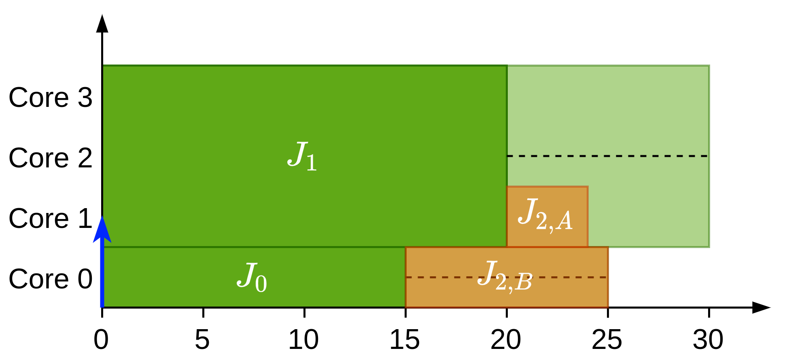{width=70%}

### Single precedence constraint gang

In this example the high-priority segment only has one precedence constraint but it needs 3 cores

| $J_i$              | $C_i^{\min}$ | $C_i^{\max}$ | $m_i$ | $P_i$ | $prec(J_i)$            |
| ------------------ | ------------ | ------------ | ----- | ----- | ---------------------- |
| $J_0$              | 15           | 25           | 1     | 0     | $\emptyset$            |
| $J_1$              | 20           | 30           | 3     | 0     | $\emptyset$            |
| $\boldsymbol{J_2}$ | 10           | 10           | 1     | 1     | $\emptyset$            |
| $J_3$              | 10           | 10           | 3     | 0     | $\{J_0\}$ or $\{J_1\}$ |

- We continue to have the same initial state and we are wondering how can $\boldsymbol{J_2}$ be scheduled next:

{width=70%}

In this case with the two options we obtain:

- **Option A**: If $prec(J_3) = \{J_0\}$:
  - $EST_2^1 = 15$ and $LST_2^1 = 25$ since $J_3$ could still be waiting for the necessary cores to run
- **Option B**: If $prec(J_3) = \{J_1\}$
  - $EST_2^1 = 15$ and $LST_2^1 = 25$

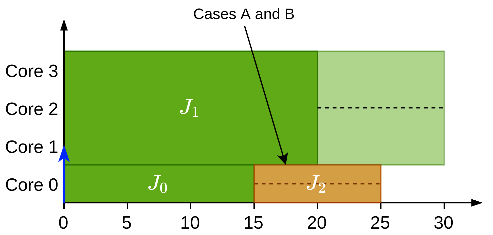{width=70%}

### Single precedence constraint global but lower job is gang

This example is very similar to the previous one but with the difference that the lower-priority job is a gang job while the high-priority segment is a single thread job.

| $J_i$              | $C_i^{\min}$ | $C_i^{\max}$ | $m_i$ | $P_i$ | $prec(J_i)$            |
| ------------------ | ------------ | ------------ | ----- | ----- | ---------------------- |
| $J_0$              | 15           | 25           | 1     | 0     | $\emptyset$            |
| $J_1$              | 20           | 30           | 3     | 0     | $\emptyset$            |
| $\boldsymbol{J_2}$ | 10           | 10           | 3     | 1     | $\emptyset$            |
| $J_3$              | 10           | 10           | 1     | 0     | $\{J_0\}$ or $\{J_1\}$ |

{width=70%}

- **Option A**: If $prec(J_3) = \{J_0\}$:
  - $EST_2^1 = 20$ and $LST_2^1 = 24$ since $J_3$ could still be waiting for its precedence to finish
- **Option B**: If $prec(J_3) = \{J_1\}$
  - $EST_2^1 = 25$ and $LST_2^1 = 24$ and thus scheduling is not possible

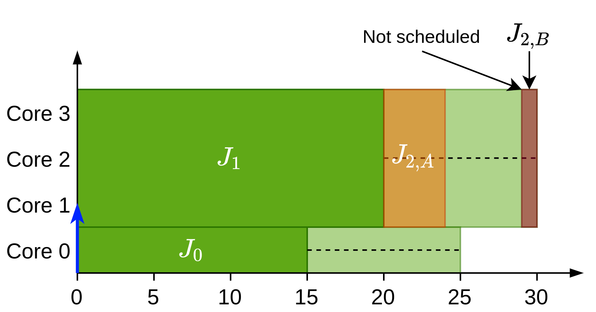{width=70%}

### Single precedence constraint gang and lower job is gang

This example is very similar to the previous one but with the difference that both the lower and higher priority jobs are gang tasks. In this case $m=2$

| $J_i$              | $C_i^{\min}$ | $C_i^{\max}$ | $m_i$ | $P_i$ | $prec(J_i)$            |
| ------------------ | ------------ | ------------ | ----- | ----- | ---------------------- |
| $J_0$              | 15           | 25           | 1     | 0     | $\emptyset$            |
| $J_1$              | 20           | 30           | 1     | 0     | $\emptyset$            |
| $\boldsymbol{J_2}$ | 10           | 10           | 2     | 1     | $\emptyset$            |
| $J_3$              | 10           | 10           | 2     | 0     | $\{J_0\}$ or $\{J_1\}$ |

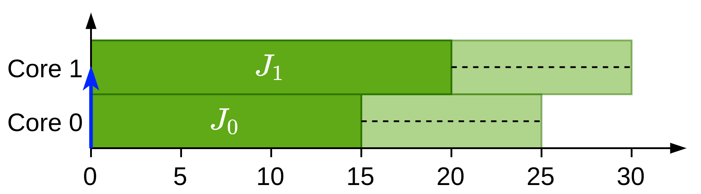{width=70%}

- **Option A**: If $prec(J_3) = \{J_0\}$:
  - $EST_2^1 = 30$ and $LST_2^1 = 29$ and thus scheduling is not possible
- **Option B**: If $prec(J_3) = \{J_1\}$
  - $EST_2^1 = 30$ and $LST_2^1 = 29$ and thus scheduling is not possible

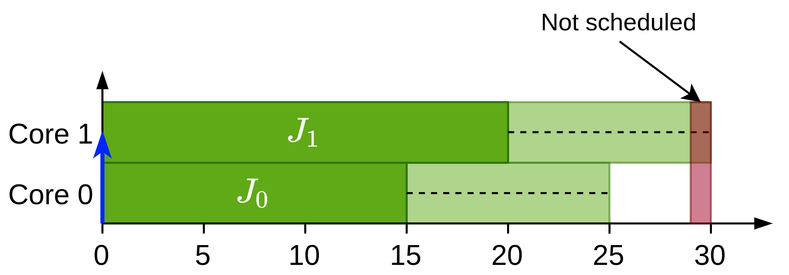{width=70%}

### Multiple precedence constraints global

In this example the high-priority segment has more than one precedence constraint but it only needs 1 core. In this case $m = 2$.

- | $J_i$              | $C_i^{\min}$ | $C_i^{\max}$ | $m_i$ | $P_i$ | $prec(J_i)$     |
  | ------------------ | ------------ | ------------ | ----- | ----- | --------------- |
  | $J_0$              | 10           | 20           | 1     | 0     | $\emptyset$     |
  | $J_1$              | 10           | 20           | 1     | 0     | $\emptyset$     |
  | $\boldsymbol{J_2}$ | 10           | 10           | 1     | 1     | $\emptyset$     |
  | $J_3$              | 10           | 10           | 1     | 0     | $\{J_0 , J_1\}$ |

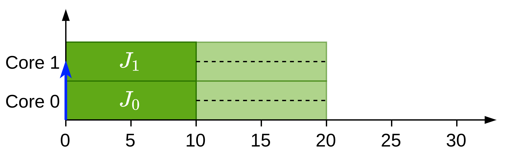{width=70%}

In this case $J_3$ has to wait for both its parents to finish execution so $J_2$ can be scheduled with:

- $EST_2^1 = 10$
- $LST_2^1 = 19$

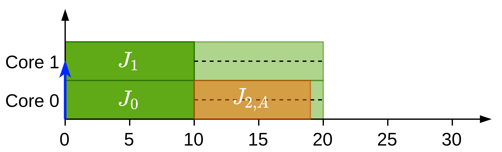{width=70%}

### Multiple precedence constraints gang

In this example the high-priority segment has more than one precedence constraint but it only needs 1 core. In this case $m = 4$.

| $J_i$              | $C_i^{\min}$ | $C_i^{\max}$ | $m_i$                 | $P_i$ | $prec(J_i)$     |
| ------------------ | ------------ | ------------ | --------------------- | ----- | --------------- |
| $J_0$              | 10           | 20           | 1                     | 0     | $\emptyset$     |
| $J_1$              | 15           | 25           | 1                     | 0     | $\emptyset$     |
| $J_2$              | 20           | 25           | 2                     | 0     | $\emptyset$     |
| $\boldsymbol{J_3}$ | 10           | 10           | 1 (A), 2 (B) or 3 (C) | 1     | $\emptyset$     |
| $J_4$              | 10           | 10           | 2                     | 0     | $\{J_0 , J_1\}$ |

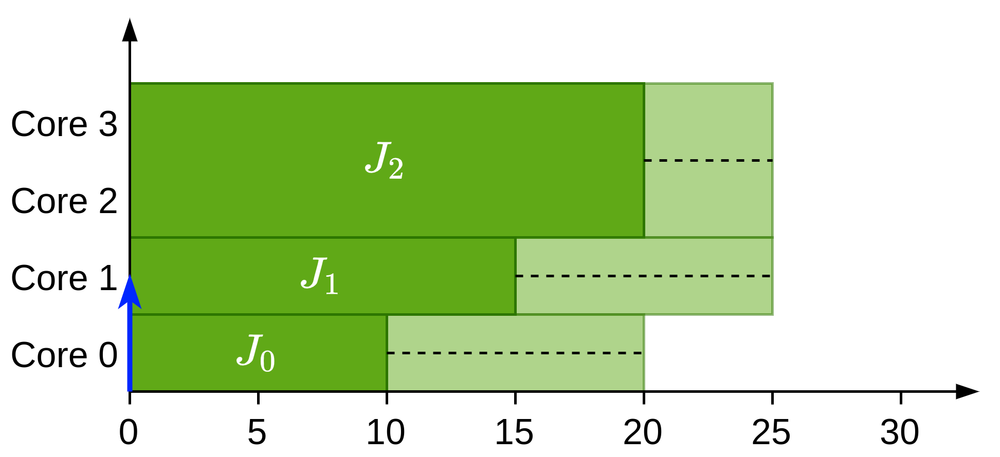{width=70%}

In this case there are three different scenarios depending in the number of cores that $J_3$ is assigned. Also, $J_4$ has to wait for both its parents to finish execution. So:

- **Option A**: $m_3 = 1$:
  - $EST_3^1 = 10$
  - $LST_3^1 = 20$
- **Option B**: $m_3 = 2$:
  - $EST_3^1 = 20$
  - $LST_3^1 = 24$
- **Option C**: $m_3 = 3$
  - $EST_3^1 = 20$
  - $LST_3^1 = 24$

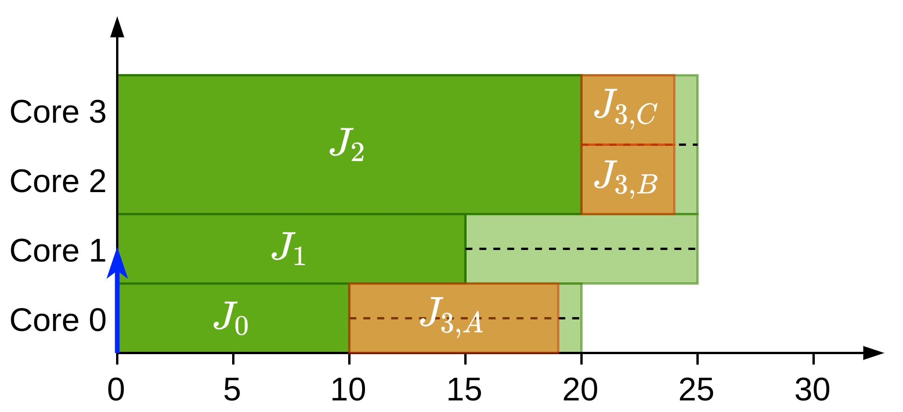{width=70%}

## The solution

### Rules found

For a job $J_i$ if $\exists\ J_k | p_i \ge m_k^{\min} \land P_i > P_k \land \big((pred(J_k) \cap \mathcal{X}(v)) \ne \emptyset\big)$ and:

- Scheduling $J_i$ with the current availability we would always possibly use the cores currently in use by $pred(J_k) \cap\mathcal{X}(v)$ 

We have to compute the new availability times **only to compute** $EST_i^p(v)$

### New availability

To solve the issue a new availability **only used to compute** $EST_i^p(v)$ is created. In this new availability the $A^{\min}(v)$ values of the cores used by $pred(J_k) \cap \mathcal{X}(v)$ are increased to the next available $A^{\min}(v)$ value and then it's checked whether $J_i$ would always possibly use all cores used by $pred(J_k) \cap \mathcal{X}(v)$

### Example

| $J_i$              | $C_i^{\min}$ | $C_i^{\max}$ | $m_i$ | $P_i$ | $prec(J_i)$     |
| ------------------ | ------------ | ------------ | ----- | ----- | --------------- |
| $J_0$              | 5            | 25           | 1     | 0     | $\emptyset$     |
| $J_1$              | 10           | 30           | 1     | 0     | $\emptyset$     |
| $J_2$              | 15           | 35           | 1     | 0     | $\emptyset$     |
| $J_3$              | 20           | 40           | 1     | 0     | $\emptyset$     |
| $J_4$              | 10           | 10           | 3     | 0     | $\{J_0 , J_1\}$ |
| $\boldsymbol{J_5}$ | 10           | 10           | 3     | 1     | $\emptyset$     |

In this example we are trying to schedule $J_5$ and jobs $J_0$, $J_1$, $J_2$ and $J_3$ have already been scheduled so we have the following system state:

{width=70%}

Now in order to schedule $J_5$ we know that cores 0, 1 and 2 will be always possibly used. That means that we are planning on using all the cores now being used by $pred(J_4) \cap \mathcal{X}(v) = \{J_0, J_1\}$. We will then find the availability value from which we will not need to use all these cores anymore. This occurs at time 20 and then we get an availability like this:

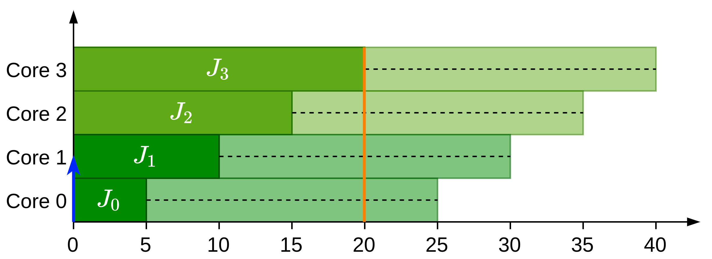{width=70%}

Then once we have found the time at which the job can be scheduled properly:

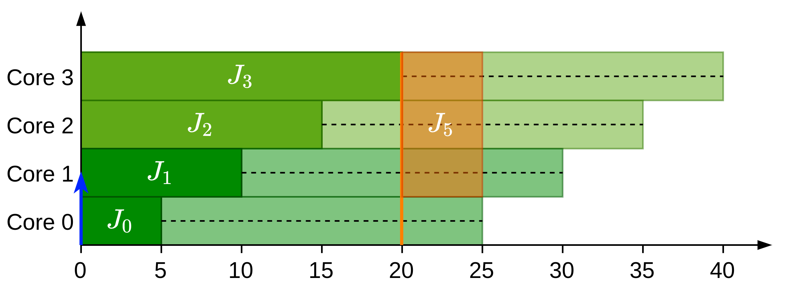{width=70%}

### Formulation

#### Notation

During this formulation we are using $J_i$ for the current evaluated job, $J_k$ for the higher-priority segment with a certainly running predecessor (so $\exists J_j | J_j \in \{pred(J_k) \cap \mathcal{X}(v)\}$) and $J_j$ for the certainly running predecessors of $J_k$.

#### The change

We thus change from:
$$
EST_i^p(v) = \max\{R_i, A^{\min}_p\}
$$

To:
$$
EST_i^p(v) = \max\{R_i, A_p^{\min}, t_{hs}\}
$$
Where $t_{hs}$ is the time taken by higher priority segments and is the time at which the possibly always used cores are not all the cores of segments with currently running predecessors. 
$$
t_{hs} = \min_{\forall q | p \le q \le m}^{\infty}\left\{A_q^{\min} \left| \left(q - \sum_{J_k \in \mathcal{S}_i(v)}\min_{J_j \in \mathcal{X}^{pred}_k(v) \land EFT^*_j(v) \le A_q^{\min}} p_j\right) \ge p\right.\right\}
$$

Where:
$$
\mathcal{S}_i(v) = \left\{J_k \left| \mathcal{X}^{pred}_i(v) \ne \emptyset \land p \ge m_k^{\min} \land P_i > P_k \land \left(\sum_{J_j \in \mathcal{X}_k^{pred}(v)}p_j\right) \le p\right.\right\}
$$
Is the set of segments with a certainly running predecessor and higher priority than $J_i$ that use the same or less cores than $J_i$ or that their predecessors use the same or less cores than $J_i$. Where:
$$
\mathcal{X}^{pred}_i(v) = \{pred(J_i) \cap \mathcal{X}(v)\}
$$
Is the set of certainly running predecessors of $J_i$.

#### Explanation

So let's go step by step:
$$
J_j \in \underbrace{\mathcal{X}^{pred}_k(v)}_{\substack{\text{certainly running} \\ \text{predecessor}}} \land \underbrace{EFT^*_j(v) \le A_q^{\min}}_{\substack{\text{using cores at} \\ \text{time } A_q^{\min}}}
$$
These are the jobs that are certainly running predecessors of $J_k$ so some of the cores currently being used by them could be used by $J_i$. Then:
$$
\min_{J_j \in \mathcal{X}^{pred}_k(v) \land EFT^*_j(v) \le A_q^{\min}} p_j
$$
These are the minimum number of cores used by a certainly running predecessor of predecessor of $J_k$. Then:
$$
q - \sum_{J_k \in \mathcal{S}_i(v)}\min_{J_j \in \mathcal{X}^{pred}_k(v) \land EFT^*_j(v) \le A_q^{\min}} p_j
$$
Is the number of cores that $J_i$ can take without taking all the cores of a predecessor of $J_k$. Then:
$$
\left(q - \sum_{J_k \in \mathcal{S}_i(v)}\min_{J_j \in \mathcal{X}^{pred}_k(v) \land EFT^*_j(v) \le A_q^{\min}} p_j\right) \ge p
$$
Is true only if $J_i$ requires less cores than the ones that are available without "disturbing" a job in $\mathcal{S}(v)$ and finally:
$$
\min_{\forall q | p \le q \le m}^{\infty}\left\{A_q^{\min} \Big| \left(q - \sum_{J_k \in \mathcal{S}_i(v)}\min_{J_j \in \mathcal{X}^{pred}_k(v) \land EFT^*_j(v) \le A_q^{\min}} p_j\right) \ge p\right\}
$$
Is the minimum $A_q^{\min}$ such that job $J_i$ can be scheduled with $p$ cores without "stealing" the cores that belong to "hunter jobs".

#### Proof

We want to proof that a job $J_i$ that has low priority in a system where jobs with precedence constraints and higher priority are running can be scheduled at the earliest at time $t_s \ge t_{hs}$. We are going to prove that by contradiction:

By contradiction, let's assume that job $J_i$ is scheduled at time $t_s < t_{hs}$ with $p$ and that there are other jobs such that $S_i(v)\ne \emptyset$. Here we can have two possibilities: either (a) there are jobs such that $J_j \in \mathcal{X}^{pred}_k(v) \land EFT^*_j(v) \le t_s$ or they aren't (b). 

- If (a), by definition of availability this time can be at the earliest $A_p^{\min}$. This means that if $J_i$ where to be scheduled next it would use all the cores used currently by predecessors of a waiting higher priority job $J_k$ which would mean that the predecessors of $J_k$ had finished they execution. By rules 1 and 4 $J_k$ would be scheduled next instead of $J_i$ which contradicts the assumption that $J_i$ is the next job to be scheduled. Either $t_s \ge t_{hs}$ or there aren't jobs such that $J_j \in \mathcal{X}^{pred}_k(v) \land EFT^*_j(v) \le t_s$. 
- Otherwise if (b), by definition of availability this time can be at earliest $t_s = A_p^{\min}$. Then the equation then is simplified into $\min_{\forall q: p \le q\le m}^{\infty}\left\{A_q^{\min}|q \ge p\right\}$ which means that $t_{hs} = A_q^{\min}$. This contradicts the assumption that $t_s < t_{hs}$. 

#### Comments

With this solution we can actually work with the fact that $EFT_j \ne A_q^{\min}$ for any $q$ which is what we can have when doing merges.

