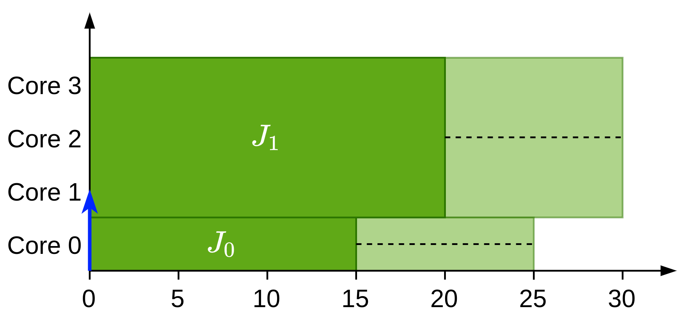

# Precedence constraints pessimism

## The problem

When using precedence constraints and we are evaluating a low priority task $J_i$, we use $t_{high}$ to compute the time at which a high priority task can start. This works well for tasks without precedence constraints however, when such tasks exist as it can be possible that $J_i$ cannot start as the high priority task can start as soon as its predecessor finish. This is not contemplated in the current formulation.

Let's visualize this with an example. Let's suppose that we have the following system:

| $J_i$ | $C_i^{\min}$ | $C_i^{\max}$ | $s_i$ | $P_i$ |
| ----- | ------------ | ------------ | ----- | ----- |
| $J_0$ | 15           | 25           | 1     | 0     |
| $J_1$ | 20           | 30           | 3     | 1     |
| $J_2$ | 10           | 10           | 1     | 2     |

{width=50%}

With this state we have three options:

- **Option A**: Both $J_0$ and $J_1$ have successors. In this case $J_2$ will never be able to execute. 
  - However using the current formulation we have
    - $EST_2^1 (v) = 15$
    - $LST_2^1(v) = \min\{t_{wc}, t_{avail}, t_{high} - 1\} = \min\{25, 24, +\infty\} = 24$
  - While we should not have this scenario
- **Option B**: Only $J_0$ has a successor. In this case $J_2$ should only be able to start after $J_1$ completes as it does not have a successor. 
  - However using the current formulation we have:
    - $EST_2^1(v) = 15$
    - $LST_2^1(v) = \min\{t_{wc}, t_{avail}, t_{high} - 1\} = \min\{25, 24, +\infty\} = 24$
  - While we should have:
    - $EST_2^1(v) = 20$
    - $LST_2^1(v) = 24$
- **Option C**: Only $J_1$ has a successor. In this case $J_2$ should be able to start as soon as $J_0$ completes as it does not have a successor. We can see that here the formulation matches what we expect:
  - $EST_2^1(v) = 15$
  - $LST_2^1(v) = \min\{t_{wc}, t_{avail}, t_{high} - 1\} = \min\{25, 29, +\infty\}$

## The solution

Now that we have identified the problem we will attempt to fix it in a way that it also works for gang scheduling (as this is the focus of our work). Let's extend the previous example with gang scheduling.

| $J_i$ | $C_i^{\min}$ | $C_i^{\max}$ | $s_i$ | $P_i$ | $prec(J_i)$ |
| ----- | ------------ | ------------ | ----- | ----- | ----------- |
| $J_0$ | 15           | 25           | 1     | 0     | $\emptyset$ |
| $J_1$ | 20           | 30           | 3     | 1     | $\emptyset$ |
| $J_2$ | 10           | 20           | 1     | 2     | $\emptyset$ |
| $J_3$ | 10           | 20           | 2     | 0     | $\{ J_0\}$  |

Now in this case there is a job with a higher priority than $J_2$  however, this job now requires 2 cores so it cannot immediatly start executing.

### Set of segments that have a higher priority and that can alwyas start before $J_i$