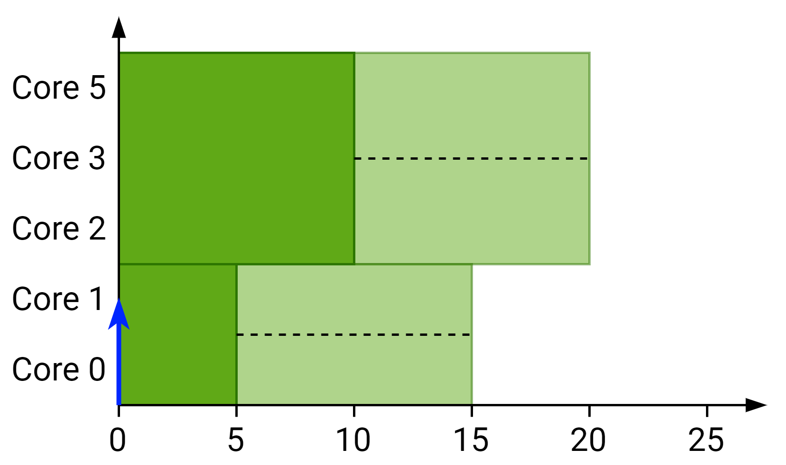
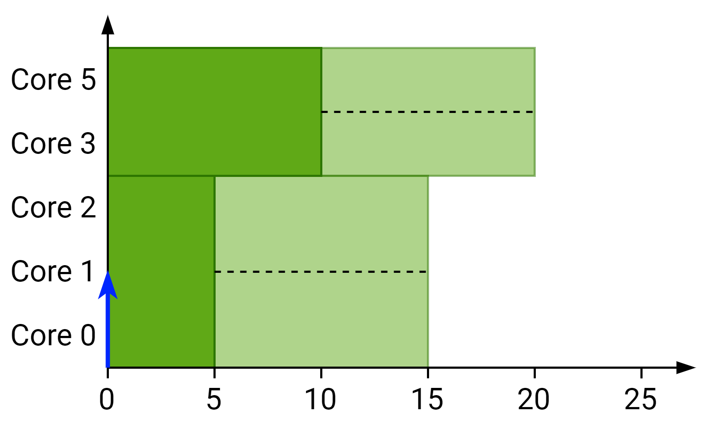
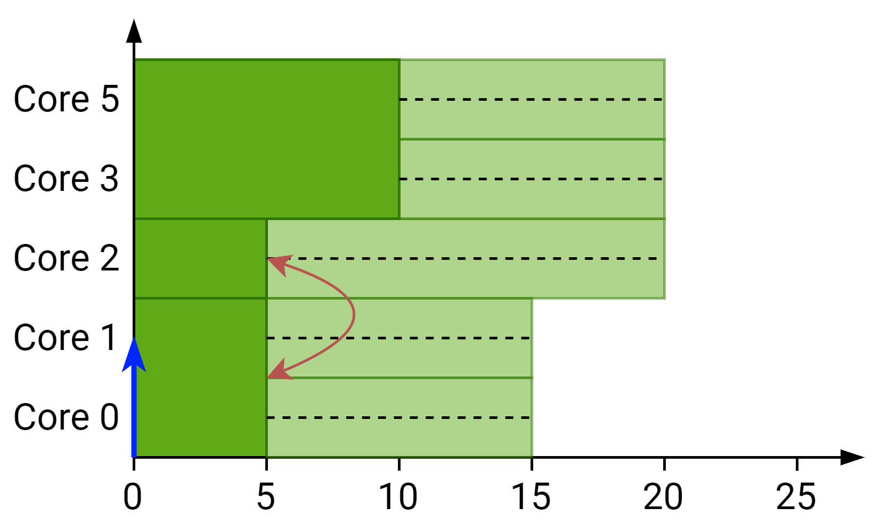
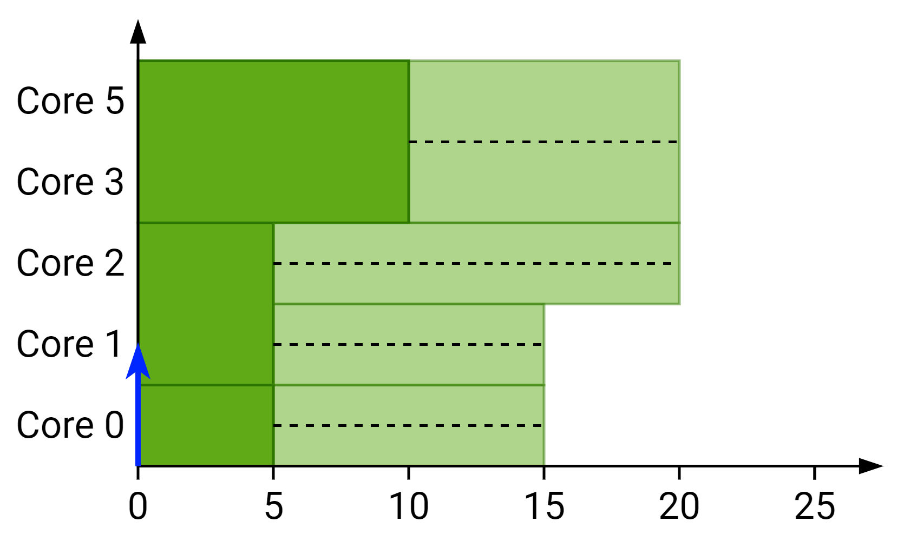

---
header-includes:
	- \usepackage[algoruled, linesnumbered]{algorithm2e}
---


# Reducing gang scheduling pessimism

## The problem

Lets suppose that we have the following system with availability:
$$
A = \left\{
\begin{matrix}
[5, 10] \\ 
[5, 10] \\ 
[5, 10] \\ 
[5, 10] \\
\end{matrix}
\right\} \qquad m = 4 \qquad \mathcal{X}(v) = \emptyset
$$
But we know that there's a single gang job running with $p_i = 4$. Now we want to check whether $J_1$ with $m_1^{\min} = 1$ and $m_1^{\max} = 4$ can be scheduled next. We find:

- For $p_1=1$:
  - $EST_1^1(v) = 5$
  - $LST_1^1(v) =10$
- For $p_1 = 2$:
  - $EST_1^2(v) = 5$
  - $LST_1^2(v) =10$
- For $p_1 = 3$:
  - $EST_1^3(v) = 5$
  - $LST_1^3(v) =10$
- For $p_1 = 4$:
  - $EST_1^4(v) = 5$
  - $LST_1^4(v) =10$

So the current analysis tells us that it can be scheduled with any of the cores possibilities. However, we know that since there's a single job running on the system as soon. We can see then how.

## The solution

### Idea behind

To solve it we are going to store the number of cores released together and find the time for exactly $p$ cores

For example for the following system $A^{stored}(v) = \{\{5, 3\}, \{10, 1\}\}$ and $A^{exact}(v) = \{10, \infty, 5, 10\}$:

{width=70%}

### Formulation

#### New availability formulation

We have to change the way the minimum availability is stored in the state. We need to join the availability with the number of cores released together. That's why availability will be stored in the following way:
$$
A^{stored}(v) = \{(A_1^{stored}, M_1), (A_2^{stored}, M_2), (A_3^{stored}, M_3), ...\}
$$
This means that $A_1^{stored}$ represents all values from $A_1^{\min}$ to $A_{M_1}^{\min}$ as it is the same value repeated $M_1$ times. $A_2^{stored}$ represents the values $A_{M_1 + 1}^{\min}$ to $A_{M_1 + M_2}^{\min}$ and so on. $M_i$ represents the number of cores that will be released simultaneously. We can see how repeating each element $M_i$ times generates possibly available values $A^{\min}(v)$.

#### Exactly possibly available cores

We need to know the time at which exactly $p$ cores can be available, no more or less. To do so we define $A^{exact}(v)$ where each $A_p^{exact}(v)$ defines the possibly available time at which exact $p$ cores are available. If that's not possible the value will be $\infty$.

It can be noted that $A^{exact}_p(v)$ is an instance of the subset sum problem and can be computed at every state without the need to store more information. We have to find the subset $B$ of $A^{stored}(v)$ such that $\sum_{M_i \in B} M_i = p$. Note also 

#### New $EST_i^p(v)$

For a job $J_i$ to be scheduled with $p$ cores we change $EST_i^p(v)$ from :
$$
EST_i^p(v)= \max\{R_i, A_p^{\min}\}
$$
To:
$$
EST_i^p(v)=\max\{R_i, t_{gang}\}
$$
Where $t_{gang}$ is the time at which $J_i$ can possibly start with $p$ cores knowing that $p+1$ cores could be released and it's defined as follows:
$$
t_{gang}= \begin{cases}
A_p^{\min}(v) & \text{if } p = m_i^{\max} \\
A_p^{exact}(v) & \text{otherwise}
\end{cases}
$$

#### Proof

Let's assume that (1) a job $J_i$ is the first job dispatched by the scheduler in a system state represented by node $v$ and that (2) $J_i$ is assigned $p$ cores such that $m_i^{\min} \le p < m_i^{\max}$. By contradiction we assume that $J_i$ is scheduled at $t_s < t_{gang}$. By definition of availability $t_s \ge A_p^{\min}$ which means that $A_p^{\min} \le t_s < A_p^{exact}$. This means that $p$ cores are possibly available at least but not exactly (by definition of $A_p^{exact}$). Which means that at time $t_s$ there are more cores available and thus the scheduler schedules $J_i$ with more than $p$ cores. This contradicts the assumption that $J_i$ has been scheduled with $p$ cores.

### Example

For the example shown previously we would have:
$$
A^{stored} = \begin{Bmatrix}
(5, 4 )
\end{Bmatrix} \qquad A^{\max} = \begin{Bmatrix}
10 \\ 10 \\ 10 \\ 10 \\
\end{Bmatrix} \qquad m = 4 \qquad \mathcal{X}(v) = \emptyset
$$
Then:
$$
A^{\min} = \begin{Bmatrix}
5 \\ 5 \\ 5 \\ 5
\end{Bmatrix} \qquad A^{exact} = \begin{Bmatrix}
5 \\ \infty \\ \infty \\ \infty
\end{Bmatrix}
$$


- For $p_1=1$:
  - $EST_1^1(v) = \infty$
  - $LST_1^1(v) =10$
- For $p_1 = 2$:
  - $EST_1^2(v) = \infty$
  - $LST_1^2(v) =10$
- For $p_1 = 3$:
  - $EST_1^3(v) = \infty$
  - $LST_1^3(v) =10$
- For $p_1 = 4$:
  - $EST_1^4(v) = 5$
  - $LST_1^4(v) =10$

### New state

Once we know that a job $J_i$ can be scheduled with $p$ cores and has $EST_i^p(v) \le LST_i^p(v)$. The $A^{\max}(v)$ values can be generated as it was done before. However, now we need to generate the new $A^{store}(v)$ values for the possible available cores. To do so we subtract up to $p$ values from the $A^{store}(v)$ values that are lower or equal than $EST_i^p(v)$ starting with the bigger ones. So it would be like this:

```{=latex}
\begin{algorithm}[H]
\SetKwInOut{Input}{input}\SetKwInOut{Output}{output}

\Input{$A^{store}(v)$ and $EST_i^p(v)$}
\Output{$A^{store}(v')$ for new state}
\BlankLine

$B = \{(A_i^{store}, M_i) | A_i^{store} \le EST_i^p(v) \land (A_i^{store}, M_i) \in A^{store}(v)\}$\;
$C = A^{store}(v) \setminus B$\;
$B:= $ sorted\_descending($B$, by=$M_i$)\;

\While{$p > 0$}{
$m := \min(p, B_{0, M})$\;
$B_{0, M} := B_{0, M} - m$\;
\If{$B_{0, M} = 0$}{
pop($B$)\;
$p := p - m$\;
}
}

\BlankLine
$B := B \cup C$\;
$PA = \{(EST_i^p, p)\} \cup \{ (\max(A_i^{store}, EST_i^p(v)), M_i) | (A_i^{store}, M_i) \in B\} \}$\;
\Return sorted\_ascending($PA$, by=$A_i^{store}$)\;

\caption{Algorithm to generate new $A^{store}(v')$ for new state}
\end{algorithm}
```


### Merge phase

The availabilities $A(v)$ and certainly running jobs $\mathcal{X}(v)$ can be merged as before. To merge $M(v)$ we have to take the minimum of every $M_i(v)$.

```{=latex}
\begin{algorithm}[H]
\SetKwInOut{Input}{input}\SetKwInOut{Output}{output}

\Input{$A^{stored}(v_A)$ and $A^{stored}(v_B)$ from states $v_A$ and $v_B$}
\Output{$A^{stored}(v')$ for state $v'$}
\BlankLine
\tcp{The values need to be sorted in ascending order}
$A^{stored}(v_A) := $ sorted\_ascending$\left(A^{stored}(v_A), \text{by=}[A_i^{stored}, M_i]\right)$\;
$A^{stored}(v_B) := $ sorted\_ascending$\left(A^{stored}(v_B), \text{by=}[A_i^{stored}, M_i]\right)$\;
\BlankLine
\While{$A^{stored}(v_A) \ne \emptyset \land A^{stored}(v_B) \ne \emptyset$}{
$M_{new} = \min\left(A^{stored}_{0,M}(v_A), A^{stored}_{0,M}(v_B)\right)$\;
$A_{new} = \min\left(A^{stored}_{0,A}(v_A), A^{stored}_{0,A}(v_B)\right)$\;
push\_back$\left(A^{stored}(v'), (A_{new}, M_{new})\right)$\tcp*[r]{Add new element}

\BlankLine
\uIf(\tcp*[f]{Update if not 0, otherwise remove}){$A^{stored}_{0,M}(v_A) - M_{new} > 0$}{
	$A^{stored}_{0,M}(v_A) := A^{stored}_{0,M}(v_A) - M_{new}$\;
}
\Else{
	pop$\left(A^{stored}_{0,M}(v_A)\right)$\;
}
\uIf(\tcp*[f]{Update if not 0, otherwise remove}){$A^{stored}_{0,M}(v_B) - M_{new} > 0$}{
	$A^{stored}_{0,M}(v_B) := A^{stored}_{0,M}(v_B) - M_{new}$\;
}
\Else{
	pop$\left(A^{stored}_{0,M}(v_B)\right)$\;
}
}
\tcp{Push the remaining values}
push\_back$\left(A^{stored}(v'), A^{stored}(v_A)\right)$\;
push\_back$\left(A^{stored}(v'), A^{stored}(v_B)\right)$\;

\Return sorted\_ascending$\left(A^{stored}(v')\right)$\;

\caption{Merge phase for $A^{stored}(v')$ values}
\end{algorithm}
```

#### Example

Let's suppose that we have the following states $v_A$ and $v_B$:

{width=70%}


{width=70%}

With:
$$
A^{stored}(v_A) = \begin{Bmatrix}
(5, 2) \\ (10, 3)
\end{Bmatrix} \qquad A^{\max} = \begin{Bmatrix}
15 \\ 15 \\ 20 \\ 20 \\ 20
\end{Bmatrix} \qquad m = 5 \qquad \mathcal{X}(v) = \emptyset
$$

$$
A^{stored}(v_B) = \begin{Bmatrix}
(5, 3) \\ (10, 2)
\end{Bmatrix} \qquad A^{\max} = \begin{Bmatrix}
15 \\ 15 \\ 15 \\ 20 \\ 20
\end{Bmatrix} \qquad m = 5 \qquad \mathcal{X}(v) = \emptyset
$$

When merging the values we can see how we obtain:
$$
A^{stored}(v') = \begin{Bmatrix}
(5, 1) \\ (5, 2) \\(10, 2)
\end{Bmatrix} \qquad A^{\max} = \begin{Bmatrix}
15 \\ 15 \\ 20 \\ 20 \\ 20
\end{Bmatrix}
$$
Notice that the last step of the algorithm is to sort the values as otherwise we would end up with:

{width=70%}

And we expect this:

{width=70%}