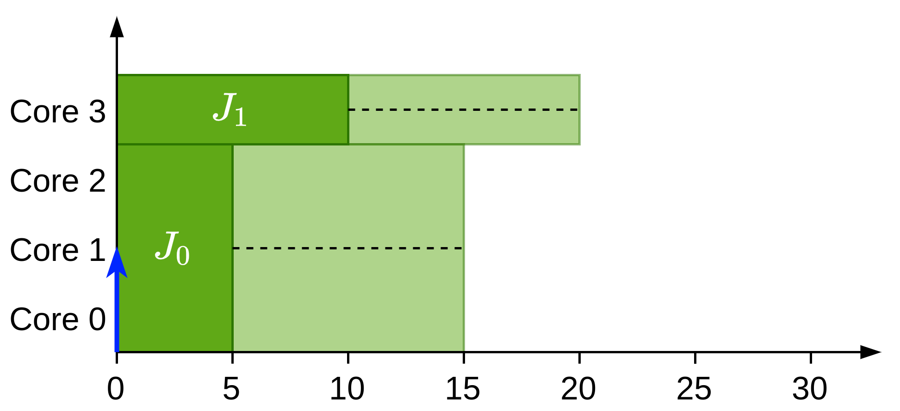

---
header-includes:
	- \usepackage[algoruled, linesnumbered]{algorithm2e}
---


# Reducing gang scheduling pessimism

## The problem

Lets suppose that we have the following system with availability:
$$
A = \left\{
\begin{matrix}
[5, 10] \\ 
[5, 10] \\ 
[5, 10] \\ 
[5, 10] \\
\end{matrix}
\right\} \qquad m = 4 \qquad \mathcal{X}(v) = \emptyset
$$
But we know that there's a single gang job running with $p_i = 4$. Now we want to check whether $J_1$ with $m_1^{\min} = 1$ and $m_1^{\max} = 4$ can be scheduled next. We find:

- For $p_1=1$:
  - $EST_1^1(v) = 5$
  - $LST_1^1(v) =10$
- For $p_1 = 2$:
  - $EST_1^2(v) = 5$
  - $LST_1^2(v) =10$
- For $p_1 = 3$:
  - $EST_1^3(v) = 5$
  - $LST_1^3(v) =10$
- For $p_1 = 4$:
  - $EST_1^4(v) = 5$
  - $LST_1^4(v) =10$

So the current analysis tells us that it can be scheduled with any of the cores possibilities. However, we know that since there's a single job running on the system as soon. We can see then how.

## The solution

### Idea behind

To solve it we are going to store the number of cores liberated at once for the possible available times $M(v)$. Each value $M_i(v)$ in $M(v)$ is related to one or more availabilities and "ties them together". Then when checking the scheduling conditions of job $J_i$ we are going to "discard" all the availabilities that correspond to cores higher than $p$.

For example for the following system $M(v) = \{3, 1\}$:

{width=70%}

### Formulation

For a job $J_i$ to be scheduled with $p$ cores we change $EST_i^p(v)$ from :
$$
EST_i^p(v)= \max\{R_i, A_p^{\min}\}
$$
To:
$$
EST_i^p(v)=\max\{R_i, t_{gang}\}
$$
Where $t_{gang}$ is the time at which $J_i$ can possibly start with $p$ cores knowing that $p+1$ cores could be released and it's defined as follows:
$$
t_{gang}= \begin{cases}
A_p^{\min}(v) & \text{if } p = m_i^{\max} \\
\displaystyle\min_{\forall q,\ p \le q \le m}^{\infty} \left\{A_q^{\min}(v)\left| \left(\sum_{j \le i_q \land M_j(v) \le p} M_j(v)\right) \ge p\right.\right\} & \text{otherwise}
\end{cases}
$$

Where $i_q$ is the index such that $M_{i_q}(v)$ is the cores release related to $A_q^{\min}$ and can be defined as follows:
$$
i_q = i : \left(\sum_{j \le i}M_j(v)\right) \le q < \left(\sum_{j \le i+1}M_j(v)\right)
$$


Additionally:
$$
\left(\sum_{j \le i_q \land M_j(v) \le p} M_j(v)\right) \ge p
$$
Discards all $A_q^{\min}$ such that they are related to a job that will liberate more cores than $p$ and where the non-discarded $A_q^{\min}$ still has $p$ cores.

#### Proof

By contradiction we are going to prove the second branch of $t_{gang}$. Assume that (1) a job $J_i$ is the first job dispatched by the scheduler in a system state represented by node $v$, that (2) $J_i$ is assigned $p$ cores such that $m_i^{\min} \le p < m_i^{\max}$. There are two possibilities, either there is (a) a $M_i > p$ related to a $A_q^{\min}$ with $q \le p$ or there is not (b).

- If (a) this means that $J_i$ is going to be possibly scheduled at $t_{gang}$ with $p$ cores. This time can only be at $A_p^{\min}(v)$ (by the definition of availability). However since we know that $M_i > p$ cores have been liberated at once the scheduler would then schedule $J_i$ with $\min\{m_i^{\max}, M_i\}$ cores which contradicts the assumption that $J_i$ has been scheduled with $p$ cores at time $t_{gang}$ either the job has been released later or there's no $M_i > p$.
- If (b), by contradiction this means that $J_i$ is going to be possibly scheduled at $t_s < t_{gang}$ with $p$ cores. By definition of the equation we know that $A_p^{\min}$ is the minimum value to match the condition. This contradicts the assumption that $J_i$ is scheduled at $t_s$ since $p$ cores are not available until $A_p^{\min}$. Either it has been scheduled with less cores or there's $M_i > p$.

### Example

For the example shown previously we would have:
$$
A = \left\{
\begin{matrix}
[5, 10] \\ 
[5, 10] \\ 
[5, 10] \\ 
[5, 10] \\
\end{matrix}
\right\} \qquad m = 4 \qquad \mathcal{X}(v) = \emptyset \qquad M(v) = \{4\}
$$
Then:

- For $p_1=1$:
  - $EST_1^1(v) = \infty$
  - $LST_1^1(v) =10$
- For $p_1 = 2$:
  - $EST_1^2(v) = \infty$
  - $LST_1^2(v) =10$
- For $p_1 = 3$:
  - $EST_1^3(v) = \infty$
  - $LST_1^3(v) =10$
- For $p_1 = 4$:
  - $EST_1^4(v) = 5$
  - $LST_1^4(v) =10$

### New state

Once we know that a job $J_i$ can be scheduled with $p$ cores and has $EST_i^p(v) \le LST_i^p(v)$. The availability values of the new state $v'$ can be generated as it was previously done. To generate the new $M(v')$ we have to put the values in pairs with the associated $A_q^{\min}$ and sort them accordingly.

### Merge phase

The availabilities $A(v)$ and certainly running jobs $\mathcal{X}(v)$ can be merged as before. To merge $M(v)$ we have to take the minimum of every $M_i(v)$.

```{=latex}
\begin{algorithm}[H]
\SetKwInOut{Input}{input}\SetKwInOut{Output}{output}

\Input{$M(v_A)$ and $M(v_B)$ from states $v_A$ and $v_B$}
\Output{$M(v')$ for state $v'$}
\BlankLine
\While{$M(v_A) \ne \emptyset \land M(v_B) \ne \emptyset$}{
$M_A := front(M(v_A))$\;
$M_B := front(M(v_B))$\;
$M_{new} = \min(M_A, M_B)$\;
$push\_back(M(v'), M_{new})$\tcp*[r]{Add new element}

\uIf(\tcp*[f]{Update if not 0 otherwise remove}){$M_A - M_{new} > 0$}{
	$front(M(v_A)) := M_A - M_{new}$\;
}
\Else{
	$pop(M(v_A))$\;
}
\uIf(\tcp*[f]{Update if not 0 otherwise remove}){$M_B - M_{new} > 0$}{
	$front(M(v_B)) := M_B - M_{new}$\;
}
\Else{
	$pop(M(v_B))$\;
}
}
$push\_back(M(v'), M(v_A))$\;
$push\_back(M(v'), M(v_B))$\;
\caption{Merge phase for $M(v')$ values}
\end{algorithm}
```


