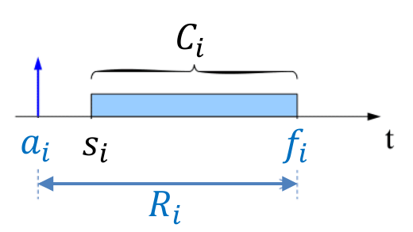
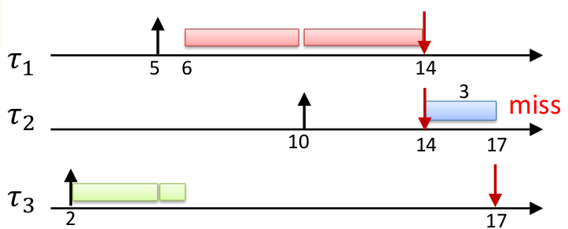

# Lesson 2 - Online scheduling

## Modeling real-time activities
> A **model** is a representation of something. It does not capture all attributes but only the *relevant attributes*. 

It should be:

- Expressive: accurate to the real system
- Tractable: not including too many details

We need to make the model complex enough so it's not useless but not too many complex so it has to many details and it's difficult to analyse.

> All models are WRONG! But some of them are useful!

We need models to be able to analyze a system. Then you can give other properties of the system (reliability...)

### Modeling computation

Important aspects:

- System to be controlled
- System model
- Definition of task/app parameters
- Application model

Then you add the operating system model and the platform model and do a timing analysis. Then create a solution and analyse if the proposed solution is feasible.

### Modeling task execution time
**Task**: a sequence of instructions that, in the absence of other Activities, is continuously executed by the processor until compression

- $f_i$ Finish time
- $s_i$ Start time. When the first instruction of the task is actually executed
- $a_i$ Activation time. When the task wants to start executing instructions
- $R_i$ Response time. Time between the task is activated and finishes. 
$$R_i = f_i - a_i$$

- $C_i$ Computation time. Time between the task starts and finishes. 
$$C_i = f_i - s_i$$

{width=50%}

#### How good is to model task's execution time by a constant value $C_i$?

The execution time can change depending on different factors:

- Software
    - Input value
    - Program path (branches)
    - Number of iterations per loop
- Hardware
    - Cache misses
    - Out-of-order execution in the processor
    - Processor buses (memory bus, ...)

#### How to get a safe $C_i$?

It is not a constant, it depends on architecture and software but we still need a $C_i$ to make the analysis simple.

Measurement is important. So, data is generated and the number of occurrences of a certain execution time is shown. E.g.: 40 times out of 100 the measured execution time is 26.

Then three definitions are done:

- Minimum execution time: $C_i^{\min}$
- Maximum execution time: $C_i^{\max}$
- Average execution time: $C_i^{\text{avg}}$

We may not be able to achieve the true **worst-case execution time** so we add a **safe** upper bound on the worst-case execution time. This is done by assuming the worst in every case, like always cache misses.

### Modeling task execution

#### Online scheduler

In a concurrent system we have one processor and many tasks but only one task can be executed at a time.

Ready tasks are kept in the ready queue and managed by a scheduling policy. The processor is assigned a task by the scheduling policy.

#### Preemption
Allow for a task with higher priority to execute before another one with lower priority. The **preempted task** goes to the ready queue.

- Preemption enhances concurrency and allows reducing response times of high priority tasks
- It can be disable to ensure the consistency of certain critical operations

#### Suspension
Happens when a task decides to suspend itself or tries to access a shared resource that is currently being used by another task. *The task has nothing to do so it suspends itself*.

The suspended task goes to the pending queue.

## Real-time tasks

A real time task $\tau_i$ is said to be feasible if it is guaranteed that it will complete before its deadline, that is 

if $f_i \le d_i$, or equivalently $R_i \le D_i$.

- $D_i$ Relative deadline
- $d_i$ Absolute deadline
$$
d_i = a_i + D_i
$$

### Slack and lateness

- $\text{slack}_i$ Slack. How far are you from the deadline when you finish
$$\text{slack}_i = d_i - f_i$$

- $L_i$ Lateness. How far you finish **after** your deadline. It should be negative or 0 to be fine. (_lateness = tardiness_)
$$L_i = f_i - d_i$$

## Online scheduling
### Definitions: Schedule
**Schedule** is a particular assignment of tasks to the processor and time intervals. 

Formally, given a task set $\tau = \{\tau_1, \tau_2, ..., \tau_n \}$, a schedule is a function $\sigma: \mathbb{R}^+ \rightarrow \mathbb{N}$ that associates an integer $k$ to each interval of time $[t_i, t_{i+1})$ with the following meaning:

$$
\begin{cases}
k &= 0 \Rightarrow \text{Processor idle} \\
k &> 0 \Rightarrow \text{Processor executing task } \tau_k \\
\end{cases}
$$

**Definitions**:
A schedule $\sigma$ is said to be feasible if it satisfies all given requirements. How do we guarantee that we meet all given requirements?

A task set $\tau$ is said to be feasible, if there exists  an algorithm that generates a feasible schedule for $\tau$.

A task set $\tau$ is said to be schedulable with ana algorithm $A$, if and only if $A$ generates a feasible schedule for $\tau$.

### Some well-known scheduling algorithms

- First-in-first-out scheduling (FIFO)
    - Also called First-come-first-serve (FCFS)
- Round robing
- Shortest-job first
- Earliest deadline first (EDF)
- Fixed-priority scheduling (FP)

> ***
> **EXAMPLE**: FIFO
>
> $\tau_i$ | $C_i$ | $a_i$|$d_i$
> -|-|-|-
> $\tau_1$ | 8 | 5 | 14
> $\tau_2$ | 3 | 10 | 14
> $\tau_3$ | 4 | 2 | 17     
> {width=70%}
> 
> ***

