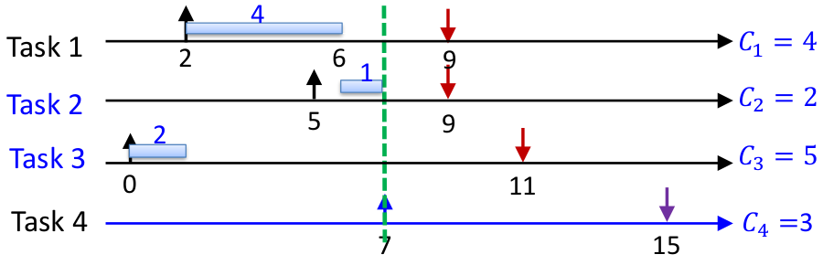
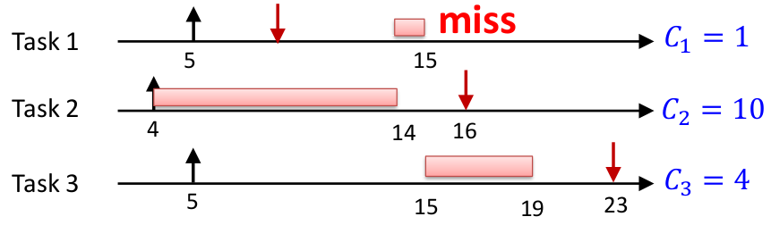

# Lesson 4 - Online scheduling of aperiodic tasks

Buttazzo's book, chapter 3

### Recall: Absolute vs relative deadline

- $d_i$ Absolute deadline. The exact time where the task should be finished
- $D_i$ Relative deadline 

$$D_i = d_i - a_i$$

> **Maximum lateness**: $L_{\max} = \max\{L_i | \forall \tau_i\}$
> 
> If $L_{\max} \le 0$, there is no deadline miss

## Online scheduling algorithms for real-time systems

### Earliest deadline first (EDF)
Order the ready queue by increasing the absolute deadline.

- Assumptions
    - Horn's algorithm is preeemptive and is for independent tasks
    - dynamic ($d_i$ depends on the **activation time** of the task)

- Property
    - Under the assumption above, EDF minimizes maximum lateness

> How can we design an online test for EDF that tells if we can safely add a new task to the system at time $t$?

1. Sort and re-index tasks by their deadlines (only the ones with $d_i \ge t$)
2. Check if there is enough time to finish the tasks for each of the deadlines

$$
\forall i \quad \sum_{k = 1}^i c_k(t) \le d_i - t
$$

> ***
> **EXAMPLE**
> 
> At time $t=7$ should we let Task 4 be added to the system
> 
> {width=75%}
> 
> $$
> \begin{aligned}
> i &= 1 \implies c_1 (t) \le d_1 - t \\
> i &= 2 \implies c_1 (t) + c_2 (t) \le d_2 - t \\
> i &= 3 \implies c_1 (t) + c_2 (t) + c_3 (t) \le d_3 - t \\
> i &= 4 \implies c_1 (t) + c_2 (t) + c_3 (t) + c_4 (t) \le d_4 - t \\
> \end{aligned}
> $$
> 
> ***


#### EDF optimality

> An algorithm $A$ is **optimal** in the sense of feasibility if it generates a feasible schedule, if there exists one

Demonstration method: It is sufficient to show that given an arbitrary feasible schedule the schedule generated by EDF is also feasible.


#### Dertouzos Transformation

This algorithm transforms any schedule $\sigma$ into an EDF schedule $\sigma_{EDF}$.

- $\sigma(t)$ Task executing at time $t$
- $E(t)$ Task with the minimum $d$ at time $t$
- $t_E$ Time at which task $E$ is executed 

``` {.python .numberLines caption="Dertouzos transformation"}
def dertozous():
    for t in range(0, d_max):
        if sigma(t) != E(t):
            sigma(t_E) = sigma(t)
            sigma(t) = E(t)
```

It preserves schedulability because:

- For the advanced slice is obvious
- For the postponed slice, the slack cannot decrease because the deadline of the postponed task MUST 

### A property of optimal algorithms

If a task set is not schedulable by an optimal algorithm then it cannot be scheduled by any other algorithm

If an algorithm $A$ minimizes $L_{\max}$ then $A$ is also optimal in the sense of feasibility. The opposite is not true.

## Table-driven scheduling

- Store the schedule in a table that is prepared offline
- Dispatch jobs according to the table

Timer interrupt handler:

1. Dispatcher reads the table entry at the current index $i$ and dispatches the task
2. Increments $i$
3. Sets the timer interrupt to the "start time" of the current table entry at index $i$

> ***
> 
> **EXAMPLE**
> 
> Task | Start time
> -|-
> 1 | 0
> 2 | 10
> 3 | 12
> 1 | 20
> 4 | 30
> 
> ***

### Advantages

- Extremely predictable
  - Provides full knowledge about when the tasks will be executing
  - You can analyze the performance of your control system
- Easy to certify
  - Avionics industry uses table-driven scheduling
- Extremely flexible for scheduling optimizations
  - It is easy to include optimization techniques while building the schedule
  - Can handle various system constraints
- Low runtime overhead
  - A true $O(1)$ algorithm for scheduling in most hardware platforms
- Very small "code" footprint
  - Only requires a few instructions to implement

### Disadvantages

- Requires a concrete knowledge of task activation times
  - Cannot be applied on event-based systems or dynamic workloads
- Building an optimal schedule may be tractably hard
  - The scheduling problem is NP-Hard
- It uses a large amount of memory
  - Memory is money! Many embedded systems have a limited processing power and memory because:
    - Memory is expensive
    - Consumes a lot of energy

### Can we save space by compressing the table

Regarding the time units:

- **Microsecond**: higher resolution but more bits
- **Millisecond**: less bits but lower resolution

Using relative or absolute values. Relative values use fewer bits but are more prone to clock skews

### Offline equivalence technique

It allows you to store only "crucial" information and build the table at runtime with the help of an online scheduling algorithm.

It has two main steps:

1. Scan phase: scan the table and compare it to what the online scheduler would generate then store the table differences. There are two types of differences:
   - **Priority inversion**: The online scheduler would give more priority to another task so we store this inversion
   - **Idle intervals**: The online scheduler would run another task but instead the processor is idle

## Non-preemptive scheduling

{width=75%}

- Non-preemptive EDF is not optimal for on-preemptive scheduling
- There does not exist any optimal **work-conserving** scheduling policy for non-preemptive tasks

### How about work-conserving policies?

It was thought that a task set can be feasibly scheduled by a work-conserving policy NP-EDF would also feasibly schedule it and that it was optimal. However, in 2016 a counter-example was found.

**Take away message**:

- EDF is good 
- Test

