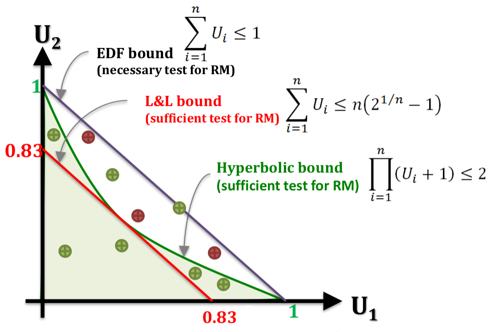

# Lesson 6 - Schedulability analysis (periodic tasks)

Buttazzo's book, chapter 4

## Assumptions

- $C_i$ and $T_i$ are constant for every job $\tau_i$
- Tasks are fully preemptive
- Context switch, preemption, and scheduling overheads are zero
- Tasks are independent

## Secrets behind L&L and hyperbolic bound tests

### Utilization-based tests and RM scheduling

EDF bound:

$$
\sum_{i = 1}^n U_i \le 1
$$

L&L bound:

$$
\sum_{i = 1}^n U_i \le n \left(2^{\frac{1}{n}} - 1\right)
$$

Hyperbolic bound:

$$
\prod_{i = 1}^n (U_i + 1) \le 2
$$

{width=75%}

Under which circumstances hyperbolic bound is better than L&L test?

When there is one big tasks and some very small tasks. However, this never happens usually in a normal system.

### Secrets behind

They found the hardest-to-schedule task set with the minimal utilization:

- It is schedulable by RM
- It fully utilizes the processor. If the execution time of any of the tasks is increased by $\epsilon_i$ the task set is not schedulable anymore
- It has the minimum utilization among all task sets that fully utilize the processor
- All tasks are released at the same time (no release offset)
- Conditions
  1. Periods follow $T_1 < T_2 < ... < T_n < 2T_1$
  2. Execution times follow:

$$
\begin{aligned}
    C_1 &= T_2 - T_1 \\
    C_2 &= T_3 - T_2 \\
    C_i &= T_{i + 1} - T_i \\
    C_n &= 2T_1 - T_n \\
\end{aligned}
$$

To make sure that your schedule is on time. Just draw the schedule and find the Worst Case Real Time.

## RM schedulability analysis

### Exact schedulability test
If an exact schedulability test for scheduling algorithm $A$ accepts a task set, then the task set is certainly schedulable by the algorithm, and if the test rejects the task set, then the task set is certainly NOT schedulable.

A task set is schedulable if and only if it is accepted by an exact schedulability test for algorithm A.

### Response-time Analysis (RTA)
Takes period and Worst-Case Response Time into account

WCRT: 

$$
R_i = \max\{R_{i, j} | \forall j, 1 \le j \le \infty \}
$$

The test: $\forall \tau_i \in \tau, \quad R_i \le D_i$

Having $\infty$ as limit is not practical. We need a smarter solution.

#### Critical instant

For any task $\tau_i$, the longest response time occurs when it arrives together with all higher priority tasks.

#### Solution

The solution is based on fixed-point iterations:

$$
R_i^{(n)} = C_i + \sum_{k = 1}^{i - 1} \left\lceil \frac{R_i^{(n - 1)}}{T_k}
\right\rceil \cdot C_k
$$

- Starting point: $R_i^{(0)} = C_i$
- Iterate until: $R_i^{(n)} \le R_i^{(n-1)}

#### Understanding the terms

- $C_i \implies$ Make sure that the execution of $\tau_i$ finishes
- $\sum_{k = 1}^{i - 1} \implies$ For all higher-priority tasks
- $\left\lceil \frac{R_i^{(n - 1)}}{T_k} \right\rceil \implies$ Count the maximum number of jobs released by task $\tau_k$ in the interval $\left[0, R_i^{(n - 1)}\right)$
- $\cdot C_k \implies$ multiply that by the WCET of $\tau_k$

#### Busy window level $i$

A busy window level $i$ is a window of time during which the processor is busy executing tasks with priority $P_i$ or higher.

#### Computational complexity of RTA

- Calculating the WCRT of a task using RTA is a **weakly NP-Hard** problem
- It has a pseudo-polynomial time computational complexity.

#### How to make RTA faster

Instead of starting from $R_i^{(0)} = C_i$

Start from $R_i^{(0)} = R_{i - 1} + C_i$

### Using RTA to build fast sufficient tests
Idea: Instead of searching for the exact WCRT just check if the workload that must be completed before the deadline is smaller thant the deadline of the task.

$$
C_i + \sum_{k = 1}^{i - 1} 
\left\lceil \frac{D_i}{T_k} \right\rceil \cdot C_k
\le D_i
$$

### A test for harmonic tasks

If the tasks are harmonic and periodic the following test is both necessary and sufficient for RM schedulability:

$$
U \le 1
$$

