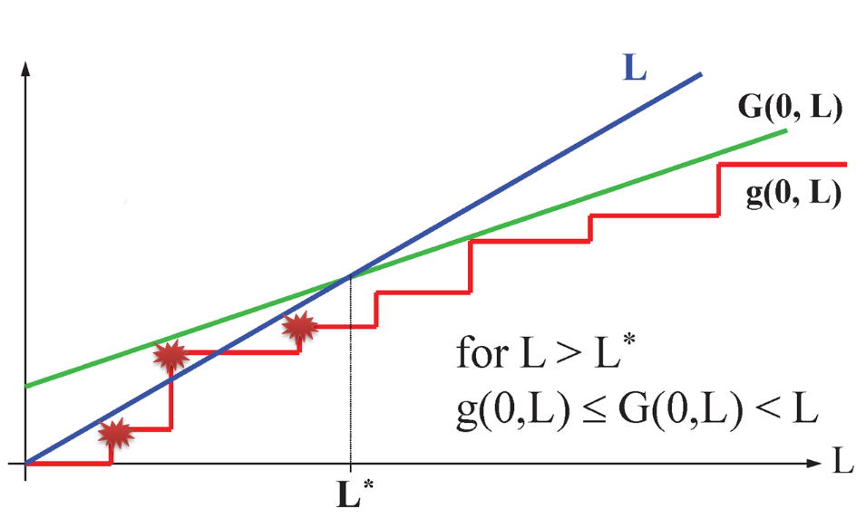
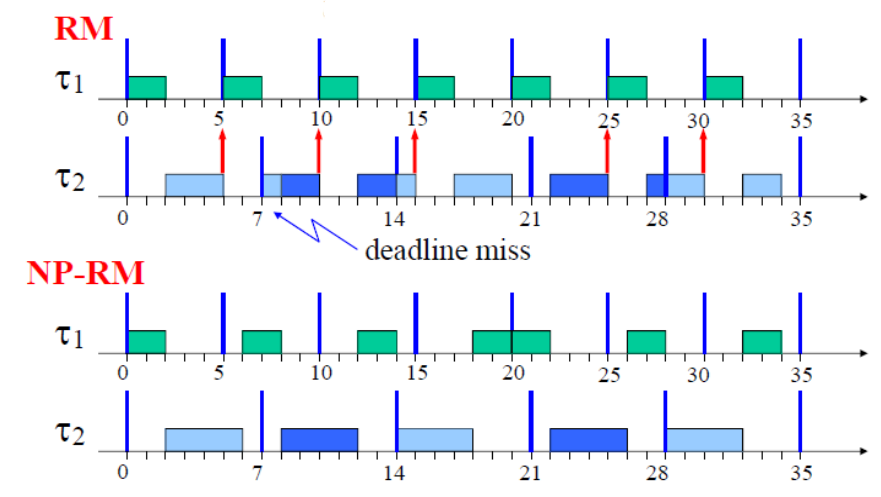

# Lesson 07 - DB analysis + non-preemptive scheduling

Buttazzo's book, chapters 4 and 8

## EDF schedulability analysis for $D <T$

> In any interval of length $L$, the computational demand $g(0, L)$ of the task set must be no greater than $L$.

$$
\forall L > 0, \qquad g(0, L) \le L
$$

### Understanding the processor demand ($g$ function)

The demand in $[t_1, t_2]$ is the computation time of those tasks arrived at or after $t_1$ with deadline less than or equal to $t_2$

$$
g(t_1, t_2) = \sum_{\forall J_{k,j}, t_1 \le a_{k, j} < d_{k,j} \le t_2} C_k
$$

### Demand of a periodic task set

Function $g(0, L)$ is also known as the Demand Bound Function (DBF)

$$
\begin{aligned}
g_i(0, L) &= \max \left\{ 0, \left( 
    \left\lfloor\frac{L - D_i}{T_i} \right\rfloor 
    + 1 \right)\cdot C_i\right\} \\
g(0, L) &= \sum_{\forall i} g_i(0, L)
\end{aligned}
$$

- $L$ is continuous
- $g$ is a step function
- Since $g(0, L)$ is a step function we can check feasibility only at deadline points, where $g$ changes.

#### Finding a safe upper bound for the analysis window

$$
g(0, L) = \sum_{i = 1}^n 
    \left\lfloor \frac{L + T_i - D_i}{T_i} \right\rfloor \cdot C_i \le
G(0, L) = \sum_{i = 1}^n
    \left( \frac{L + T_i - D_i}{T_i} \right)
$$

$$
G(0, L) = L \cdot U + \sum_{i=1}^n (T_i - D_i) \cdot U_i \qquad U \le 1
$$

#### Limiting $L$

{width=75%}

For any $L \ge L^*$, it is meaningless to check if $g(0, L) \le L$ because it will obviously be smaller. Hence, we can stop the search at $L^*$.

$$
L^* = \frac{\sum_{i = 1}^n (T_i - D_i) \cdot U_i}{1 - U}
$$

#### Processor demand test

$$
\forall L \in D, \quad g(0, L) \le L
$$

Where $D$ is the set of deadline points for which $g(0, L)$ must be calculated:

$$
\begin{aligned}
    D &= \{d_{i,j} | d_{i, j} \le \min\{ H, L^* \} \} \\
    H &= \operatorname{lcm} (T_1, ..., T_n) \\
    L^* &= \frac{\sum_{i = 1}^n (T_i - D_i) \cdot U_i}{1 - U}
\end{aligned}
$$

### EDF vs FP

- Context switches: in general FP has more context switches
- Permanent load
  - FP: starvation of low priority tasks that end up never executing
  - EDF: All tasks execute at a lower rate but no task is blocked
- Implementation overhead
  - Both EFD and FP can be implemented using a binary min heap
    - FP: build the heap using priorities
    - EDF: build the heap using the absolute deadlines
  - However, using a bitmap data structure FP can be implemented in $O(1)$

**Conclusion**:

- EDF:
  - Higher schedulability
  - Reduces context switches
  - During overloads does not starve low-priority tasks
- FP:
  - Simple to implement
  - Widely implemented in most operating systems
  - More predictable during overloads

## Non-preemptive scheduling

### Disadvantages of preemptions
1. Context switches cost
2. Cache-related preemption delay (CRPD): It is the delay introduced by high-priority tasks that evict cache lines containing data used in the future
3. Larger worst-case execution time. Due to CRPD the execution time is larger
4. Pipeline cost: some time is lost when flushing the pipeline and to refill it when it is resumed
5. Bus cost: due to the cache misses more time is lost due to additional conflicts in with I/O devices
6. A preemption can cause more preemptions
7. Preemption cost can be very large: WCETs may increase up to 35% in the presence of preemptions (less efficiency)

Some tasks cannot be scheduled in preemptive mode and can be scheduled in non-preemptive mode

### Advantages of NP scheduling
- Reduces context switch overhead, making WCETs smaller and more predictable
- Simplifies the access to shared resources, no semaphores are needed for critical sections
- Reduces the stack size, the tasks can share the same stack since no more than one task can be in execution
- It allows achieving a smaller I/O jitter
- In FP it can even improve schedulability

{width=75%}

## Disadvantages of NP scheduling
1. Some deadlines can be missed
2. The utilization bound under non-preemptive scheduling drops to zero
3. Anomalies: you had a schedulable system. You increase the processor speed and suddenly it is not schedulable anymore

## Response-time analysis of NP-FP

- **Maximum blocking** $B_i = \max\left\{C_j | \forall \tau_j, P_i < P_j \right\}$
- **Maximum interference**
- 

$$
WO_i^{(n)} = B_i + \sum_{k=1}^{i-1} \left(\left\lfloor\frac{WO_i^{(n-1)}}{T_k}\right\rfloor\right) \cdot C_k
$$
$$
R_i = C_i + WO_i
$$

## History of schedulability analysis of NP-FP
In 1994 Tindel introduced the test we saw earlier. They did not know that their test is correct only if some conditions met.

In the late 90's this test was used in CAN controllers in the cars for any type of task set.

In 2007 TU/e noticed a bug in the test. However, thankfully no accident happened because of this bug. Why?

Engineers actually implemented the test in a wrong way which actually was the proper way that did not have a bug 🙃. 

