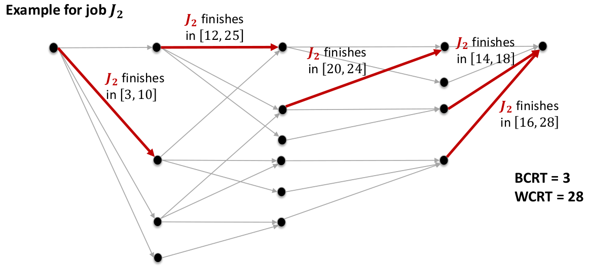

# Lesson 8 - Simulation-based schedulability tests

## Successful stories on non-preemptive scheduling

### A general non-work-conserving solution

1. Select the highest-priority ready job: Can be chosen by any scheduling policy
2. Check if executing that job will cause a deadline miss for a set of jobs that will arrive in the future
   1. **Yes**: Don't schedule the current task, leave the processor **idle** instead
   2. **No**: Then schedule the current high-priority ready task

> ***
> 
> **EXAMPLE**: Precautious-RM policy
> 
> Just look at "one" future job
> 
> - Select the highest-priority ready task
> - If it will cause a deadline miss then
>   - Leave the processor idle
> - Else
>   - Dispatch the task
> 
> ***

### Critical window EDF (CW-EDF)

- Considers the next job of each task
- Sorts their deadlines
- Obtains the latest start time of each job starting from the one with the latest deadline
- Checks if the current high priority job can finish before th latest start time $S$
  
### Important design factors for scheduling algorithms

- Efficiency: How successful is the algorithm in generating feasible schedules
- Analyzability: Can you analyze it at all?
- Runtime
- Memory requirement

## Exact schedulability analysis

### A closer look at the "scheduling"

There can be some task sets that are schedulable but that are rejected by the tests

### The dumbest yet smartest schedulability test

The previous tests work with *worst execution time* while this one works with actual time. It is a **simulation-based** schedulability test. It is not a sound test.

- Schedule the tasks until the hyperperiod with the given scheduling policy
- If there is a deadline miss, it is not schedulable
- Otherwise, it is schedulable

Why is it smart? Because it allows designing schedulability analyses for a wide class of scheduling policies and tasks sets

Why is it dumb? Because some task parameters are non-deterministic:

- If you have many tasks, it can take a lot of time to execute
- Hyper-period could be too big but usually this is still doable 
- There are uncertainties in the task set, like the execution time

#### Challenges

- An exact test must consider all possible scenarios
- There are fewer permissible job orderings than schedules
- Is there a way to use job-ordering abstraction to analyze schedulability?

## Schedule-Abstraction Graph

### What is a schedule-abstraction graph

Allows aggregating similar schedules while searching for all possible schedules

- A path in the graph represents an ordered set of dispatched jobs
- A vertex abstracts a system update
- An edge abstracts a dispatched job
- A state represents the finish-time interval of any path reaching that state

### How to use a schedule-abstraction graph?

The worst-case (best-case) response time of a job $J_i$ is its largest (smallest) finish time amongst all edges whose label is $J_i$

{width=75%}

### How to build schedule-abstraction graphs?

Repeat until every path includes all jobs:

1. Find the shortest path
2. For each non-dispatched job that can be dispatched after the path
   1. Expand: add a new vertex
   2. Merge: if possible merge the new vertex with an existing vertex

### Expanding the graph

An eligible job for path $P$ is a job that can be scheduled after $P$ in at least one execution scenario.

### Deriving rules for expanding the graph

1. Work-conserving rule: $t_{wc}$ is the time at which a job is certainly released and the processor is certainly available
2. JLFP rule: $t_{high}$ is the time at which a higher-priority job is certainly released
3. Latest Start Time (LST): $LST = \min \{ t_{high} - 1, t_{wc} \}$

