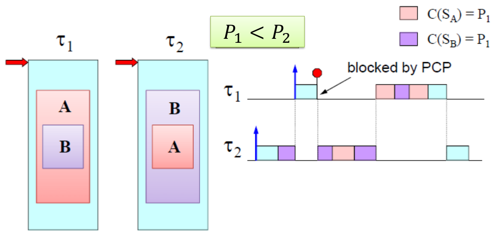
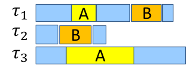
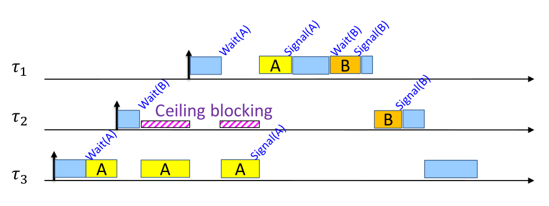

# Lesson 9 - Handling shared resources

Giorgio Buttazzo's book, chapter 7

## Critical sections

If the system supports concurrent execution (e.g. preemptive scheduling) then the access to the shared resources must be protected by semaphores

## Semaphores

Each shared resource is protected by a different semaphore

- $s = 1 \implies$ free resource
- $s = 0 \implies$ busy (locked) resource

```python
def wait(s):
    if s == 0:
        # Task must be blocked
        block_task()
    else:
        s = 0

def signal(s):
    if blocked_tasks:
        # Awaken the first in the queue
        wake_first_task()
    else:
        s = 1
```

### Using semaphores to protect shared resources

Semaphores guarantee that at any time, only one of these tasks can enter the critical section. Even though you solve the data inconsistency with semaphores, this can cause deadline misses.

### Guidelines:

- Try to shorten the critical section
  - Global variables can be copied into local variables
- Avoid critical sections across loops or conditions
- Avoid nested critical sections
  - You will keep one lock and wait for another one, wasting tasks on the system
- Avoid cross-cutting critical sections

Do these guidelines solve the "blocking" problem?

### Impact on schedulability

This can cause a conflict on a critical section and cause a direct blocking from the low-priority task to the high priority task. This is called a **priority inversion**.

### Key aspects in designing an access protocol

- Access rule: Determines when to block or whether to block or not
- Progress rule: Determines how to execute inside a critical section
- Release rule: Determines how to order the pending requests of the blocked tasks

## Resource access protocols

### Non-Preemptive Protocol (NPP)

Whenever a task accesses a resource, it enters a **non-preemptive mode** until it releases the resource.

#### Advantages
Simplicity and efficiency

- Semaphore queues are not needed, because tasks never block on a `wait(s)`
- Each task can block at most on a single critical section
- It prevents deadlocks and allows stack sharing
- It is transparent to the programmer

#### Disadvantages

- Tasks can be blocked even if they don't use any shared resource
- Long critical sections delay all high-priority tasks
- A task could be blocked even if it "may" not access a critical section

### Highest-locker priority (HLP) protocol

It is also known as Immediate-Priority Ceiling (IPC). When a task accesses a resource (e.g. `wait(s)`), its priority upgrade to the priority of the priority of the highest-priority task that **may use** the resource $S$

$$
p_i(S) = \min(P_j | \forall \tau_j, \tau_j \text{ uses } S)
$$

#### Advantages
Simplicity and efficiency

- Semaphore queues are not needed, because tasks never block on a `wait(s)`
- Each task can block at most on a single critical section
- It prevents deadlocks and allows stack sharing

#### Disadvantages

- A task could be blocked even if it "may" not access a critical section (like NPP)
- It is not transparent to programmers (due to ceilings)

### Priority-inheritance protocol (PIP)

Whenever a task accesses a resource $S$ that is locked by another task, the priority of the locking task **upgrades** to the priority of the highest-priority task that is currently blocked on resource $S$.

There are two types of blocking:

- Direct blocking: A task blocks on a locked semaphore
- Indirect blocking (Push-through blocking): A task is blocked because a lower-priority task inherited a higher priority

#### Identifying blocking resources

Under PIP a task $\tau_i$ can be blocked on a semaphore $S_k$ only if:

- $S_k$ is directly shared between $\tau_i$ and lower-priority tasks
- $S_k$ is shared between tasks with lower priority than $\tau_i$ and tasks having priority higher than $\tau_i$

**Lemma 1**: A task $\tau_i$ can be blocked at most once by a lower priority task $\implies$ If there are $n_i$ tasks with priority lower than $\tau_i$, then $\tau_i$ can be blocked at most $n_i$ times, independently of the number of critical sections that can block $\tau_i$.

**Lemma 2**: A task $\tau_i$ can be blocked at most once on a semaphore $S_k$ $\implies$ If there are $m_i$ distinct semaphores that can block $\tau_i$, then $\tau_i$ can be blocked at most $m_i$ times, independently of the number of critical sections that can block $\tau_i$.

#### Bounding blocking times
Theorem:
> $\tau_i$ can be blocked at most for the duration of $\alpha_i = \min(n_i, m_i)$ critical sections

- $n_i$ number of tasks with priority less than $\tau_i$
- $m_i$ number of semaphores that can block $\tau_i$

#### Advantages

- Removes the pessimism of NPP and HLP, a task is blocked only when really needed
- It is transparent to the programmer

#### Problems

- More complex to implement
- Prime to chained blocking
- It does not avoid deadlocks


### Priority Ceiling Protocol (PCP)

A task can access a resource only if it passes the PCP access test. If the test is passed, the rest is like the PIP protocol

Resource ceiling:

$$
C(S_k) = \min \{ P_j | \forall \tau_j, \tau_j \text{ uses } S_kq \}
$$

PCP access test:

$$
P_i < \min \{ C(S_k) | S_k \text{ locked by tasks } \ne \tau_i \}
$$

#### PCP: deadlock avoidance

{width=100%}


#### PCP: Avoiding chained blocking

{width=30%}

{width=100%}


