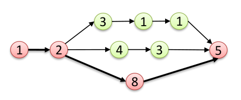
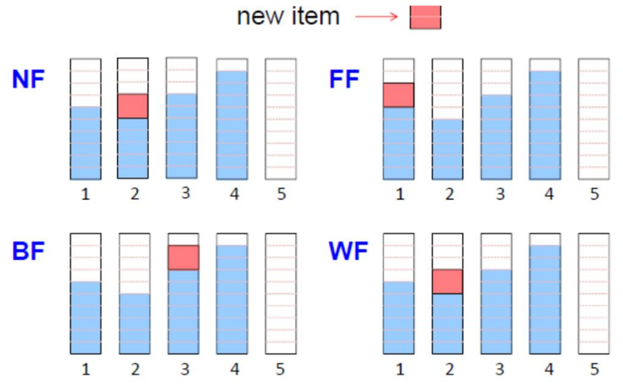

# Lesson 10 - Multiprocessor scheduling

## Switching to multi-core systems

Trends:

- Consolidation: Port the functionalities of multiple processors into a multicore system
- Parallelism: Parallelizing the application code, each code segment can run on a different core in parallel, hence, the tasks have shorter response time

### Industry challenges

1. Parallelizing legacy code implies a tremendous cost and effort
2. Execution of tasks on a multicore platform cause a lot of **conflicts/interferences** on software and hardware resources

### WCET in multicore

Test by Lockheed Martin Space Systems on 8-core platform: The execution time can be up to 6 times larger due to shared resources.

Why does it happen?

### Types of memory

Usually we have:

- Primary storage (DRAM)
- Secondary storage (Disk)
- Cache (SRAM)

Because there are multiple accesses to the same memory the other tasks can interfere with the memory load.

### Cache in multicore systems

If there's, for example, a L3 cache shared every core can interfere with the cache.

**Possible solution**: Partition the last-level cache between the tasks. This can be done by software or by hardware.

**Problems**: Every task has less cache as you have effectively divided the cache in two. The cache is faster but it's more common to have conflicts.

- Use _non-preemptive scheduling_ on the cores
- Partition the shared cache L3 by the number of cores (rather than the number of tasks)

### Memory banks

Divide the memory in different banks, but still there are many I/O conflicts since DRAM accesses have to be queued.

### Types of multicore systems

- Identical cores
- Heterogeneous cores

## Parallel real-time tasks

We always assume homogeneous processors

### Task models for parallel real-time tasks

Representing a parallel code requires more complex structures like a graph (usually directed-acyclic graph).

### Structured parallelism

- Fork-Join Graphs
    - After a fork node, all immediate successors must be executed
    - A join node is executed only after all immediate predecessors are completed
- Nested fork-join model can have nested forks and joins

#### Assumptions and parameters

- Arrival pattern
    - Periodic
    - Sporadic
    - Aperiodic
- Task parameters: $\tau_i = \{ c_{i,1}, c_{i,2},..., c_{i,m} \}, D_i, T_i$

#### Important factors

- **Sequential computation time**:
    - If $C_i^s \le D_i$ holds, the task is schedulable on a single core system
$$
C_i^s = \sum_{j = 1}^{m_i} c_{i, j}
$$

- **CPU utilization** of a parallel task:
    - If $\sum U_i > m$ then the task set is certainly NOT schedulable on a multicore platform with $m$ cores
$$
U_i = \frac{C_i^s}{T_i}
$$

- **Critical path length**: the length of the longest path in the graph
    - Necessary schedulability test: $C_i^p \le D_i$
$$
C_i^p
$$

{width=75%}

### Multiprocessor models

- Identical: Processors are the same type and have the same speed. Each task has the same WCET on each processor
- Uniform: Processors are the same type but may have different speeds. Task WCETs are smaller on faster processors
- Heterogeneous: Processors can be of different type. The WCET of a task depends on the processor type and the task itself

## Real-time scheduling for multicore platforms

#### Assumptions

- Identical multicore systems
- WCET of each task is a sound upper bound on the actual execution time of the task for any possible co-running task and any scenario
- If it is not mentioned explicitly, we assume that each task has one sequential code segment

### Classification of multiprocessor scheduling algorithms

It can be classified depending on:

- Priority: different jobs can have different priorities or the priority can be changed dynamically
- Migration: jobs are allowed to move between cores or they are assigned to a single core

### Partitioned scheduling

- Each processor manages its own ready queue
- The processor for each task is determined **offline**
- The processor cannot be changed at runtime

### Global scheduling

- The system manages a single queue of ready tasks
- The processor is determined at runtime
- During execution, a task can migrate to another processor

How does it work:

- The first $m$ tasks are scheduled upon the $m$ cores
- When a task completes, the next one in the queue is scheduled on the available core
- When a higher-priority task arrives, it preempts the task with the lowest priority among the executing ones

#### Types

- **Work-conserving** scheduler: no processor is ever idled when a task is ready to execute
- **Non-work-conserving** scheduler: A processor may be left idle even if there are ready jobs in the system

#### Advantages

- Allows parallel execution
- Load balancing between cores
- Easier re-scheduling
- Lower average response time
- More efficient reclaiming and overload management
- Number of preemptions

#### Disadvantages

- Migration cost
    - A migrated task needs to load a lot of data into cache which becomes a big source of unpredictability
- Scheduling overheads
- Few schedulability tests
- No job-level fixed-priority scheduling algorithm is optimal

**Dhall's effect**

> The lower bound on the utilization of a task set that is not schedulable by any work-conserving global scheduling algorithm on a multiprocessor system with $m$ cores is 1

So, regardless of the number of cores in the system, we may not be able to find a feasible schedule for the tasks even if the utilizations is just about 1.

#### Negative results about global scheduling

- Weak theoretical framework
    - Unkown critical instant
    - Global-EDF is not optimal
    - Any global job-level fixed-priority scheduler is not optimal
    - Optimal algorithms exist only for sequential implicit deadline tasks
    - Many sufficient test

### Partitioned scheduling

The problem reduces to:

- Bin-packing problem
- Uniprocessor scheduling problem

#### Possible partitioning choices

- Partition by information-sharing requirements
- Partition by functionality
- Use the leas possible number of processors or run at the lowest possible frequency
- Partition to increase schedulability

#### Classic partitioning algorithms for real-time systems

**Partitioning problem**

> Given a set of tasks $\tau = \{ \tau_1, \tau_2, ..., \tau_n \}$ and a multiprocessor platform with $m$ processors, find an assignment from tasks to processors such that each task is assigned to one and only one processor

Classic solutions:

1. Select a fitness criteria. EXAMPLE: task utilization $U_i = \frac{C_i}{T_i}$ or task density $\alpha_i = \frac{C_i}{D_i}$
2. Decide how do you want to sort the tasks
3. Decide what is the fitness evaluation method
4. Use a fitting policy to assign tasks to processors

**Partition heuristics**

- First Fit (FF): Place each item in the first bin that can contain it
- Best Fit (BF): Place each item in the bin with the smallest empty space
- Worst Fit (WF): Place each item in the used bin with the largest empty space, otherwise start a new bin
- Next Fit (NF): Place each item in the same bin as the last item. If it does not fit start a new bin

{width=75%}

**Observations**: The performance of each algorithm strongly depends on the input sequence

- **NF** has a poor performance since it does not exploit the empty space in the previous bins
- **FF** improves performance by exploiting the empty space available in all the used bins
- **BF** tends to fill the used bins as much as possible
- **WF** tends to balance the load among the used bins

#### First-fit algorithm

Achieves an approximation factor of 2. So the number of bins used by this algorithm is no more than twice the optimal number of bins.

#### Lopez utilization bound for partitioned EDF

$$
U^{EDF+FF} \le \frac{1}{2} \cdot (m + 1)
$$

**A refined bound**:

If $n > \beta \cdot m$ and $\forall i, U_i \le U_{max}$, then the task set is schedulable by $U^{EDF+FF}$ if:

$$
\begin{aligned}
U^{EDF+FF} &\le \frac{\beta \cdot m + 1}{\beta + 1} \\
\beta &= \left\lfloor \frac{1}{U_{max}} \right\rfloor
\end{aligned}
$$

- $U_{max}$ is the maximum task utilization among all tasks
- $\beta$ is the maximum number of tasks with utilization $U_{max}$ that fit into one processor

### Global vs partitioned

- There are task sets that are schedulable only with a global scheduler
- There are task sets that are schedulable only with a partitioned scheduler

#### Pros of global

- Allows parallel execution
- Automatic load balancing
- Lower avg. response time
- Easier re-scheduling
- More efficient reclaiming and overload management
- Generally lower number of preemptions

#### Pros of partitioned

- Supported by automotive industry 
- No migrations
- Isolation between cores
- Mature scheduling framework
- Low scheduling overhead

#### Cons of global

- Migration costs
- Inter-core synchronization
- Loss of cache affinity
- Weak scheduling framework

#### Cons of partitioned

- Cannot exploit unused capacity
- Rescheduling not convenient
- NP-hard allocation

### Semi-partitioned scheduling

- Tasks are statically allocated to processors if possible
- Remaining tasks are split into chunks which are allocated to different processors

Subtasks are not independent but are subject to a precedent constraint

### Clustered scheduling

A task can only migrate within a predefined subset of processors

