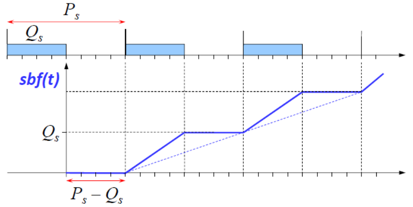

# Lesson 11 - Reservation based scheduling

Giorgio Buttazzo's book, chapter 9

## Varying workload

### What can we do with a varying workload?

#### Calculate and use the worst-case execution time

**Advantages**:

- Is is safe
- Necessary for hard real-time systems

**Disadvantages**:

- Too conservative
- Pessimistic analysis far from reality
- It leads to overprovisioning the system

#### Model it using more expensive task models

**Advantages**:

- It is safe but not pessimistic: you can use it to obtain the WCRT of the task
- Necessary for hard real-time systems

**Disadvantages**:

- It is too complex to derive such a model from a general application
- Some systems do not have such a regular pattern
- It is hard to analyze such a complex workload

#### Just use a smaller value

There will be cases where the actual execution time is larger than you expected it to be. This is called **overrun**. 

**Advantages**:

- It is different since it allows having an analysis that is closer to the average case performance of the system
- Allows using the existing analysis techniques

**Disadvantages**:

- It is unsafe, we may have deadline misses
- If the value we assign is too small there are many overruns
- You cannot use it for hard real-time systems
- Handling overruns increases the overheads

### Consequences of overruns

A task overrun may or may not cause a deadline miss, but in general, it may delay the execution of other tasks, causing a deadline miss.

### What can go wrong if they are not controlled?

**EDF** may have a domino effect: one or more overruns may result in a series of deadline misses

In **FP**, low-priority tasks may starve due to an overrun in high-priority tasks

### Handling overruns: not-so-good solutions

- Cut the task as soon as the task overruns: this totally violates data consistency
- Do not do anything. "Pray" that nothing will happen
- Exception handling mechanisms: It can be a good or bad solution depending in how it is handled

### Handling overruns: good solutions

- Performance degradation (or graceful degradation)
    - Execute a shorter version of the program. Example
        - Fast and low quality
        - Middle ground
        - Slow but high quality
- Resource reservation
    - Allows analyzing WCRT despite possible transient overruns
    - Isolates task's overrun from each other

## Performance degradation

- Degrading functionality (reducing task execution time)
- Skipping specific jobs
- Increasing periods

The load can be decreased not only by rejecting tasks but also by reducing their performance requirements

### Functional degradation
In some applications computation can be performed at different level of accuracy or quality of service

> The higher the QoS, the longer the computation

- Imprecise computation
- Multiple version

#### Imprecise computation
Each task $\tau_i$ is divided in two parts:

- A mandatory part with the worst case execution time $M_i$
- An optional part with the worst case execution time $O_i$
  
Error: $\varepsilon_i = O_i - \sigma_i$

In this case a schedule is:

- Feasible if all mandatory parts complete within $D_i$
- Precise, if also the optional parts are completed

#### Multiple versions
If a task does not comply with the imprecise computational model, another option is to implement multiple versions

**Example**: Engine control task
Some tasks are activated at specific angles. If the car accelerates then the engine task is run more often and the car cannot brake anymore.

What can be done is when the speed increases just use smaller functionality for the engine that takes less time to execute.

### Job skipping

Periodic load can also be reduced by skipping some jobs, once in a while. Many systems tolerate skips, if they do not occur too often:

- Multimedia systems
- Inertial systems

**Example** (slide 24): The system is overloaded, but tasks can be EDF-schedulable if $\tau_1$ skips one instance every 3.

$$
U_p = \frac{1}{2} + \frac{4}{6} = 1.17 = 1
$$

#### Weakly-hard systems
A task with $(m, k)$ weakly-hard timing constraint is feasible if and only if in every window of $k$ **consecutive** jobs of that task, at least $m$ jobs meet their deadlines.

In general if a task set is $(m, k)$ feasible, as long as we increase $k$ or decrease $m$ is always feasible.

## Reservation-based scheduling

### Hierarchical scheduling
Resource reservation can be used to develop hierarchical systems, where each component is implemented within a reservation.

There's a global scheduler that for synchronizing data accesses. There are also local schedulers that interact with the global scheduler.

[Xen project](https://xenproject.org) is one of the most famous hierarchical schedulers.

Linux also uses a hierarchical hypervisor

**Example**: static time partition

- Example of reservation providing 4 units every 10 (bandwidth = 0.4)
- Assume that the server is scheduled as the highest-priority entity in the system

> $sbf(t)$ shows the minimum amount of time available in the reservation $S$ in every time interval of length $t$

### Analyzing reservation-based scheduling

To describe the time available in a reservation, we need to identify, for any interval $[0, t]$, the minimum time allocated in the worst-case situation.

Supply bound function $sbf(t)$ minimum amount of time available in the reservation $S$ in every time interval of length $t$

#### Analysis under resource reservation + EDF
Assume that tasks inside the server are scheduled by EDF

We can use Processor Demand Criterion as follows:
$$
\forall t > 0, \quad dbf(t) \le sbf(t)
$$

For each point where either the value of $sbf(t)$ or $dbf(t)$ changes, check if $dbf(t)$ is smaller than $sbf(t)$

#### Faster test: approximating supply lower-bound function with a line
Assume that tasks inside the server are scheduled by EDF. Design a faster **sufficient** schedulability test

Replace $sbf(t)$ with a **lower bound** called _supply lower-bound function_ $slbf(t)$

$$
\begin{aligned}
slbf(t) &= \max\{0, \alpha (t - \Delta)\} \\
\alpha &= \lim_{t \rightarrow \infty}\frac{sbf(t)}{t} \\
\Delta &= \sup_{r \ge 0} {t - \frac{sbf(t)}{\alpha}} \\
\end{aligned}
$$

- $\alpha$: Bandwidth
- $\Delta$: Service delay

> ***
> 
> **EXAMPLE**: Periodic server
> 
> Budget $Q_s$ and period $P_s$ running at the highest priority (among other servers) we have
> 
> {width=75%}
> $$
> \begin{aligned}
> \Delta &= P_s - Q_s   
> \alpha &= \frac{Q_s}{P_s}
> \end{aligned}
> $$
> ***

## Observations about periodic servers

In a periodic server with bandwidth $\alpha$, we have that:

$$
\begin{cases}
    Q &= \alpha P \\
    \Delta &= 2(P - Q) = 2P(1 - \alpha)
\end{cases}
$$

The delay is proportional to the server period

A reservation can be wasted because:

- Occasional load 

